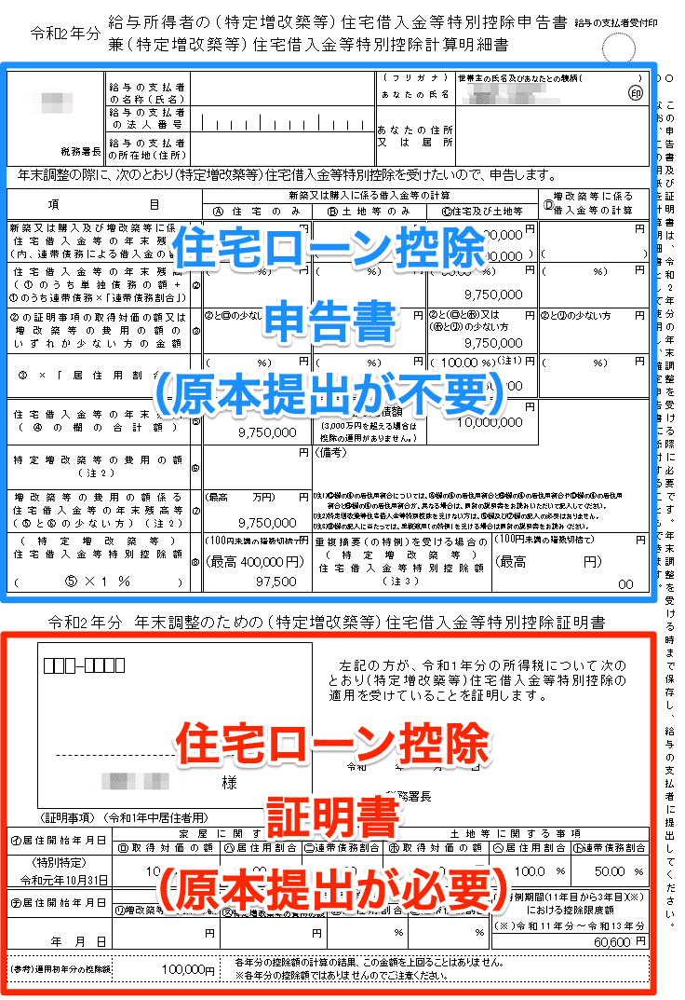

:::alert
当ページで案内しているSmartHRの年末調整機能の内容は、2021年（令和3年）版のものです。
2022年（令和4年）版の年末調整機能の公開時期は秋頃を予定しています。
なお、画面や文言、一部機能は変更になる可能性があります。
公開時期が決まり次第、[アップデート情報](https://smarthr.jp/update)でお知らせします。
:::

以下の項目に該当する回答があった場合、書類の画像添付は不要でも原本の提出が必要です。

#### 今年中に会社を辞めた場合

- （前職の）源泉徴収票

#### 配偶者または扶養親族が海外に居住している場合

- 親族関係書類
- 送金関係書類

:::tips
送金関係書類は原本に限らず、写しも送金関係書類として取り扱いできます。
詳しくは下記のPDF資料内【「送金関係書類」とは 】をご覧ください。
[国外居住親族に係る扶養控除等の適用について（リーフレット）｜国税庁](https://www.nta.go.jp/publication/pamph/pdf/kokugaifuyou_leaflet.pdf)
:::

#### 勤労学生

- 学生証のコピーまたは在学証明書

詳しくは下記のページをご覧ください。

[No.1175 勤労学生控除｜国税庁](https://www.nta.go.jp/taxes/shiraberu/taxanswer/shotoku/1175.htm)

#### 障害者控除

- 障害者手帳のコピー
- （障害者手帳申請中の場合）医師の診断書で代用可能

:::tips
障害者手帳のコピーは、申告書に書類の提出が必要である旨が記載されていません。
原本の提出を求めるかは、各社の判断で進めてください。
:::

#### 保険料申請（生命保険、介護医療保険、個人年金保険、地震保険）

- 保険料の控除証明書

#### 国民年金保険

- 社会保険料控除証明書

#### 小規模企業共済等

- 掛金払込証明書等
- 個人型年金加入者掛金の払込証明書（iDeCo）

#### 住宅ローン控除申請

- 金融機関が発行した「住宅取得資金に係る借入金の年末残高等証明書」
- 「年末調整のための（特定増改築等）住宅借入金等特別控除証明書」

:::tips
令和3年から「住宅ローン控除申告書」が電子化の対象になりました。
ただし、「住宅ローン控除証明書」部分は原本の提出が必要になりますのでご注意ください。

詳しくは下記のページをご覧ください。
[2021年の年末調整はどう変わる？「令和3年度 税制改正」の3つの変更ポイント｜SmartHR Mag.](https://mag.smarthr.jp/procedure/detail/nencho_zeiseikaisei_2021/)
:::

国民年金・国民年金基金以外の社会保険は証明書の提出は不要とされているため、年末調整機能では、表示されません。

詳しくは管轄税務署にお問い合わせいただくか、下記のページをご覧ください。

[令和3年分 年末調整のしかた｜国税庁](https://www.nta.go.jp/publication/pamph/gensen/nencho2021/pdf/nencho_all.pdf)
