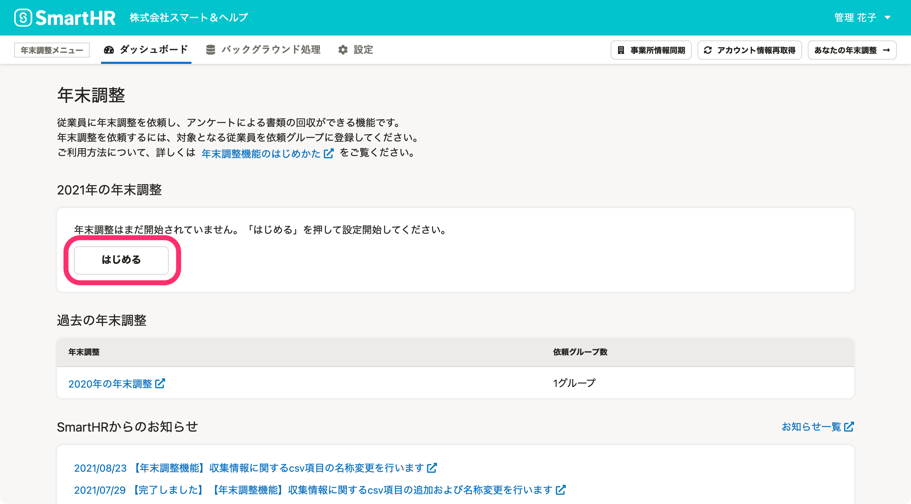
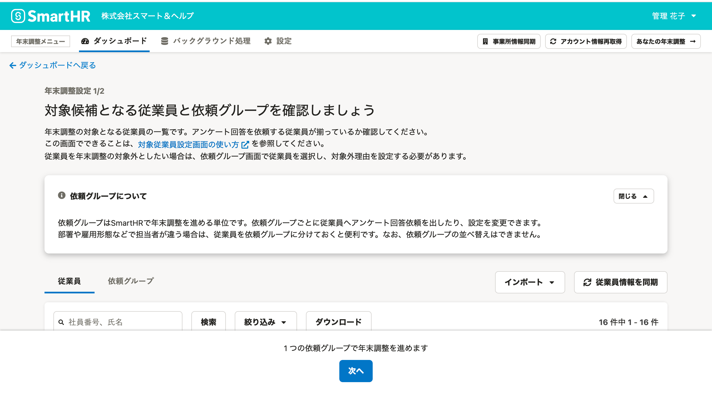
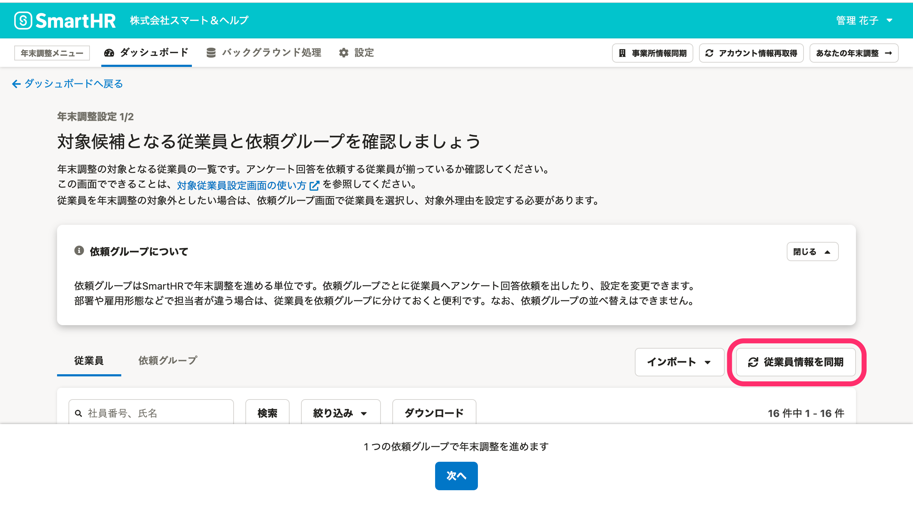
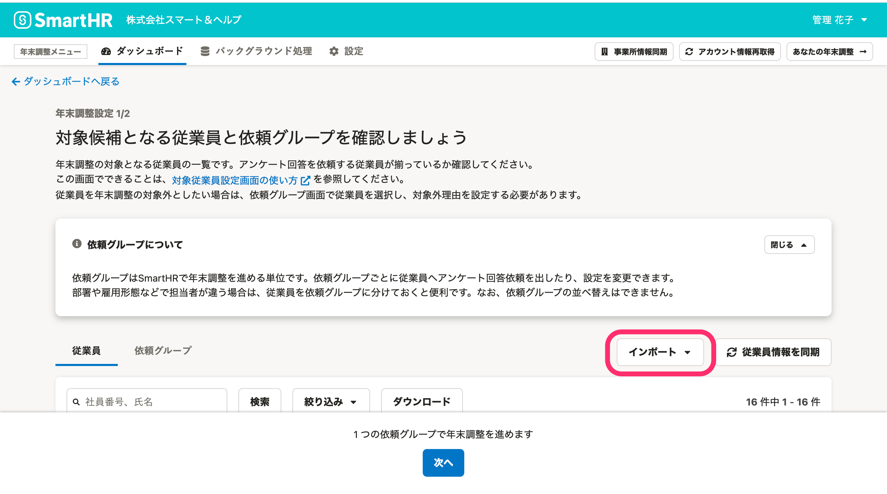

:::alert
当ページで案内しているSmartHRの年末調整機能の内容は、2021年（令和3年）版のものです。
2022年（令和4年）版の年末調整機能の公開時期は秋頃を予定しています。
なお、画面や文言、一部機能は変更になる可能性があります。
公開時期が決まり次第、[アップデート情報](https://smarthr.jp/update)でお知らせします。
:::

年末調整の対象となる従業員の確認方法を説明します。

# 注意点

SmartHRに登録されたマイナンバーを年末調整で作成した書類へ取り込む際、従業員の社員番号で紐付けします。

年末調整開始後（依頼グループの作成後）は、年末調整終了まで従業員の社員番号を変更しないようお願いします。

# 1.［はじめる］をクリック

年末調整メニューの **［ダッシュボード］** にある **［はじめる］** をクリックすると、 **［年末調整設定1/2］** 画面に移動します。

# 2\. 年末調整の対象となる従業員を確認する

 **［年末調整設定1/2］** 画面では、年末調整の対象となる従業員の確認と、依頼グループの作成・編集ができます。

まずは、一覧に年末調整の対象としたい従業員が全員表示されているか確認してください。

一覧に表示されていない従業員には、年末調整のアンケートを依頼できません。

#### 

:::alert
**年末調整の対象としたい従業員が表示されていない場合**
対象の従業員情報がSmartHRに登録されていない可能性があります。
SmartHRの従業員情報に、対象の従業員が登録されているか確認してください。
[年末調整に必要な従業員情報を整備する](https://knowledge.smarthr.jp/hc/ja/articles/360035370473)
:::
:::tips
#### SmartHRに従業員を追加した場合や部署情報を追加・更新した場合の従業員情報の同期
依頼グループ作成後にSmartHRへ従業員を新しく追加した場合や、従業員の部署情報を追加・更新した場合には、従業員情報の同期が必要です。
 **［年末調整設定1/2］** 画面の［ **従業員情報を同期］** をクリックすると、SmartHRに登録されている従業員情報を年末調整機能に同期してよいか確認するダイアログが表示されます。
ダイアログの［ **同期］** をクリックしてください。

#### 依頼前の昨年の保険料データや団体保険料データのインポートについて
 **［対象従業員設定］** 画面の **［インポート▼］** のプルダウンメニューから、昨年の保険料データや、団体保険料データのインポートが可能です。
前年にSmartHRで年末調整を行なっていない場合、依頼前にデータをインポートしておくと便利です。
従業員がアンケートを回答する際に、インポートした情報が入力された状態で回答できるので、従業員の入力の手間を軽減できます。

それぞれの詳しい操作方法は、下記ヘルプページをご覧ください。
[年末調整機能で昨年分の保険や住宅借入金控除の申告情報を表示する](https://knowledge.smarthr.jp/hc/ja/articles/360035370453)
[団体保険のデータをインポートする](https://knowledge.smarthr.jp/hc/ja/articles/360036159813)
:::

# 次の工程に進む

対象となる従業員を確認後、依頼グループの作成に進みます。

下記のヘルプページをご覧ください。

[依頼グループを作成し、従業員を振り分ける](https://knowledge.smarthr.jp/hc/ja/articles/4405215155993)
