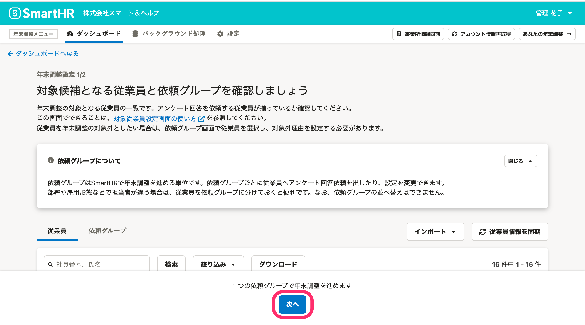
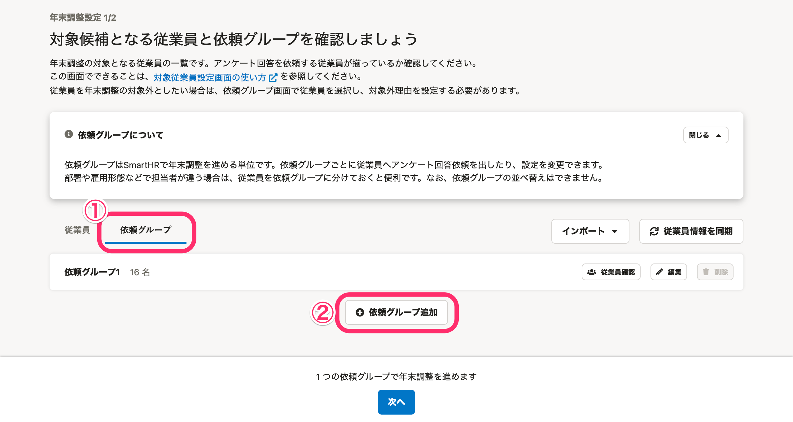
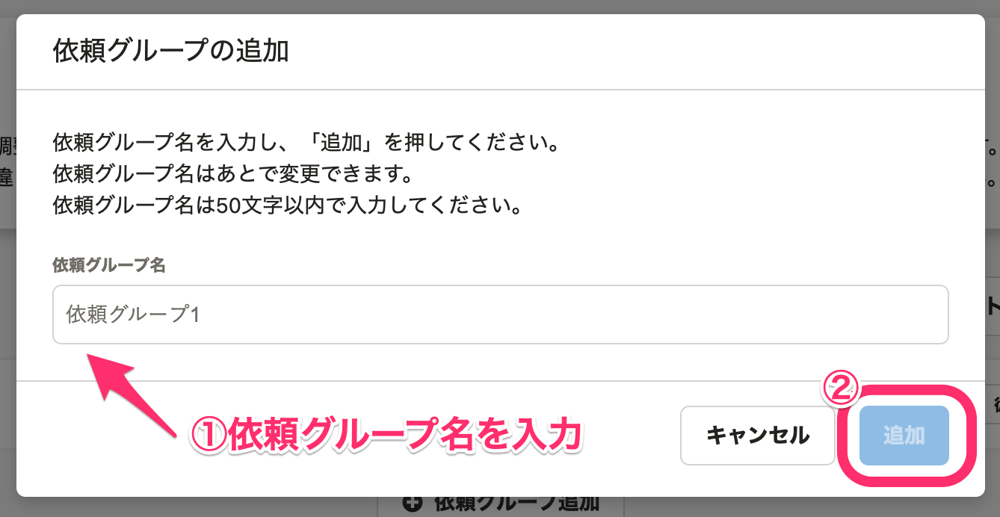

:::alert
当ページで案内しているSmartHRの年末調整機能の内容は、2021年（令和3年）版のものです。
2022年（令和4年）版の年末調整機能の公開時期は秋頃を予定しています。
なお、画面や文言、一部機能は変更になる可能性があります。
公開時期が決まり次第、[アップデート情報](https://smarthr.jp/update)でお知らせします。
:::

年末調整機能で依頼グループの作成し、従業員を振り分ける方法を説明します。

全従業員を1つの依頼グループで管理する場合と、複数の依頼グループで管理する場合とで手順が異なります。

利用シーンにあわせて、次のいずれかの手順を参照してください。

:::tips
部署や雇用形態によって年末調整の担当者が異なる場合は、それぞれの依頼グループを作成し、従業員を振り分けておくと便利です。
なお、複数の依頼グループで管理していても、年末調整終了後に年末調整のデータを出力する際には、依頼グループに関係なくまとめてデータを出力できます。
:::

# 全従業員を1つのグループで管理する

 **［年末調整設定1/2］** 画面の下部に表示されている **［次へ］** をクリックして、 **［年末調整設定2/2］** に進んでください。

詳しくは、以下のヘルプページをご覧ください。

[年末調整の依頼グループの設定と変更方法](https://knowledge.smarthr.jp/hc/ja/articles/360038197674)

# 複数の依頼グループで管理する場合

複数の依頼グループで管理したい場合、個別にグループを追加する方法と、CSVファイルを使って一括で追加する方法があります。

## 個別に依頼グループを追加する

 **［年末調整設定1/2］** 画面の **［依頼グループ］** タブをクリックして画面の表示を切り替えます。

 **［＋依頼グループ追加］** をクリックすると、 **［依頼グループの追加］** というダイアログが表示されます。

任意の依頼グループ名を入力して **［追加］** をクリックすると、依頼グループが追加されます。

## CSVファイルを使って一括で追加する

CSVファイルを使った一括設定も可能です。詳しくは以下のヘルプページをご覧ください。

[年末調整の依頼グループを一括で設定する](https://knowledge.smarthr.jp/hc/ja/articles/4403662363161)

:::tips
### 年末調整の初期設定完了後でも、依頼グループは追加できます
年末調整の初期設定が完了している場合は、依頼一覧画面の左側にある **［対象従業員設定］** をクリックして表示される対象従業員設定画面から依頼グループを追加してください。

:::

# 次の工程に進む

従業員の振り分けが完了したら、依頼グループの設定に進みます。

以下のヘルプページをご覧ください。

[年末調整の依頼グループの設定と変更方法](https://knowledge.smarthr.jp/hc/ja/articles/360038197674)
