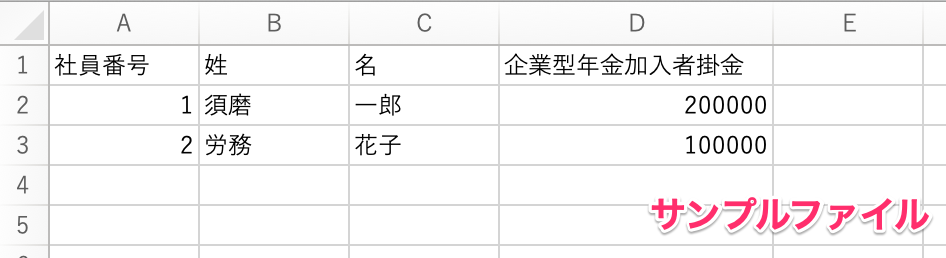
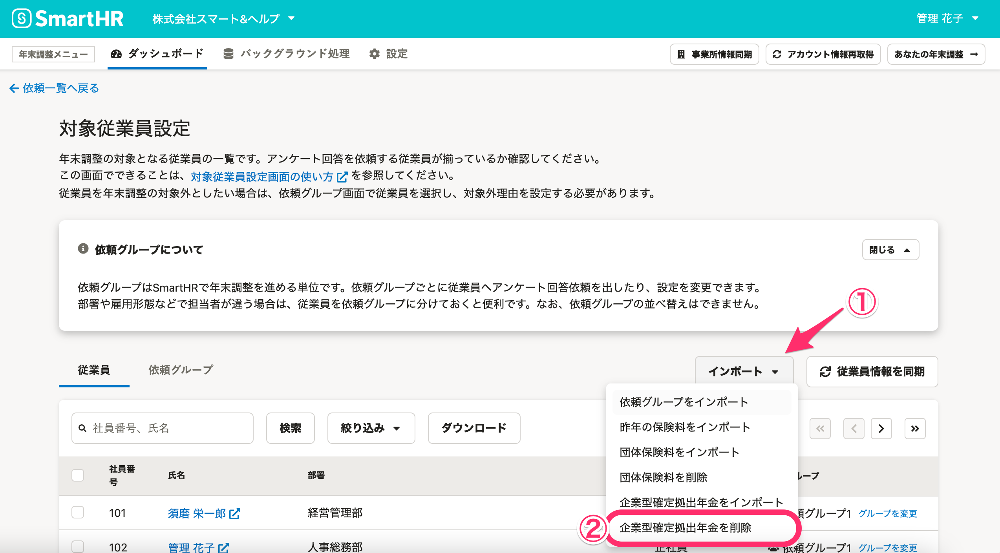

:::alert
当ページで案内しているSmartHRの年末調整機能の内容は、2021年（令和3年）版のものです。
2022年（令和4年）版の年末調整機能の公開時期は秋頃を予定しています。
なお、画面や文言、一部機能は変更になる可能性があります。
公開時期が決まり次第、[アップデート情報](https://smarthr.jp/update)でお知らせします。
:::

CSVファイルを使って企業型確定拠出年金情報を一括登録・削除する方法を説明します。

会社が把握している掛金などの情報を取り込んだ状態で、年末調整の依頼をしたい場合にご利用ください。

企業型確定拠出年金データのCSVファイルについて、詳しくは下記のヘルプページをご覧ください。

:::related
[【一覧】企業型確定拠出年金データCSV凡例](https://knowledge.smarthr.jp/hc/ja/articles/360061217434)
:::

# 注意事項

## 企業型確定拠出年金のデータのインポートは、年末調整開始時に設定してください。

インポートの対象は年末調整が「未依頼」の従業員です。

年末調整を依頼後の従業員に企業型確定拠出年金のデータをインポートしたい場合は、その従業員の依頼を「未依頼」にして、インポートしなおしてください。

[年末調整の依頼を「未依頼」に戻す](https://knowledge.smarthr.jp/hc/ja/articles/360034870774)

## インポートした情報は、従業員による情報の編集が許可されていません。

インポートした企業型確定拠出年金のデータは、アンケート画面および収集情報編集画面での **［従業員による情報の編集］** が **［許可しない］** に設定されています。

 **［許可しない］** 設定のままだと、依頼の差し戻しをした際に、従業員が情報を編集できません。

従業員による編集を許可する場合は、収集情報の **［保険情報］** タブにある **［企業型確定拠出年金掛金］** の **［従業員による情報の編集］** を **［許可する］** に変更してください。

## 以下2つの掛金はインポート不要です。

### 事業主掛金

会社が掛金を支払い、従業員による支払いがない場合は年末調整の必要がありません。

### 給与から天引きし、社会保険料として扱っている掛金

給与から天引きし、社会保険料として扱っている掛金は、年末調整の必要がありません。

保険料控除等申告書で申告しなくても控除の対象として扱われます。

# 一括登録手順

## 1\. ［対象従業員設定］をクリック

 **［対象従業員設定］** をクリックすると、 **［対象従業員設定］** 画面に移動します。

## 2\. ［インポート▼］>［企業型確定拠出年金をインポート］をクリック

 **［インポート▼］** のプルダウンメニューから **［企業型確定拠出年金をインポート］** をクリックすると、 **［企業型確定拠出年金のインポート］** ダイアログが表示されます。

## 3\. CSVテンプレートダウンロードし、ファイルを編集する

 **［ダウンロード］** をクリックし、CSVテンプレートをダウンロードします。

CSVテンプレートをもとに、内容を編集してください。

## 4\. ファイルを選択し、［アップロード］をクリック

 **［ファイルを選択］** をクリックし、対象のファイルを選択して **［アップロード］** をクリックすると、バックグラウンド処理を開始します。

バックグラウンド処理の結果は、年末調整メニューの **［**  **バックグラウンド処理］** で確認できます。

# 削除手順

## 1\. ［対象従業員設定］画面の［インポート▼］>［企業型確定拠出年金を削除］をクリック

 **［対象従業員設定］** 画面にある **［インポート▼］>［企業型確定拠出年金を削除］** をクリックすると、「企業型確定拠出年金を削除しますか？」というダイアログが表示されます。

## 2.［削除］をクリック

 **［削除］** をクリックするとバックグラウンド処理を開始します。

:::alert
上図に記載のとおり、依頼ステータスが **［未依頼］** でも、収集情報の **［保険情報］** タブにある **［企業型確定拠出年金掛金］** の従業員による情報の編集を許可している場合、企業型確定拠出年金のデータは削除されません。

:::

バックグラウンド処理の結果は、年末調整メニューの **［バックグラウンド処理］** で確認できます。

