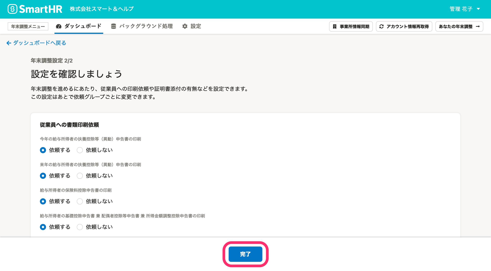
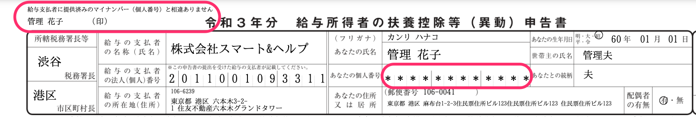
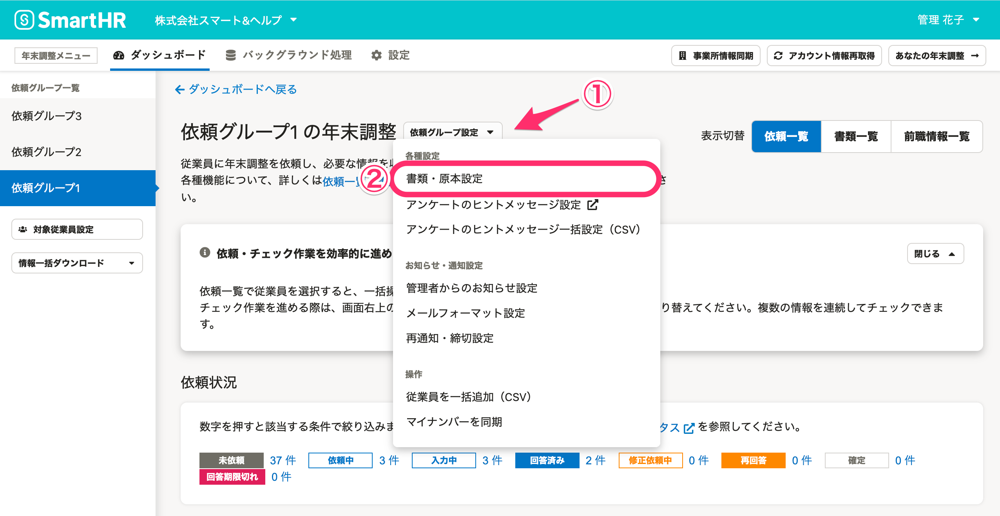
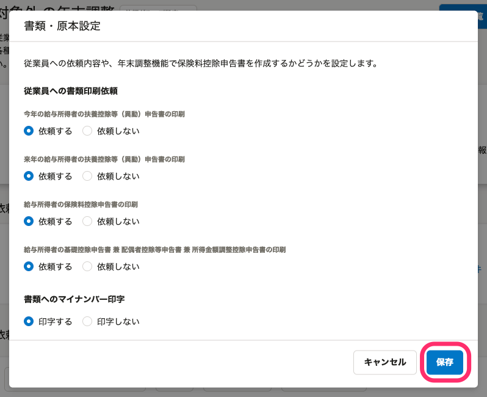

:::alert
当ページで案内しているSmartHRの年末調整機能の内容は、2021年（令和3年）版のものです。
2022年（令和4年）版の年末調整機能の公開時期は秋頃を予定しています。
なお、画面や文言、一部機能は変更になる可能性があります。
公開時期が決まり次第、[アップデート情報](https://smarthr.jp/update)でお知らせします。
:::

年末調整の依頼グループの設定と変更方法を説明します。

# 依頼グループの設定をする

 **［年末調整設定2/2］** では、年末調整を進めるにあたって従業員への依頼内容や書類印刷の有無などの設定が可能です。

設定が終わったら、 **［完了］** を押してください。

なお、ここで設定した内容は、あとで依頼グループごとに変更可能です。

## 設定項目

### 従業員への書類印刷依頼

下記の書類について、書類の印刷依頼をそれぞれ設定できます。

- 今年の給与所得者の扶養控除等（異動）申告書
- 来年の給与所得者の扶養控除等（異動）申告書
- 給与所得者の保険料控除申告書
- 給与所得者の基礎控除申告書 兼 配偶者控除等申告書 兼 所得金額調整控除申告書

印刷した書類を提出してほしい場合は **［依頼する］** を選択します。

 **［依頼する］** にチェックを入れると、従業員画面で **［要印刷］** のラベルが表示されます。

データ保存のみで、紙の申告書の提出を必要としない場合は［ **依頼しない］** を選択します。

 **［依頼しない］** にチェックを入れると、従業員画面で **［印刷不要］** のラベルが表示されます。

### 書類へのマイナンバー印字

印刷した書類またはダウンロードしたPDFにマイナンバーを表示する場合は、 **［印字する］** を選択します。

 **［印字しない］** を選択すると、給与所得者の扶養控除等（異動）申告書の左上に「給与支払者に提供済みのマイナンバー（個人番号）と相違ありません」という文言とともに、従業員の氏名と押印欄が表示され、マイナンバーは**＊**表記になります。

:::alert
書類のプレビュー画面では、 **［**  **印字する］** を選択していてもマイナンバーは表示されません。
:::

給与所得者の扶養控除等申告書へのマイナンバー表示を省略できる要件は、下記のページを参考にしてください。

:::related
[給与所得者の扶養控除等申告書へのマイナンバー表示を省略できる要件とは](https://knowledge.smarthr.jp/hc/ja/articles/360026263873)
:::

### 証明書の画像添付

下記の証明書の画像添付を必須としたい場合は **［**  **必須］** 、任意提出とする場合は **［任意］** 、不要とする場合は **［不要］** を選択してください。

- 生命保険等の証明書
- 源泉徴収票
- 障害者手帳 ※
- 勤労学生の学生手帳
- 配偶者や扶養家族が海外居住の場合の必要書類
- 住宅ローン控除の必要書類

いずれも画像の添付だけでなく、原本（勤労学生の場合は、学生証のコピーなど在学を証明する書類）の提出が必要です。

なお、証明書の画像を添付を **［**  **必須］** としても、各種情報の入力が必要ない従業員には影響しません。

:::tips
※障害者手帳については、申告書に書類の提出が必要である旨が記載されていません。
原本の提出を求めるかについては、各社で判断してください。
:::

### 保険料控除申告書の作成設定

 **［申告書を作成する］** を選択すると、生命保険料、社会保険料などの支払いがないと回答した場合でも、未入力の申告書が作成されます。

この設定は、依頼グループに含まれるすべての従業員に適用されます。

### 原本の提出方法

従業員の原本提出用の台紙として、SmartHRで作成したものを使用する場合は、 **［生命保険等証明書原本の台紙を使って提出する］** を選択します。

この設定をすると、従業員による年末調整のアンケートの最後の設問で、従業員が台紙のPDFファイルをダウンロードできます。

自社で用意した台紙を使用する場合は、 **［生命保険等証明書原本の台紙を使わずに提出する］** を選択してください。

従業員の画面には、台紙へのリンクが表示されなくなります。

:::related
[「生命保険等証明書原本の台紙」の使用方法](https://knowledge.smarthr.jp/hc/ja/articles/4404550207769)
:::

# 依頼グループの設定を変更する

依頼グループを作成した後に、年末調整依頼グループの設定を変更できます。

従業員情報の取込後や依頼を行なった後でも、変更した設定が反映されます。

## 1\. 依頼一覧の［依頼グループ設定▼］>［書類・原本設定］をクリック

依頼一覧の **［依頼グループ設定▼］>［書類・原本設定］** をクリックします。

## 2\. 設定内容を変更し、［保存］をクリック

変更したい内容を入力し、 **［保存］** をクリックすると設定を変更します。

:::tips
2020年版では「未依頼」ステータスの従業員のみ依頼グループの変更が可能でした。
2021年版から依頼ステータスにかかわらず、依頼グループの変更が可能となりました。
:::
:::alert
依頼グループの順序を入れ替えたい場合は、一度すべての依頼グループを削除し、改めて依頼グループを追加し直す必要があります。
表示順の仕様などの詳細とあわせて、以下のヘルプページをご覧ください。
[Q. 依頼グループの並び替えはできますか？](https://knowledge.smarthr.jp/hc/ja/articles/360055630894)
:::

# 次の工程に進む

引き続き年末調整の作業を進める場合は、以下のヘルプページをご覧ください。

:::related
[アンケート画面のヒントを追加・編集する](https://knowledge.smarthr.jp/hc/ja/articles/360034870854)
:::

年末調整の依頼グループ作成後、よく寄せられる各種操作方法については、以下のヘルプページをご覧ください。

:::related
[年末調整の依頼グループに関するよくある質問](https://knowledge.smarthr.jp/hc/ja/articles/360056509734)
[年末調整の依頼グループを削除する](https://knowledge.smarthr.jp/hc/ja/articles/360037003793)
:::

年末調整に関する通知や書類への印字設定、操作に関する権限を設定する場合は、以下のヘルプページをご覧ください。

:::related
[年末調整の通知設定をする](https://knowledge.smarthr.jp/hc/ja/articles/360053201294)
[年末調整の書類に印字する住所の設定をする](https://knowledge.smarthr.jp/hc/ja/articles/360053201314)
[年末調整の権限を設定する](https://knowledge.smarthr.jp/hc/ja/articles/360034870874)
[「生命保険等証明書原本の台紙」の使用方法](https://knowledge.smarthr.jp/hc/ja/articles/4404550207769)
:::
