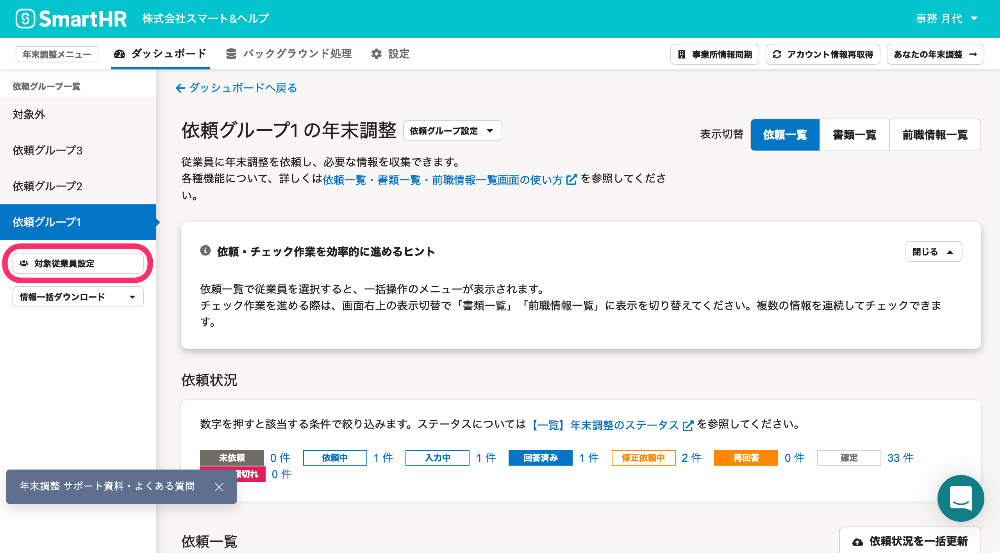
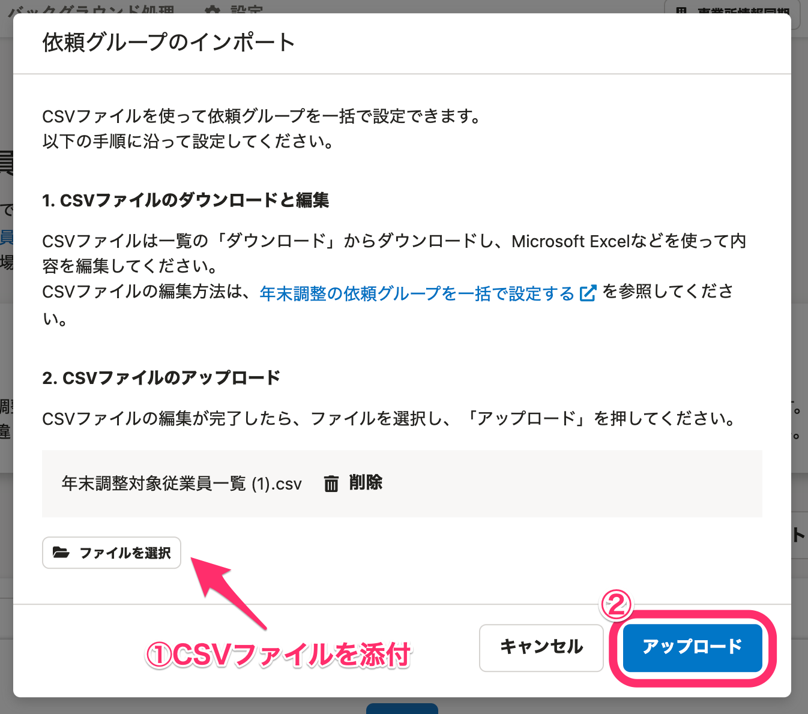

:::alert
当ページで案内しているSmartHRの年末調整機能の内容は、2021年（令和3年）版のものです。
2022年（令和4年）版の年末調整機能の公開時期は秋頃を予定しています。
なお、画面や文言、一部機能は変更になる可能性があります。
公開時期が決まり次第、[アップデート情報](https://smarthr.jp/update)でお知らせします。
:::

年末調整機能で複数の依頼グループにわけて従業員を管理したい場合、個別にグループを追加する方法と、CSVファイルを使って一括で追加する方法があります。

当ページでは、CSVファイルを使って一括で依頼グループに従業員を追加する方法を説明します。

個別にグループを追加する方法について詳しくは、以下のヘルプページをご覧ください。

[依頼グループを作成し、従業員を振り分ける](https://knowledge.smarthr.jp/hc/ja/articles/4405215155993)

# 1.［年末調整設定1/2］画面の［ダウンロード］をクリック

対象となる従業員を確認し、 **［年末調整設定1/2］** 画面の **［ダウンロード］** をクリックすると、 **［従業員一覧のダウンロード］** 画面が表示されます。

:::tips
年末調整の初期設定が完了している場合は、 **［対象従業員設定］** をクリックして表示される対象従業員設定画面から操作してください。

:::

# 2\. CSVファイルをダウンロード

 **［従業員一覧のダウンロード］** 画面の **［ダウンロード］** をクリックすると、バックグラウンド処理が始まります。

年末調整メニューの **［バックグラウンド処理］** をクリックします。

 **［処理名］** の一覧から、対象の **［年末調整対象従業員一覧ダウンロード］** をクリックすると処理結果の画面に移動します。

添付ファイル項目の下にある **［ダウンロード］** をクリックして、CSVファイルをダウンロードします。

# 3\. CSVファイルの編集

ダウンロードしたCSVファイルを開き、依頼グループ列に任意の依頼グループ名を入力して、CSVファイルを保存します。

依頼グループ列に入力した依頼グループ名が、新しい依頼グループとして登録されます。

# 4\. CSVファイルのインポート

 **［年末調整設定1/2］** 画面の **［インポート▼］>［依頼グループをインポート］** をクリックすると、 **［依頼グループのインポート］** 画面が表示されます。

 **［ファイルを選択］** をクリックして編集したCSVファイルを添付し、 **［アップロード］** をクリックすると、バックグラウンド処理が始まります。

バックグラウンド処理の状況は、先ほどと同じ手順で確認してください。

バックグラウンド処理が完了すると、CSVファイルで指定した通りに依頼グループが作成され、従業員が割り振られたことが確認できます。

