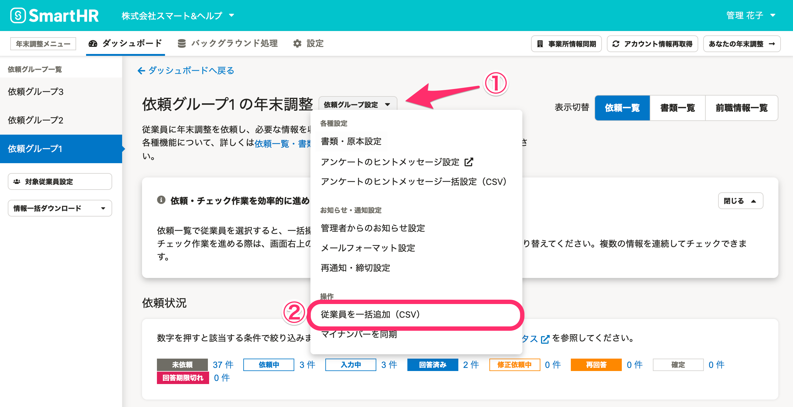
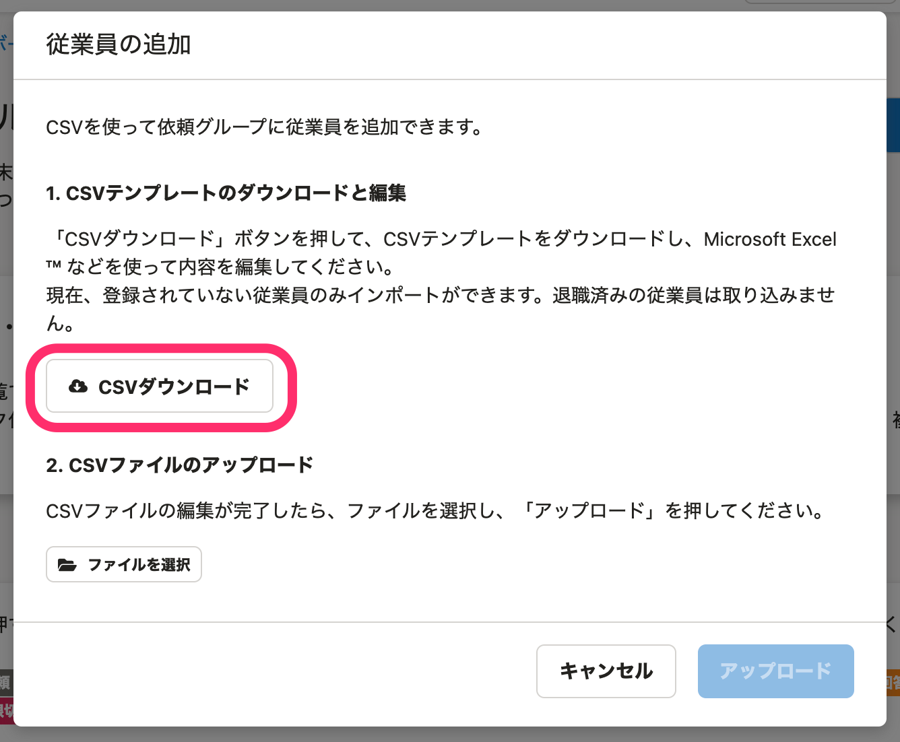
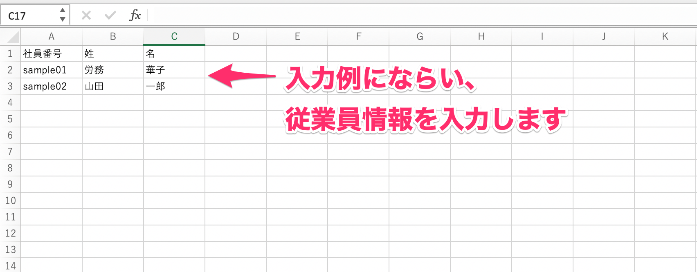
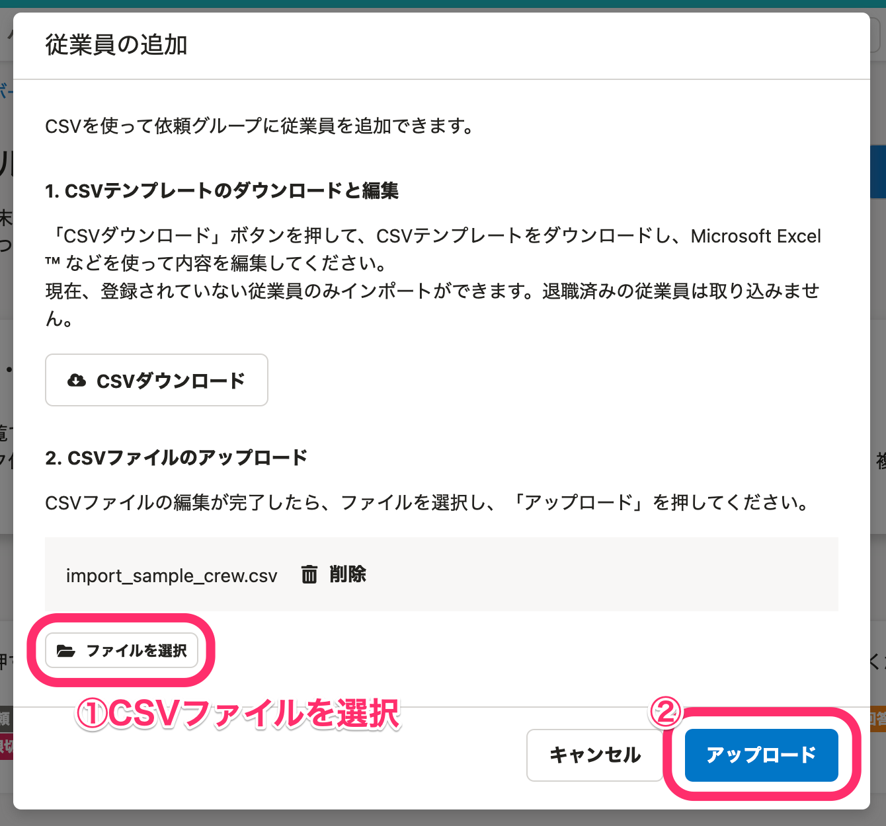
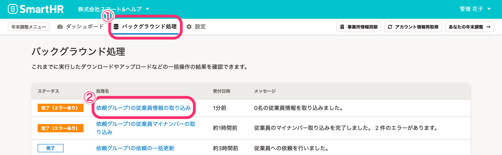
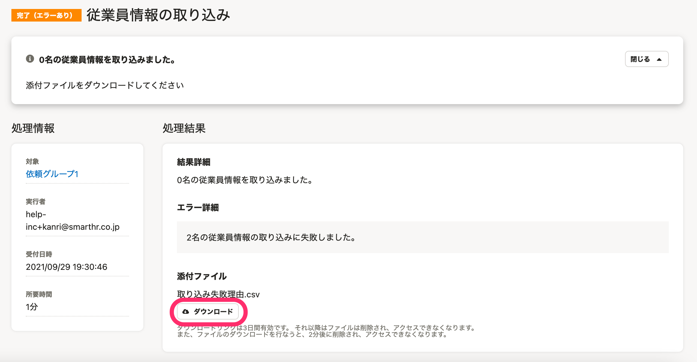

:::alert
当ページで案内しているSmartHRの年末調整機能の内容は、2021年（令和3年）版のものです。
2022年（令和4年）版の年末調整機能の公開時期は秋頃を予定しています。
なお、画面や文言、一部機能は変更になる可能性があります。
公開時期が決まり次第、[アップデート情報](https://smarthr.jp/update)でお知らせします。
:::

年末調整の依頼グループ作成後、CSVファイルを使って依頼グループに従業員を追加する方法を案内します。

:::tips
 **［従業員を一括追加（CSV）］** は、どの依頼グループにも登録されていない従業員のみが対象です。
:::

# 1.［依頼グループ設定▼］>［従業員を一括追加（CSV）］をクリック

依頼一覧画面にある **［依頼グループ設定▼］>［従業員を一括追加（CSV）］** をクリックします。

# 2.［CSVダウンロード］をクリック

 **［従業員の追加］** 画面が表示されるので、 **［CSVダウンロード］** をクリックして、CSVテンプレートをダウンロードします。

# 3\. CSVファイルを編集する

ダウンロードしたCSVファイルを開くと、入力例が記載されています。

例にならい、追加したい従業員の「社員番号」「姓」「名」を入力してください。

編集が終わったら、CSVファイルを上書き保存します。

:::tips
依頼グループに追加する従業員情報は、CSVファイルに入力した「社員番号」をもとにSmartHRの登録情報から取り込みます。
そのため、必須の入力項目は「社員番号」のみで、「姓」「名」の入力は任意です。
退職済みの従業員は取り込みません。
:::

# 4.［ファイルを選択］>［アップロード］をクリック

 **［従業員の追加］** 画面にある **［ファイルを選択］** をクリックし、編集したCSVファイルを選択して **［アップロード］** をクリックすると、バックグラウンド処理が始まります。

# 5\. バックグラウンド処理の完了を待つ

バックグラウンド処理が完了すると、依頼一覧に従業員が追加されます。

:::tips
バックグラウンド処理の状況は、年末調整メニューの **［バックグラウンド処理］** から確認できます。
ステータスが **［完了］** になり、 **［{依頼グループ名}の従業員情報の取り込み］** をクリックすると、処理結果画面に移ります。

エラーが出た場合は、 **［ダウンロード］** をクリックして、取り込み失敗理由のCSVファイルをダウンロードし、エラー内容を確認してください。

:::
