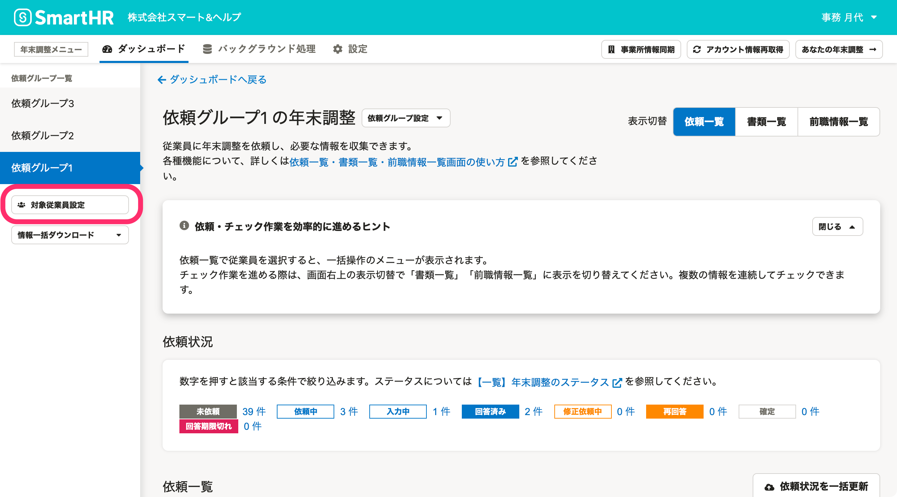
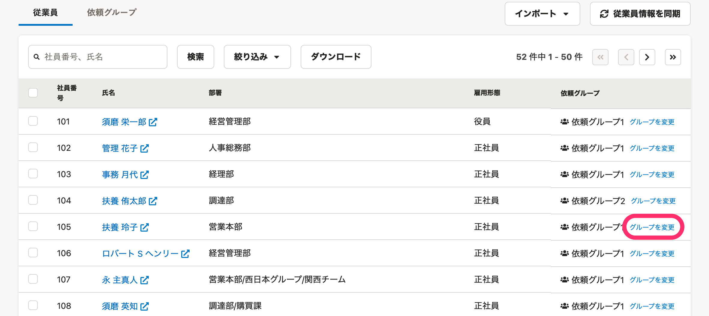

:::alert
当ページで案内しているSmartHRの年末調整機能の内容は、2021年（令和3年）版のものです。
2022年（令和4年）版の年末調整機能の公開時期は秋頃を予定しています。
なお、画面や文言、一部機能は変更になる可能性があります。
公開時期が決まり次第、[アップデート情報](https://smarthr.jp/update)でお知らせします。
:::

年末調整機能で、依頼グループ内の従業員を別の依頼グループに移動する手順を説明します。

:::tips
依頼グループの変更は依頼ステータスが「未依頼」の従業員に限定されていましたが、2021年版では「未依頼」以外の依頼も依頼グループを変更できるようになりました。
:::

# 特定の従業員の依頼グループを変更する

## 1\. 依頼一覧画面の［対象従業員設定］をクリック

 **［対象従業員設定］** をクリックすると、対象従業員設定画面に移動します。

## 2\. 対象従業員の［グループを変更］をクリック

依頼グループを移動する従業員の **［グループを変更］** をクリックすると、 **［依頼グループの変更］** 画面が表示されます。

## 3.［所属させる依頼グループ］を選択・入力して［変更］をクリック

 **［所属させる依頼グループ］** を設定し、 **［変更］** をクリックすると、所属する依頼グループが変更されます。

依頼グループ名の入力欄をクリックすると、作成済みの依頼グループ名が表示されます。

新たに依頼グループを作成する場合は、依頼グループ名の入力欄に依頼グループ名を50文字以内で入力してください。

# 複数の従業員の依頼グループを一括で変更する

複数の従業員の依頼グループを一括で変更したい場合は、下記のヘルプページをご覧ください。

:::related
[年末調整の依頼グループを一括で設定する](https://knowledge.smarthr.jp/hc/ja/articles/4403662363161)
:::

# 依頼グループの変更に伴う、書類や依頼ステータスへの影響

 **「回答期限切れ」** の依頼も含め、どのステータスの依頼であっても、ステータスを変更せず、依頼グループを移動できます。

**依頼グループを変更した場合、基本的に元の依頼ステータスのまま移動し、収集情報、作成された書類にも変更はありません。**

ただし、 **「回答期限切れ」** の依頼を変更する場合や、受付終了日を過ぎた依頼グループに依頼を移動する場合は、以下のとおりステータスが変わる場合があります。

## 「回答期限切れ」の依頼を、他の依頼グループに移動した場合

#### 移動先の依頼グループの受付終了日が、先の日付もしくは未設定の場合

依頼ステータスは、 **「回答期限切れ」** 直前の依頼ステータスに変わります。

#### 移動した依頼グループの受付終了日が、過去の日付の場合

依頼ステータスは、 **「回答期限切れ」** のまま変わりません。

## 「回答期限切れ」ではない依頼を、受付終了日を過ぎている依頼グループに移動した場合

#### 依頼ステータスが「依頼中」「入力中」の依頼を移動させた場合

移動させた翌日のAM8:00に、依頼ステータスが **「回答期限切れ」** に変わります。

#### 依頼ステータスが「未依頼」「修正依頼中」「再回答」「回答済み」「確定」の依頼を移動させた場合

依頼ステータスは、元のステータスのまま変わりません。

## すでに受付終了日を過ぎた依頼グループの受付終了日を、先の日付に変更した場合

#### 依頼ステータスが「回答期限切れ」の依頼の場合

 **「回答期限切れ」** のステータスのまま変わりません。

#### 依頼ステータスが「回答期限切れ」以外の依頼の場合

受付終了日のAM8:00に、依頼ステータスが **「回答期限切れ」** に変わります。

:::related
[Q. 受付終了日後、従業員に年末調整のアンケートに回答してもらいたい場合は？](https://knowledge.smarthr.jp/hc/ja/articles/360037871974)
:::
