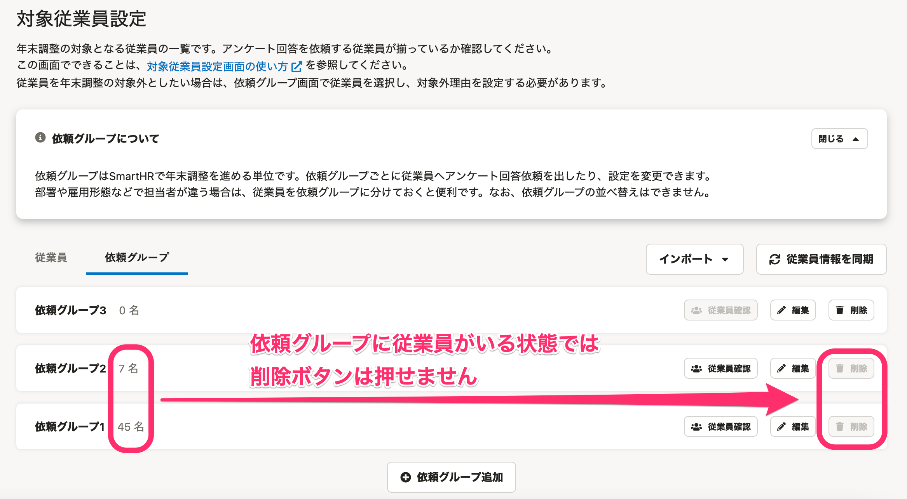
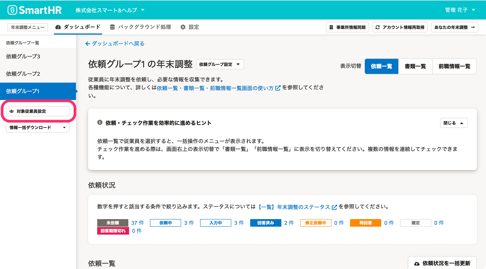
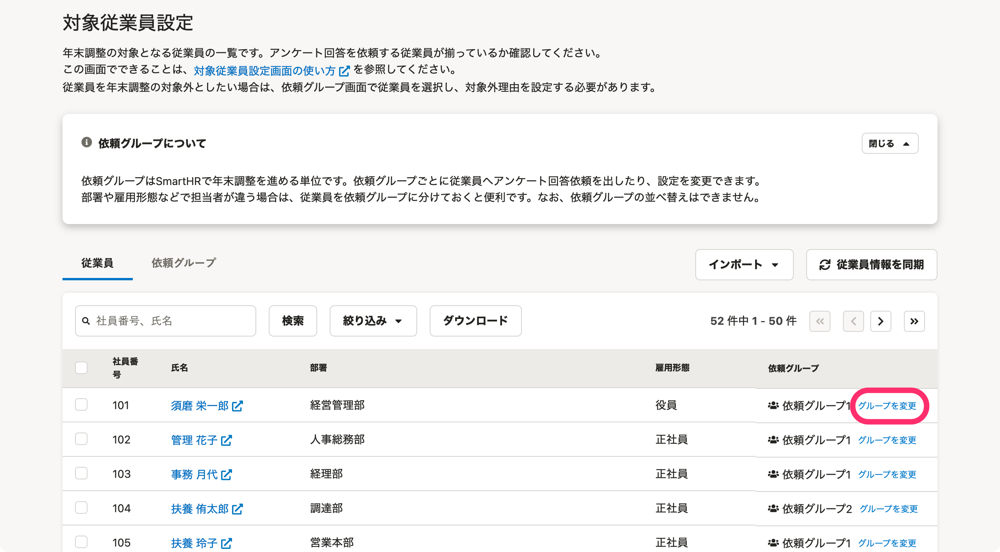
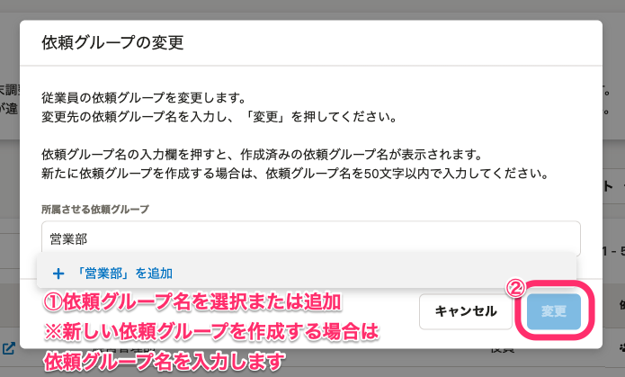
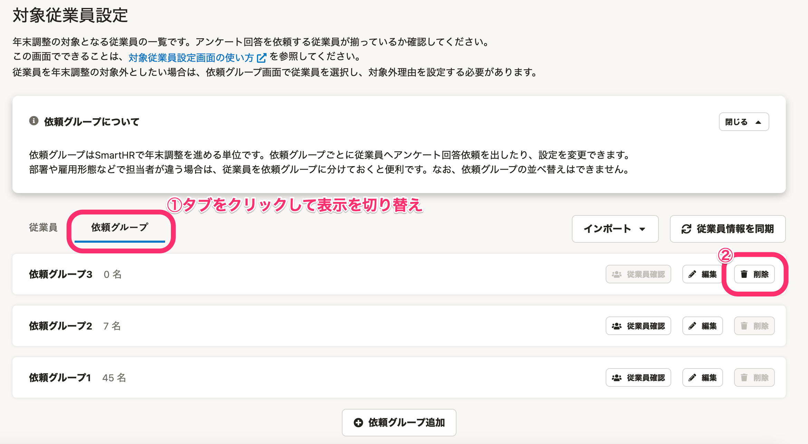
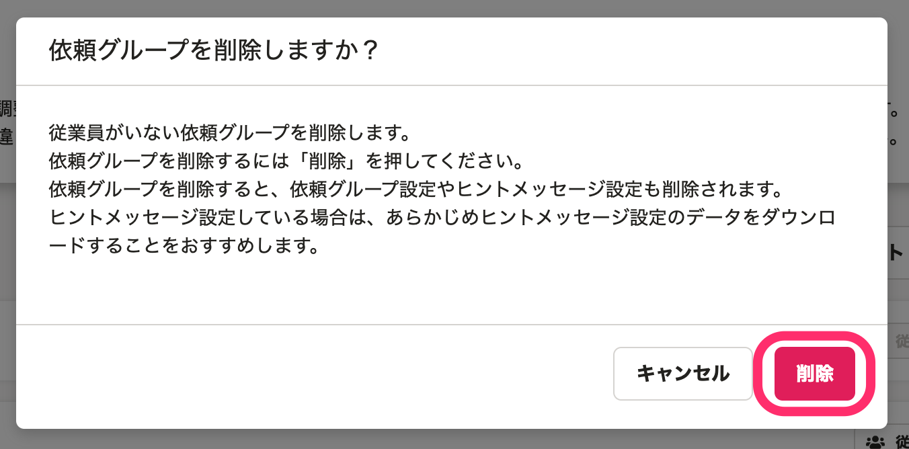
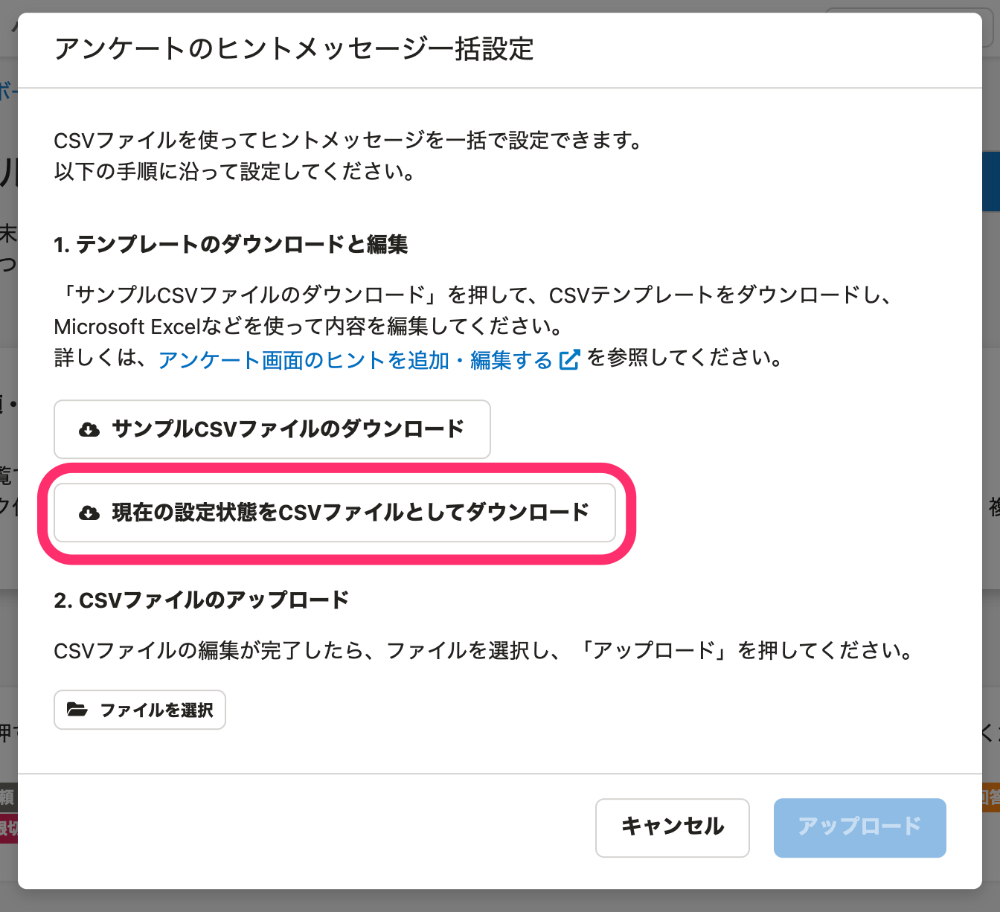
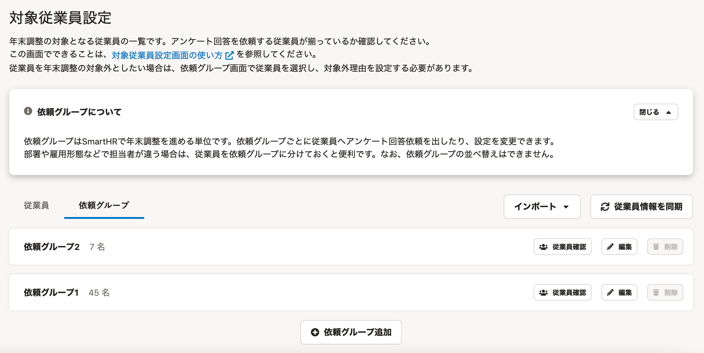

:::alert
当ページで案内しているSmartHRの年末調整機能の内容は、2021年（令和3年）版のものです。
2022年（令和4年）版の年末調整機能の公開時期は秋頃を予定しています。
なお、画面や文言、一部機能は変更になる可能性があります。
公開時期が決まり次第、[アップデート情報](https://smarthr.jp/update)でお知らせします。
:::

年末調整の依頼グループを削除する手順を説明します。

# 事前準備

依頼グループの削除は、依頼グループに従業員がいると実行できません。

下記の通り、依頼グループにいる従業員を他の依頼グループへ移動または削除してください。

## 従業員を他の依頼グループへ移動する（依頼グループを変更する）

 **［対象従業員設定］** をクリックします。

 **［対象従業員設定］** 画面の従業員一覧の右端にある **［グループを変更］** をクリックすると、 **［依頼グループの変更］** という画面が表示されます。

 **［所属させる依頼グループ］** の入力フォーム欄をクリックして、プルダウンメニューから任意の依頼グループを選択し、 **［変更］** をクリックすると依頼グループを変更できます。

新しい依頼グループを作成する場合は、 **［所属させる依頼グループ］** に新しい依頼グループ名を入力してください。

## 従業員を依頼グループから削除する

詳しくは以下のヘルプページをご覧ください。

:::related
[年末調整の依頼一覧から従業員を削除する](https://knowledge.smarthr.jp/hc/ja/articles/360035370413)
:::

# 1.［対象従業員設定］をクリック

 **［対象従業員設定］** をクリックします。

# 2.［依頼グループ］タブに表示を切り替え、［削除］をクリック

 **［依頼グループ］** タブに表示を切り替えて、依頼グループ名の右端にある **［削除］** をクリックすると、確認のダイアログが表示されます。

# 3.［削除］をクリック

内容を確認し、 **［削除］** をクリックすると依頼グループを削除します。

:::alert
依頼グループを削除すると、**依頼グループ設定やヒントメッセージ設定が削除されます**。
ヒントメッセージ設定をしている場合は、必要に応じて、現在の設定をCSVファイルでダウンロードしておいてください。
ダウンロードしたCSVをアップロードすると、ヒントメッセージの再登録ができます。
CSVファイルは、依頼グループ名の横にある **［依頼グループ設定▼］>**   **［アンケートのヒントメッセージ一括設定（CSV）］>［現在の設定状態をCSVファイルとしてダウンロード］** をクリックしてダウンロードしてください。

:::

該当の依頼グループが削除されたことを確認してください。

