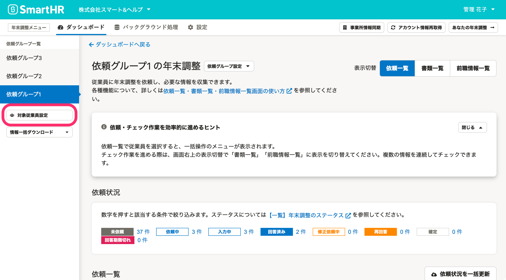
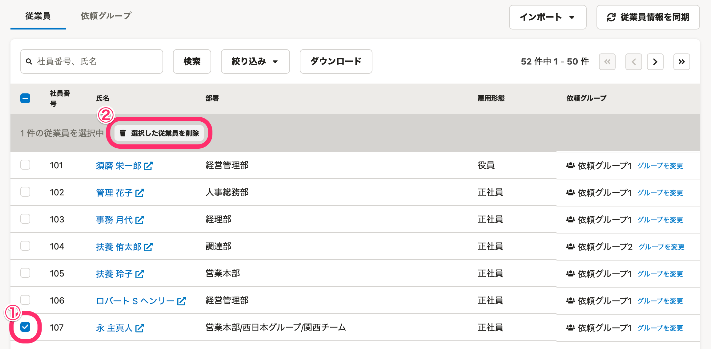
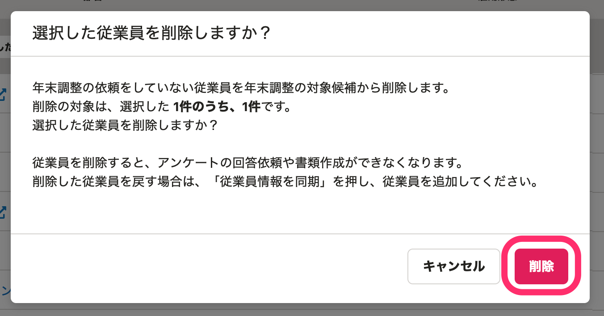

:::alert
当ページで案内しているSmartHRの年末調整機能の内容は、2021年（令和3年）版のものです。
2022年（令和4年）版の年末調整機能の公開時期は秋頃を予定しています。
なお、画面や文言、一部機能は変更になる可能性があります。
公開時期が決まり次第、[アップデート情報](https://smarthr.jp/update)でお知らせします。
:::

年末調整の依頼一覧から従業員を削除する方法を説明します。

なお、SmartHRで従業員情報を更新し、最新情報を年末調整機能に同期したい場合は、従業員の削除と追加が必要です。

当ページで案内している手順に沿って、削除と追加をしてください。

:::tips
一覧から削除できるのは、年末調整の依頼ステータスが **［未依頼］** の従業員のみです。
また、従業員の削除ができるのは管理者権限を持つアカウントのみです。
ステータスを「未依頼」にする手順は、下記のヘルプページをご覧ください。
[年末調整の依頼を「未依頼」に戻す](https://knowledge.smarthr.jp/hc/ja/articles/360034870774)
:::

# 削除にあたっての注意点

## 従業員を削除すると、事前に取り込んだ団体保険料や企業型確定拠出年金のデータも削除されます

削除する従業員の依頼ステータスが「未依頼」の場合、削除した従業員分の団体保険料や企業型確定拠出年金などのデータは、再度、 **［対象従業員設定］** 画面の **［インポート▼］** メニューから取り込めます。

なお、団体保険料や企業型確定拠出年金などのデータを再度取り込む際は、**全員分のデータを取り込まず、削除した従業員に絞って取り込みしてください。**

**削除していない従業員に対しても取り込みが行なわれ、情報が重複して登録されます。**

## 年末調整の対象としたくない従業員は、削除ではなく「対象外」としてください

従業員情報を削除しても、 **［従業員情報を同期］** をクリックすると、削除した従業員が依頼一覧に再度追加されてしまいます。

[Q. 従業員を削除したのに、情報を同期したら再度従業員が追加されてしまった場合は？](https://knowledge.smarthr.jp/hc/ja/articles/360053916713)

# 1.［対象従業員設定］をクリック

［ **対象従業員設定］** をクリックすると、年末調整の対象従業員の一覧画面が表示されます。

# 2\. 削除したい従業員を選択し、［選択した従業員を削除］をクリック

削除したい従業員にチェックを入れると、従業員一覧の項目名の下にメニューボタンが表示されます。

 **［選択した従業員を削除］** をクリックすると、確認画面のダイアログが表示されます。

内容を確認して **［削除］** をクリックすると、依頼一覧から従業員が削除されます。

:::tips
これらの操作は、あくまで年末調整の依頼一覧から従業員を削除するものであり、**SmartHRに登録されている従業員情報は削除されません。**
:::

# 従業員を追加する

CSVファイルを使い、任意の依頼グループに従業員を追加する手順は、下記ヘルプページをご覧ください。

:::related
[年末調整の依頼グループに従業員を一括で追加する](https://knowledge.smarthr.jp/hc/ja/articles/360056088674)
:::
