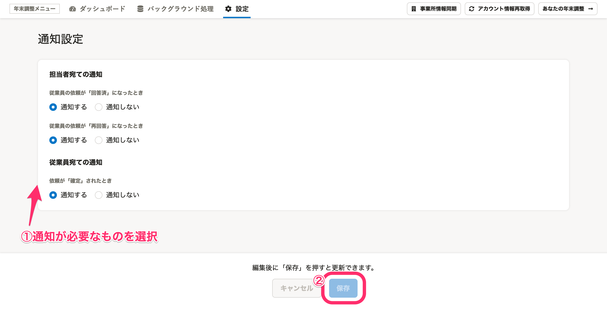

:::alert
当ページで案内しているSmartHRの年末調整機能の内容は、2021年（令和3年）版のものです。
2022年（令和4年）版の年末調整機能の公開時期は秋頃を予定しています。
なお、画面や文言、一部機能は変更になる可能性があります。
公開時期が決まり次第、[アップデート情報](https://smarthr.jp/update)でお知らせします。
:::

年末調整に進捗があった場合、担当者宛て／従業員宛てに通知を設定できます。

| **通知の宛先** | **通知のタイミング** |
| --- | --- |
| 担当者 | 従業員の依頼が「回答済」になったとき |
| 従業員の依頼が「再回答」になったとき |
| 従業員 | 依頼が「確定」されたとき |

:::tips
初期設定では、全項目が「通知する」の設定になっています。通知を必要とする場合は、設定の必要はありません。
:::
:::related
[【一覧】年末調整機能で届く通知（メール）の内容](https://knowledge.smarthr.jp/hc/ja/articles/360039321893)
:::

# 1\. 年末調整メニューの［設定］>［通知設定］をクリック

年末調整メニューの **［設定］>［通知設定］** をクリックすると、通知設定画面へ移動します。

# 2\. 任意の設定を選択し、［保存］をクリック

任意の設定を選択し、 **［保存］** をクリックします。

