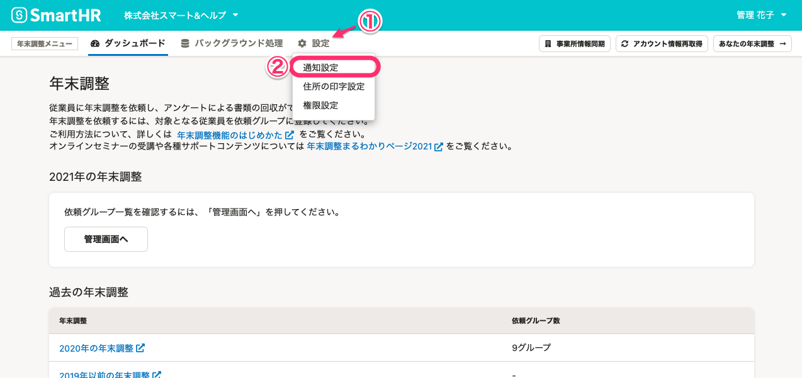
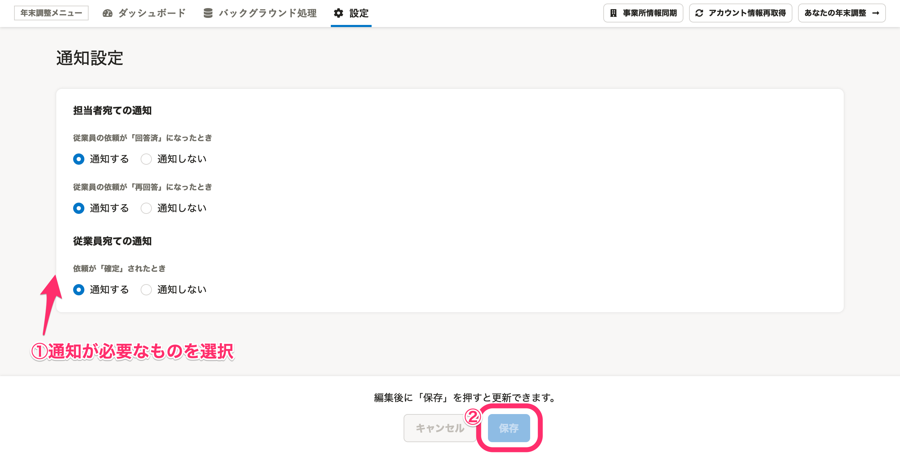

:::alert
当ページで案内しているSmartHRの年末調整機能の内容は、2021年（令和3年）版のものです。
2022年（令和4年）版の年末調整機能の公開時期は秋頃を予定しています。
なお、画面や文言、一部機能は変更になる可能性があります。
公開時期が決まり次第、[アップデート情報](https://smarthr.jp/update)でお知らせします。
:::

通知設定で従業員宛の通知を［ **通知する］** に設定すると、年末調整のステータスを **「確定」** にした際、従業員へ通知できます。

# 1\. 年末調整メニューの［設定］>［通知設定］をクリック

年末調整メニューを **［設定］>［通知設定］** の順にクリックすると、通知設定画面へ移動します。

# 2\. 任意の設定を選択し、［保存］をクリック

従業員宛ての通知を設定し、 **［保存］** をクリックします。

 **［**  **通知する］** を選択した場合、ステータスを **「確定」** にすると従業員に通知されます。

 **［通知しない］** を選択した場合、ステータスを変更しても従業員へ通知されません。

:::tips
書類を差し戻した場合は、通知の設定にかかわらず、従業員に通知されます。
:::

従業員宛ての通知内容は、下記のヘルプページをご覧ください。

:::related
[【一覧】年末調整機能で届く通知（メール）の内容](https://knowledge.smarthr.jp/hc/ja/articles/360039321893)
:::
