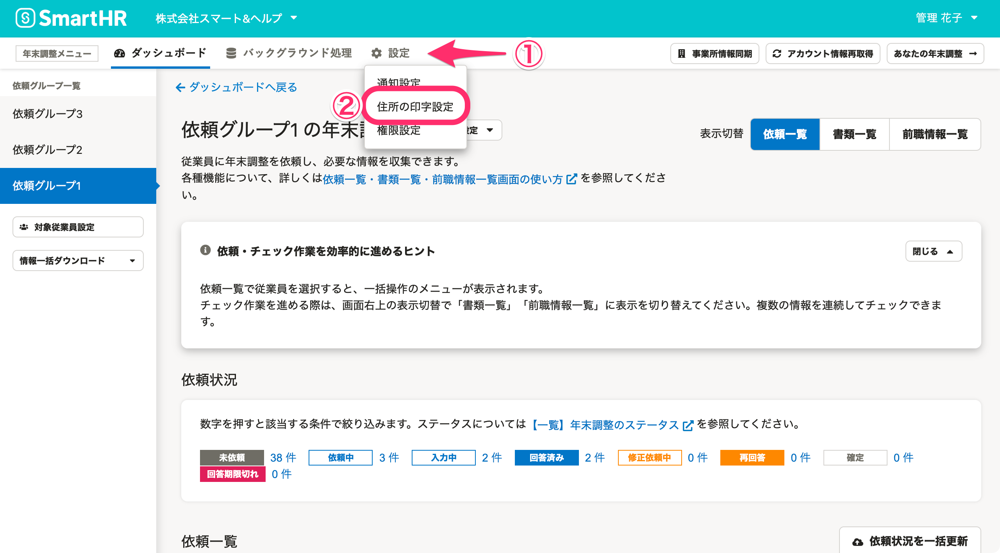
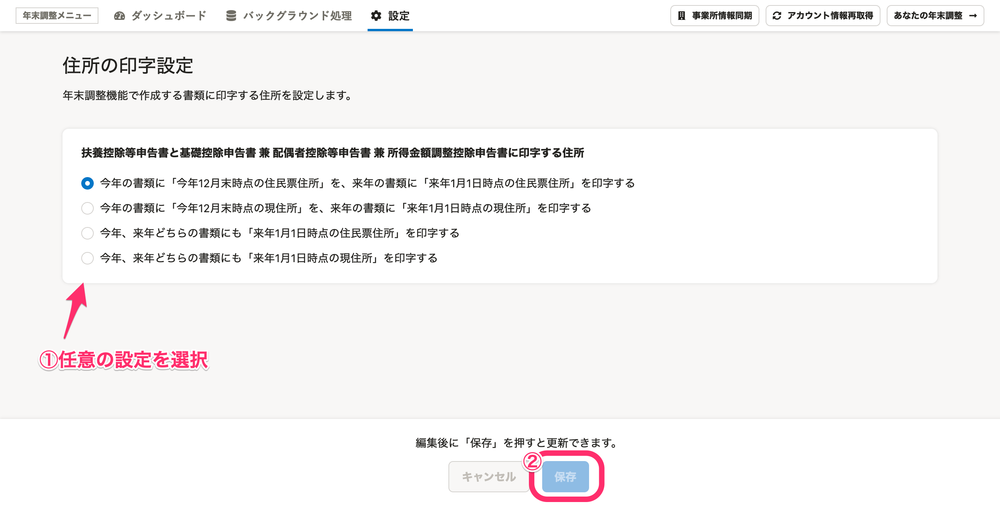

:::alert
当ページで案内しているSmartHRの年末調整機能の内容は、2021年（令和3年）版のものです。
2022年（令和4年）版の年末調整機能の公開時期は秋頃を予定しています。
なお、画面や文言、一部機能は変更になる可能性があります。
公開時期が決まり次第、[アップデート情報](https://smarthr.jp/update)でお知らせします。
:::

年末調整機能で作成する「給与所得者の扶養控除等（異動）申告書」と「給与所得者の基礎控除申告書 兼 給与所得者の配偶者控除等申告書 兼 所得金額調整控除申告書」に、いつ時点の住所を印字するかを設定できます。

:::tips
初期設定から変更する必要がない場合は、操作不要です。初期設定は以下のとおりです。
- 今年の書類に「今年12月末時点の住民票住所」を、来年の書類に「来年1月1日時点の住民票住所」を印字する
:::

# 1\. 年末調整メニューの［設定］>［住所の印字設定］をクリック

年末調整メニューの **［設定］>［住所の印字設定］** をクリックすると、 **［住所の印字設定］** 画面へ移動します。

# 2\. 任意の設定を選択し、［保存］をクリック

年末調整機能で作成する書類に印字したい住所を以下から選択し、 **［保存］** をクリックします。

- 今年の書類に「今年12月末時点の住民票住所」を、来年の書類に「来年1月1日時点の住民票住所」を印字する
- 今年の書類に「今年12月末時点の現住所」を、来年の書類に「来年1月1日時点の現住所」を印字する
- 今年、来年どちらの書類にも「来年1月1日時点の住民票住所」を印字する
- 今年、来年どちらの書類にも「来年1月1日時点の現住所」を印字する

設定は任意のタイミングで変更でき、変更した内容は即時で反映されます。

なお、設定はすべての依頼グループおよび、2020年の年末調整で作成された書類に適用されます。

:::alert
「給与所得者の保険料控除等申告書」と「給与所得者の（特定増改築等）住宅借入金等特別控除申告書」は、住所の印字設定ができません。
書類には印字される住所は以下の通りです。
- 給与所得者の保険料控除等申告書：「今年12月末時点の住民票住所」を印字
- 給与所得者の（特定増改築等）住宅借入金等特別控除申告書：「今年12月末時点の現住所」を印字
:::
