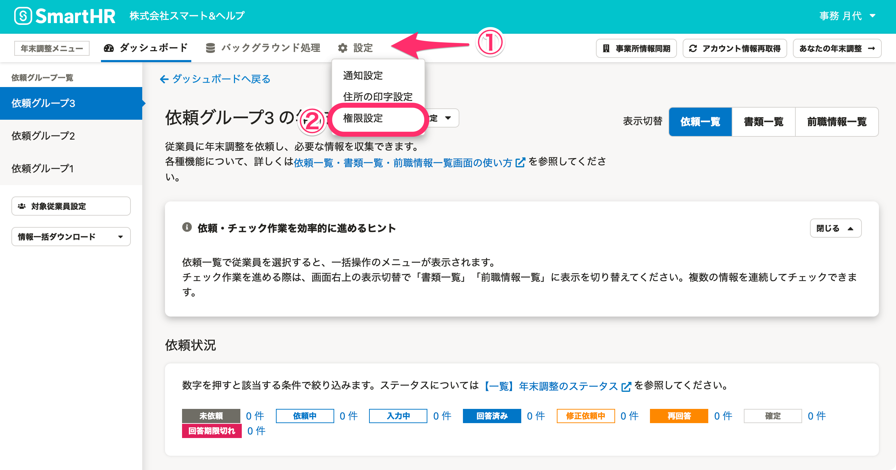
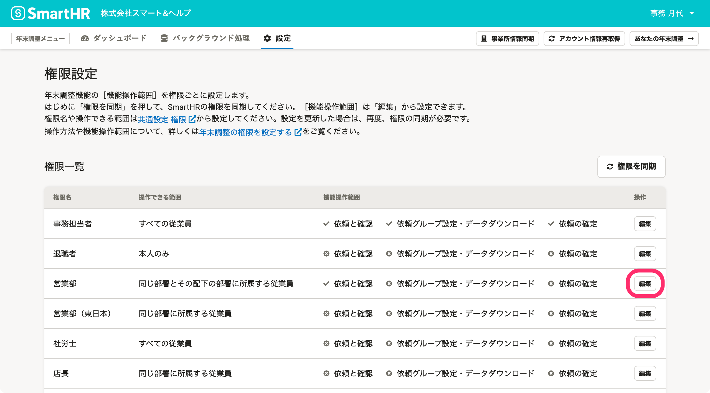
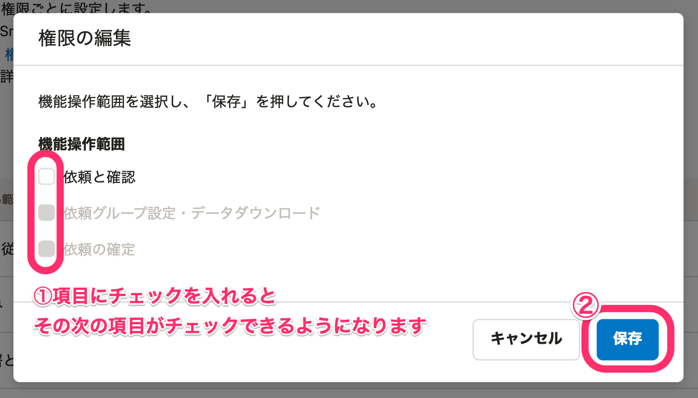
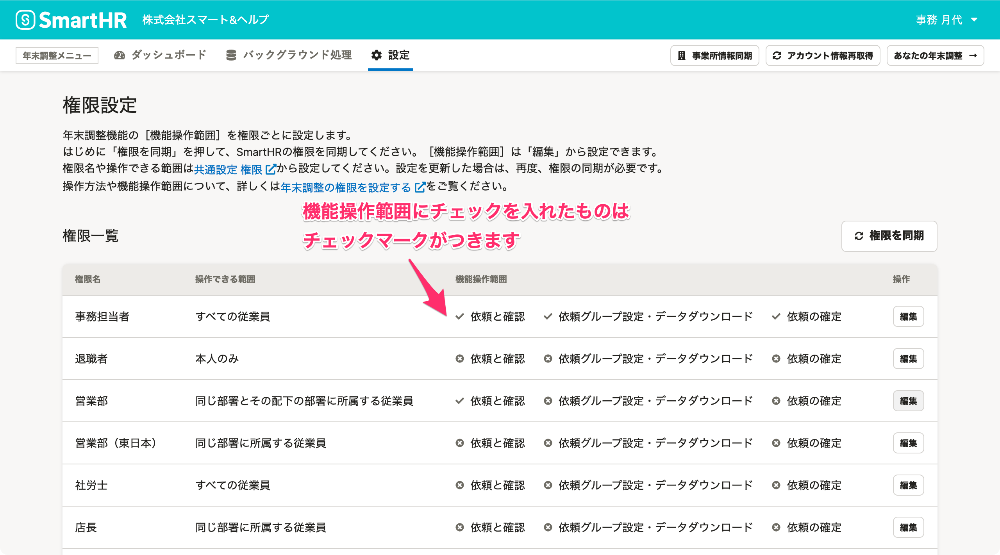
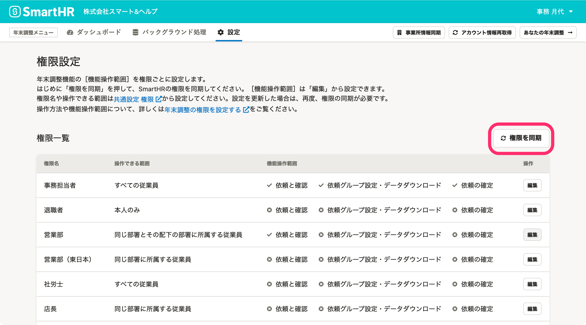
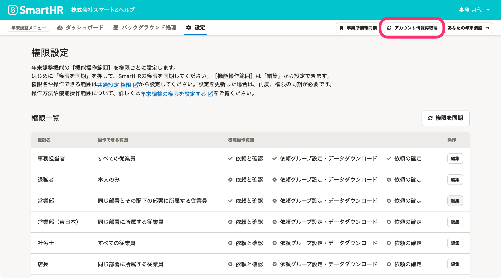

:::alert
当ページで案内しているSmartHRの年末調整機能の内容は、2021年（令和3年）版のものです。
2022年（令和4年）版の年末調整機能の公開時期は秋頃を予定しています。
なお、画面や文言、一部機能は変更になる可能性があります。
公開時期が決まり次第、[アップデート情報](https://smarthr.jp/update)でお知らせします。
:::

年末調整に関する権限は、年末調整メニューにある **［設定］>［権限設定］** から設定できます。

:::alert
年末調整の権限は、管理者権限を持つアカウントによる操作可能範囲の設定が必要です。
それぞれの権限に機能操作範囲を設定してから、年末調整を進めてください。
:::
:::tips
このページで設定できる権限は、従業員が年末調整のアンケートに回答する画面には影響がありません。
年末調整の権限設定にかかわらず、依頼をされたすべての従業員は年末調整のアンケートに回答できます。
:::

# 年末調整の権限とは

年末調整の権限は、SmartHRの **［権限］** に登録している権限と、それに紐づくアカウントおよび操作できる範囲を引き継いでいます。

:::related
[権限設定の［従業員関連］>［操作できる範囲］とは](https://knowledge.smarthr.jp/hc/ja/articles/360026264173)
:::

年末調整の権限設定では、SmartHRに登録している **［権限］** に対して、以下の機能操作範囲を設定します。

- 依頼と確認
- 依頼グループ設定・データダウンロード
- 依頼の確定

:::alert
カスタム権限で操作できる範囲を **［すべての従業員］以外** に設定している場合、カスタム権限を付与した担当者を年末調整の対象として取り込んでいないと、操作できる範囲であっても依頼の閲覧ができません。
お手数ですが、以下いずれかの対応を行なってください。
- 年末調整の対象として従業員を年末調整機能に取り込む
    
- カスタム権限の操作できる範囲を **［すべての従業員］** とする
    
また、年末調整の権限には、部署及び雇用形態の操作できる範囲が適用されますが、兼務先の範囲は適用されませんのでご注意ください。
:::

# 権限の設定手順

## 1\. 年末調整メニューにある［設定］>［権限設定］をクリック

年末調整メニューの **［設定］>［権限設定］** をクリックすると、権限設定画面が表示されます。

## 2\. ［編集］をクリック

編集したい権限名の右端にある **［編集］** をクリックすると、権限の編集画面が表示されます。

## 3\. 権限を設定し、［保存］をクリック

選択した権限の操作可能範囲にチェックを入れて、［ **保存］** をクリックします。

権限を設定すると、機能操作範囲にチェックを入れたものにはチェックマークがつきます。

:::tips
SmartHRに登録している権限や操作できる範囲をカスタムしたい場合は、下記のヘルプページをご覧ください。
[カスタム権限を追加する](https://knowledge.smarthr.jp/hc/ja/articles/360026106594)
:::

# SmartHRで登録している［権限］を変更した場合

SmartHRで登録している権限や操作できる範囲を変更した場合は、 **［権限を同期］** をクリックして、年末調整の権限設定を更新してください。

なお、SmartHRで登録している権限を削除して **［権限を同期］** しても、一度同期した権限は権限一覧から削除できません。

:::alert
従業員に紐付く権限は、 **［権限を同期］** をクリックしても更新されません。
対象となる従業員が **［アカウント情報再取得］** をする必要があります。

:::

# 機能操作範囲ごとの、使用できる機能一覧

| **カテゴリー** | **機能** | **管理者** |   **依頼と 確認**   | **依頼グループ設定・データダウンロード** |   **依頼の確定**   | **権限なし** |
| --- | --- | --- | --- | --- | --- | --- |
| 年末調整の作成 | 2021年の年末調整の作成 | ◯ |    |   |    |   |
| 年末調整全体の設定 | 年末調整への権限の設定  | ◯ |   |   |   |   |
| 通知設定 | ◯ |   |   |   |   |
| 書類への住所印字設定 | ◯ |   |   |   |   |
| 依頼グループの設定 | 依頼グループ名の変更 | ◯ |   |   |   |   |
| 依頼グループの設定（印刷依頼、印字、画像添付、台紙利用） | ◯ |   | ◯ | ◯ |   |
| メールフォーマット編集 | ◯ |   | ◯ | ◯  |   |
| ヒント設定 | ◯ |   | ◯ | ◯ |   |
| 再通知・締切設定 | ◯ |   | ◯ | ◯ |   |
| お知らせ設定 | ◯ |   | ◯ | ◯ |   |
| 年末調整の初期設定・従業員設定 | 依頼グループの初期設定（年末調整設定2/2） | ◯ |   |   |   |   |
| 対象従業員設定画面の表示 | ◯ |   |   |   |   |
| 対象従業員の削除 | ◯ |   |   |   |   |
| 対象従業員の従業員情報の同期 | ◯ |   |   |   |   |
| 昨年の保険料のインポート | ◯ |   |   |   |   |
| 団体保険料のインポート | ◯ |   |   |   |   |
| 団体保険料データの一括削除  | ◯ |   |   |   |   |
| 依頼グループの作成 | ◯ |   |   |   |   |
| 従業員の依頼グループへの紐付け（一括追加含む） | ◯ |   |   |   |   |
| 依頼グループの削除 | ◯ |   |   |   |   |
| 従業員一覧のダウンロード | ◯ |   |   |   |   |
| 年末調整への同期 | 事業所情報の同期 | ◯ |   |   |   |   |
| 依頼グループへの同期 | マイナンバー情報の同期  | ◯ |   |   |   |   |
| 書類に取り込んだマイナンバーの確認 | 書類に印字されたマイナンバーの書類上の表示（ダウンロード時） | ◯ |   |   |   |   |
| 依頼グループをまたいだ情報一括ダウンロード | 依頼グループをまたいだ、すべてのデータダウンロード | ◯ |   |   |   |   |
| 依頼グループを一括操作 | 依頼グループを跨いだCSVファイルによる設定 | ◯ |   |   |   |   |
| 従業員の依頼の未依頼処理 | 依頼を未依頼に戻す | ◯ |   |   |   |   |
| 従業員への依頼と確認       | 担当者ダッシュボードの表示 | ◯ | ◯ | ◯ | ◯ |   |
| 依頼一覧画面の表示 | ◯ | ◯ | ◯ | ◯ |   |
| 従業員への依頼 | ◯ | ◯ | ◯ | ◯ |   |
| 依頼の再通知 | ◯ | ◯ | ◯ | ◯ |   |
| 「依頼の差し戻し」の取り消し | ◯ | ◯ | ◯ | ◯ |   |
| 依頼の対象外設定 | ◯ | ◯ | ◯ | ◯ |   |
| 書類/前職情報一覧画面の表示 | ◯ | ◯ | ◯ | ◯ |   |
| 書類/前職情報の表示 | ◯ | ◯ | ◯ | ◯ |   |
| 書類/前職情報の差し戻し | ◯ | ◯ | ◯ | ◯ |   |
| 書類/前職情報のダブルチェック待ち処理 | ◯ | ◯ | ◯ | ◯ |   |
| 書類/前職情報の確認済み処理 | ◯ | ◯ | ◯ | ◯ |   |
| 収集情報の編集 | ◯ | ◯ | ◯ | ◯ |   |
| 収集情報の修正依頼 | ◯ | ◯ | ◯ | ◯ |   |
| 収集情報の修正依頼の取り消し | ◯ | ◯ | ◯ | ◯ |   |
| 依頼詳細ページの表示 | ◯ | ◯ | ◯ | ◯ |   |
| 従業員の操作履歴閲覧 | ◯ | ◯ | ◯ | ◯ |   |
| 従業員の回答履歴閲覧  | ◯ | ◯ | ◯ | ◯ |   |
| 従業員の台紙ダウンロード | ◯ | ◯ | ◯ | ◯ |   |
| 依頼へのコメント | ◯ | ◯ | ◯ | ◯ |   |
| バックグラウンド処理の閲覧・ダウンロード | バックグラウンド処理一覧と詳細の閲覧および、データのダウンロード  | ◯ |   | ◯ | ◯ |   |
| データダウンロード          | 依頼グループの依頼状況一覧のダウンロード（ダウンロードファイルの作成実行） | ◯ |   | ◯   | ◯ |   |
| 依頼グループの収集情報のダウンロード（ダウンロードファイルの作成実行） | ◯ |   | ◯   | ◯ |   |
| 依頼グループの給与奉行形式のダウンロード（ダウンロードファイルの作成実行）  | ◯ |   | ◯ | ◯ |   |
| 依頼グループの差分リストのダウンロード（ダウンロードファイルの作成実行） | ◯ |   | ◯ | ◯ |   |
| 依頼グループの家族情報一括更新用CSVのダウンロード（ダウンロードファイルの作成実行） | ◯ |   | ◯ | ◯ |   |
| 依頼グループの書類更新日時CSVのダウンロード（ダウンロードファイルの作成実行） | ◯ |   | ◯ | ◯ |   |
| 依頼グループの原本一覧のダウンロード（ダウンロードファイルの作成実行） | ◯   |   | ◯ | ◯ |   |
| 依頼グループの書類一覧のダウンロード（ダウンロードファイルの作成実行） | ◯ |   | ◯ | ◯ |   |
| 依頼グループの書類PDFのダウンロード（ダウンロードファイルの作成実行） | ◯ |   | ◯ | ◯ |   |
| 依頼の確定   | 依頼の確定 | ◯ |   |   | ◯ |   |
| 依頼の確定取り消し | ◯ |   |   | ◯ |   |
| 従業員による入力と提出    | 従業員ダッシュボードの表示 | ◯ | ◯ | ◯ | ◯ | ◯ |
| 自分のアンケート入力 | ◯ | ◯ | ◯ | ◯ | ◯ |
| 差し戻された収集情報のフォーム入力と提出 | ◯ | ◯ | ◯ | ◯ | ◯ |

:::alert
「過去の年末調整一覧」は、管理者権限を持つアカウントでしか閲覧できません。
また、年末調整メニューにある **［設定］>［権限設定］** は、2021年版の年末調整機能に対する設定です。
過去の年末調整については、操作可能範囲の設定はできません。
:::

# CSVファイル・書類PDFのダウンロードについて

CSVファイル・書類PDFのダウンロードは、ファイルを作成したアカウントのみ操作可能です。

同等の権限を持っていても、別のアカウントからはダウンロードできません。

※管理者アカウントは、他のアカウントがダウンロードを実行したファイルもダウンロードできます。

**ダウンロードリンクの仕様**

- ダウンロードリンクは3日間有効です。それ以降はファイルは削除され、アクセスできなくなります。
- ファイルをダウンロードすると、ダウンロードリンクは2分後に削除され、アクセスできなくなります。
