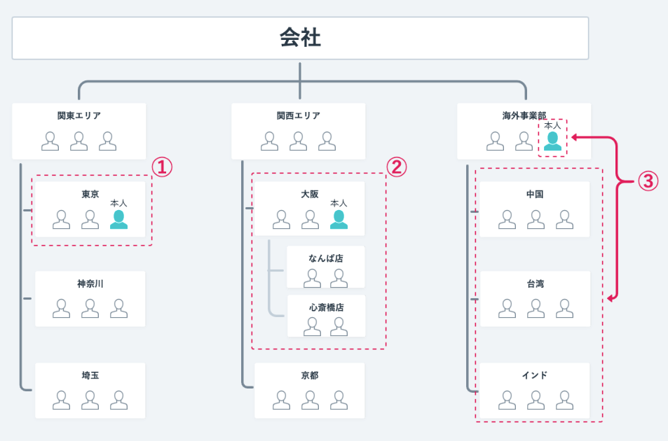
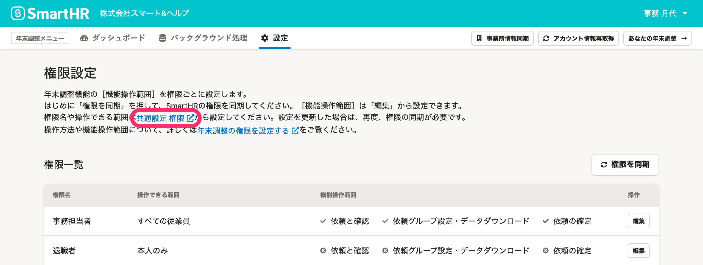
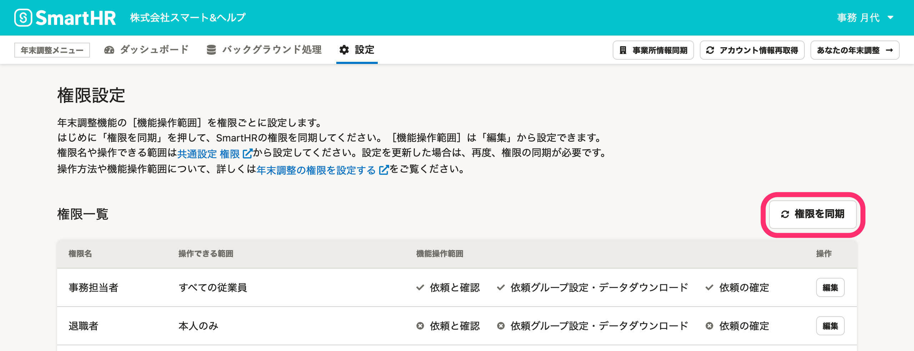
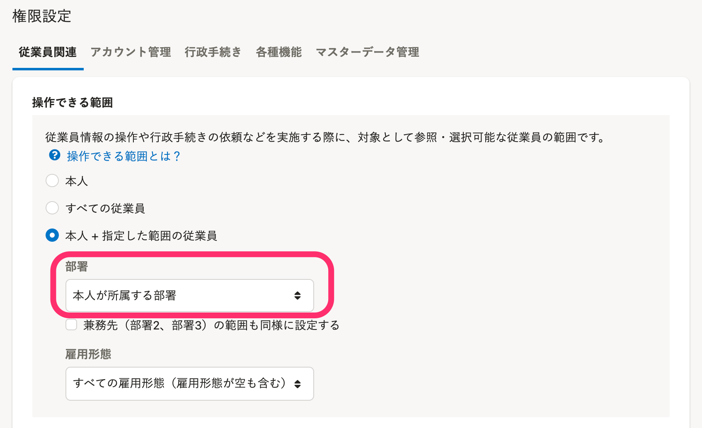
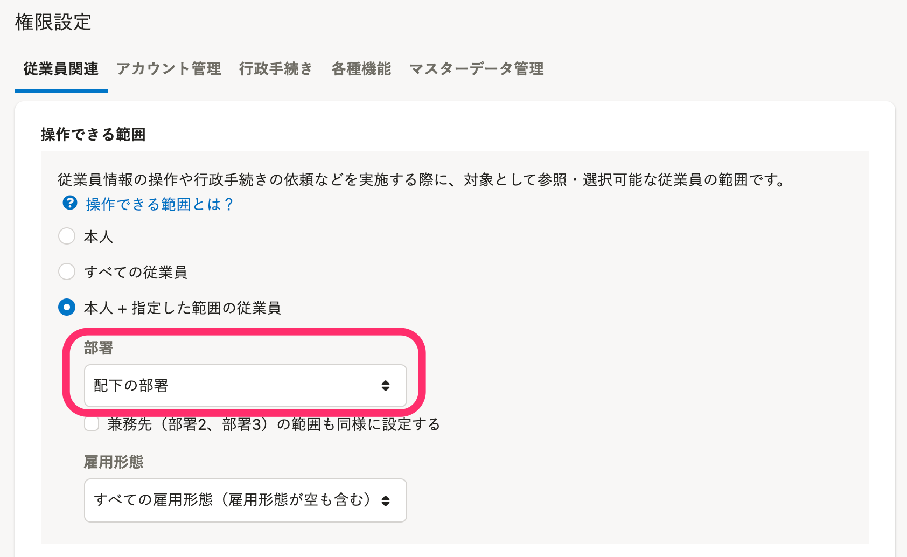
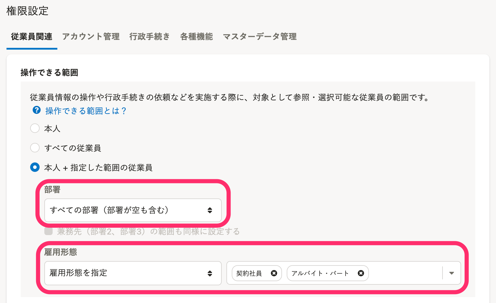

:::alert
当ページで案内しているSmartHRの年末調整機能の内容は、2021年（令和3年）版のものです。
2022年（令和4年）版の年末調整機能の公開時期は秋頃を予定しています。
なお、画面や文言、一部機能は変更になる可能性があります。
公開時期が決まり次第、[アップデート情報](https://smarthr.jp/update)でお知らせします。
:::

年末調整の提出内容チェックを複数人で進める場合、従業員情報の閲覧・操作制限をかけるには個別の権限設定が必要です。

「担当部署の従業員のみチェックを任せたい」「雇用形態ごとで業務を分担したい」場合などに使える、4つの権限設定を紹介します。

- 「本人が所属する部署の従業員」を対象とする権限設定（下図①）
- 「本人が所属する部署と、その配下の部署に含まれる従業員」を対象とする権限設定（下図②）
- 「本人が所属する部署の配下の部署の従業員」を対象とする権限設定（下図③）
- 「特定の雇用形態の従業員」を対象とする権限設定

年末調整の権限設定の仕様や設定手順、よくある質問は以下のヘルプページを参照してください。

:::related
[年末調整の権限を設定する](https://knowledge.smarthr.jp/hc/ja/articles/360037373434)
:::

[年末調整の権限に関するよくある質問](https://knowledge.smarthr.jp/hc/ja/sections/4910647552537)

# 事前準備と、権限設定の年末調整機能への反映方法

## 事前準備

SmartHRの権限設定画面を開いてから操作を進めてください。

SmartHRの権限設定画面は、年末調整機能の権限設定画面にある **［共通設定 権限］** をクリックすると別ウィンドウで表示できます。

:::related
[カスタム権限を追加する](https://knowledge.smarthr.jp/hc/ja/articles/360026106594)
:::

## 権限設定の年末調整機能への反映方法

SmartHRで権限設定を追加・更新した後は、年末調整機能の権限設定画面で **［権限を同期］** をクリックして権限を同期してください。

# 「本人が所属する部署の従業員」を対象とする権限設定

 **［従業員関連］** タブにある **［操作できる範囲］** を以下のとおり設定してください。

- 操作できる範囲： **［本人＋指定した範囲の従業員］** 
- 部署： **［本人が所属する部署］** 
- 雇用形態： **［すべての雇用形態（雇用形態が空も含む）］** 

# 「本人が所属する部署と、その配下の部署に含まれる従業員」を対象とする権限設定

 **［従業員関連］** タブにある **［操作できる範囲］** を以下のとおり設定してください。

- 操作できる範囲： **［本人＋指定した範囲の従業員］** 
- 部署： **［本人が所属する部署＋配下の部署］** 
- 雇用形態： **［すべての雇用形態（雇用形態が空も含む）］** 

# 「本人が所属する部署の配下の部署の従業員」を対象とする権限 

 **［従業員関連］** タブにある **［操作できる範囲］** を以下のとおり設定してください。

- 操作できる範囲： **［本人＋指定した範囲の従業員］** 
- 部署： **［配下の部署］** 
- 雇用形態： **［すべての雇用形態（雇用形態が空も含む）］** 

# 「特定の雇用形態の従業員」を対象とする権限設定

 **［従業員関連］** タブにある **［操作できる範囲］** を以下のとおり設定してください。

- 操作できる範囲： **［本人＋指定した範囲の従業員］** 
- 部署： **［すべての部署（部署が空も含む）］** 
- 雇用形態： **［雇用形態を指定］** を選択し、任意の雇用形態を指定

例：雇用形態が「契約社員」「アルバイト・パート」の従業員を対象とする場合

:::tips
部署と雇用形態の設定を組み合わせることで「特定の部署の、特定の雇用形態の従業員」といったより柔軟な指定も可能です。
:::
