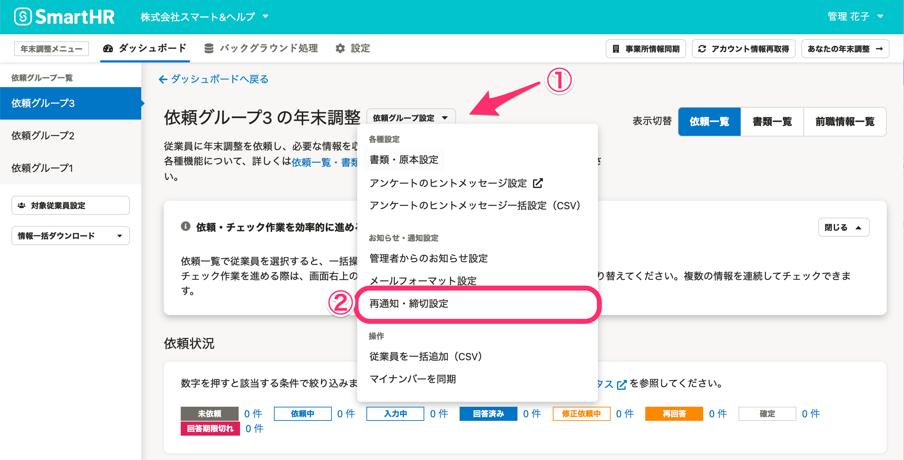
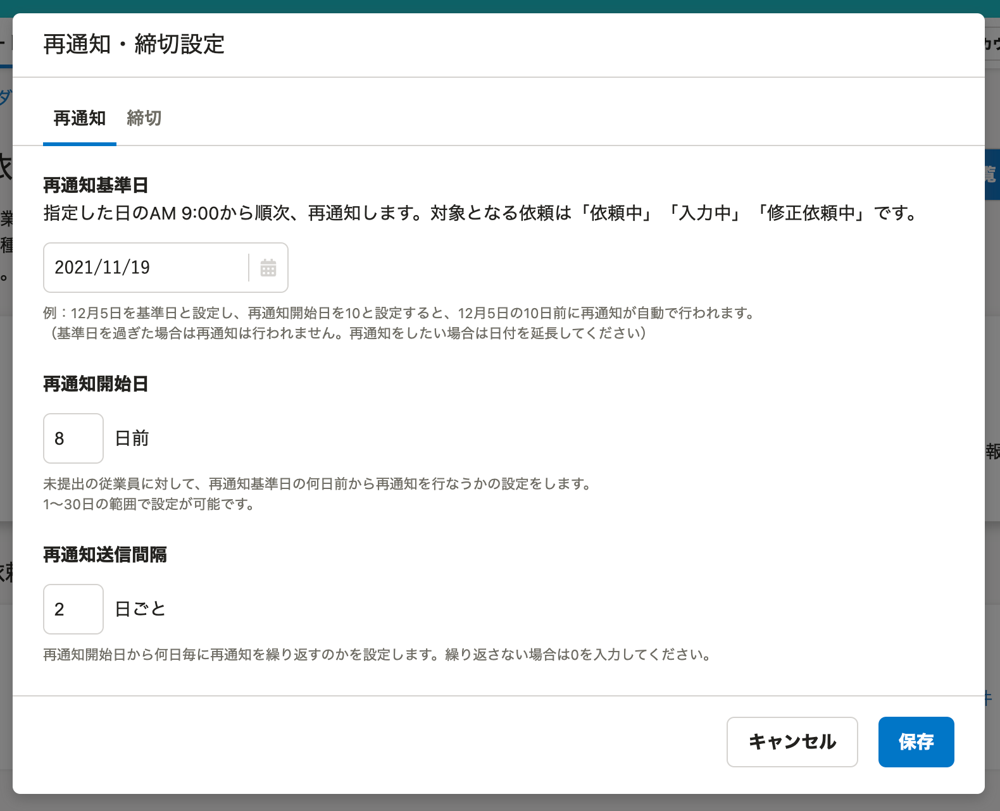
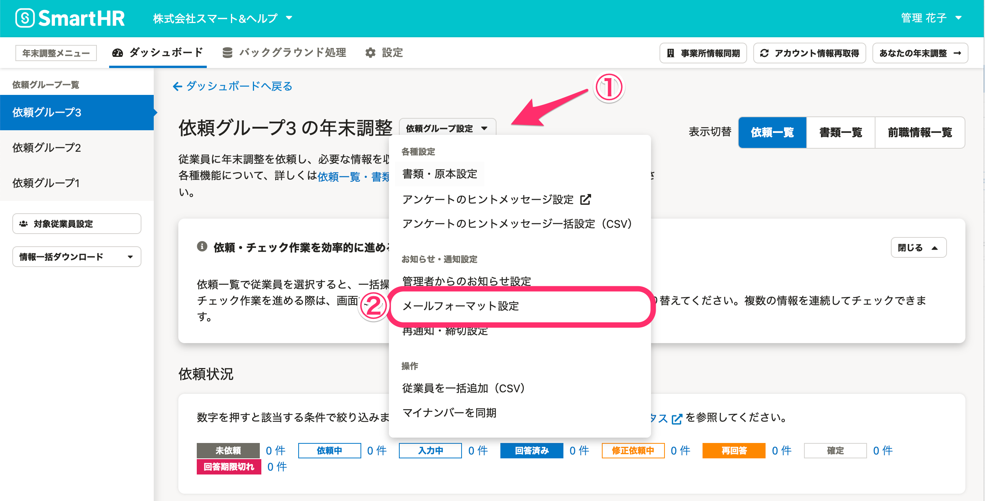
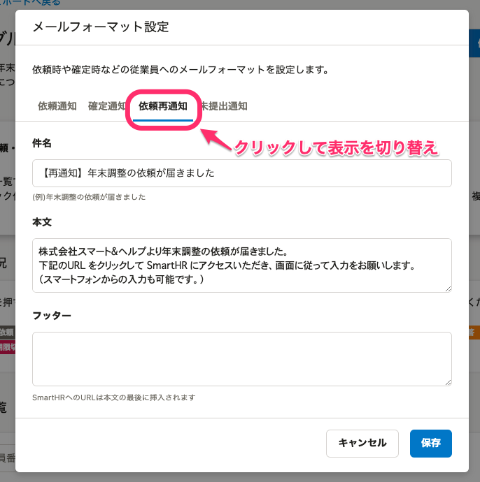
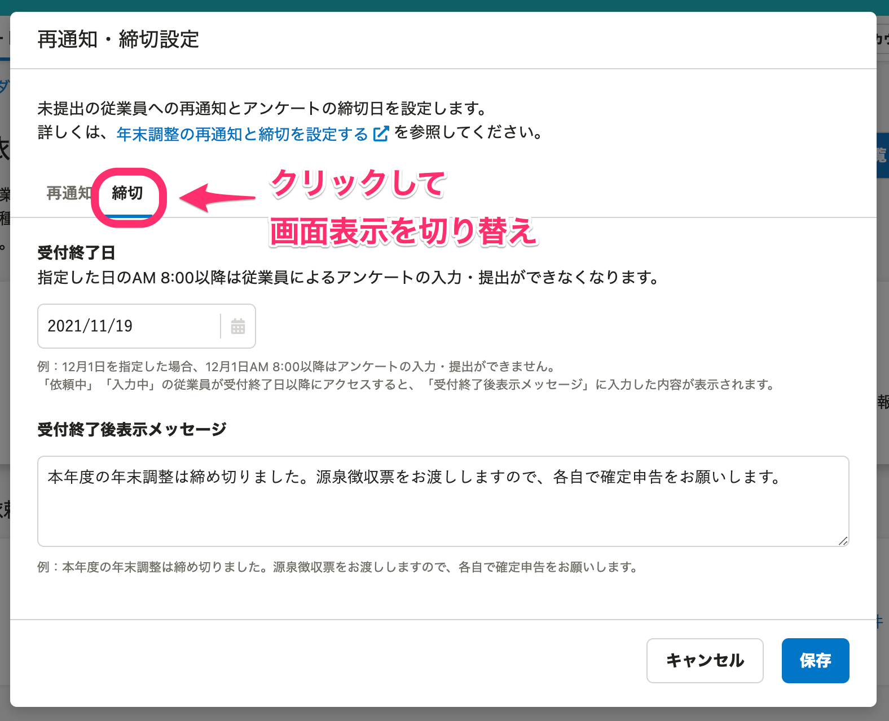
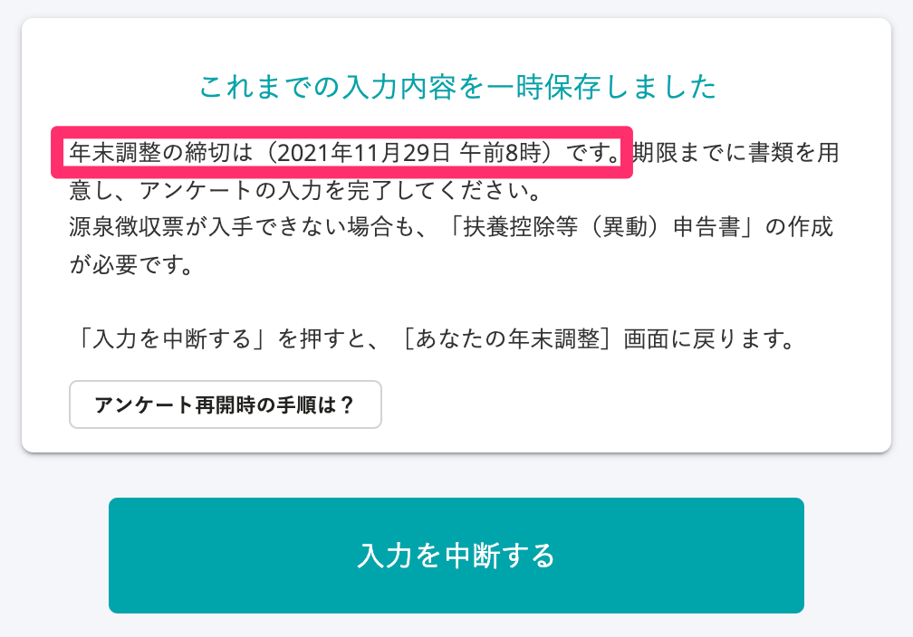
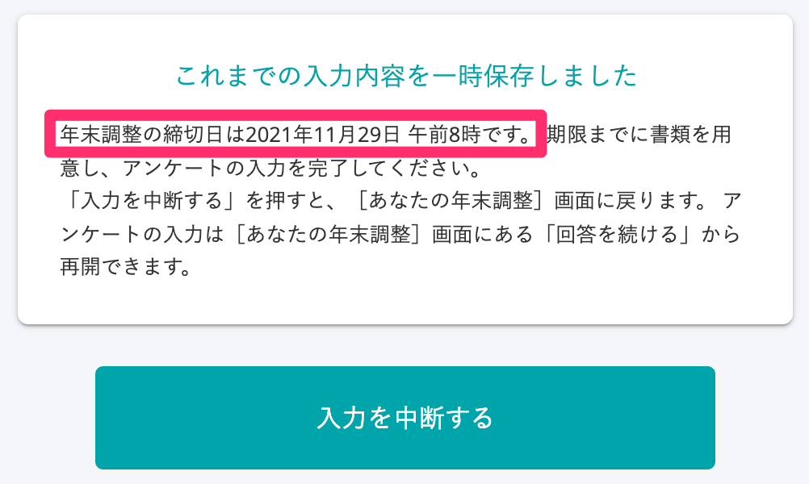

:::alert
当ページで案内しているSmartHRの年末調整機能の内容は、2021年（令和3年）版のものです。
2022年（令和4年）版の年末調整機能の公開時期は秋頃を予定しています。
なお、画面や文言、一部機能は変更になる可能性があります。
公開時期が決まり次第、[アップデート情報](https://smarthr.jp/update)でお知らせします。
:::

依頼グループごとに、年末調整が未提出の従業員への再通知設定や提出締切日の設定ができます。

依頼グループ名の横にある  **［依頼グループ設定▼］>［再通知・締切設定］** をクリックすると、年末調整の **［再通知・締切設定］** 画面に移動します。

# 再通知設定

再通知機能を使うと、従業員宛てのリマインドメールを自動で送信でき、未提出の従業員への連絡がスムーズになります。

下図は、2021年11月19日を基準日として、その8日前（11/11）から2日おきに再通知を実施する場合の設定例です。

従業員からの提出状況次第で、 **［再通知開始日］** や **［再通知送信間隔］** を変更するなどして通知してください。

:::tips
再通知メールの内容を編集したい場合は、 **［依頼グループ設定▼］>［メールフォーマット設定］** をクリックします。

 **［依頼再通知］** タブをクリックし、内容を編集してください。
依頼再通知メールには、年末調整の締切を記載することをおすすめします。

:::

# 締切設定

 **［再通知・締切設定］** の **［締切］** タブをクリックすると、アンケート回答の受付終了日や受付終了後に表示されるメッセージが設定できます。

 **［受付終了日］** のAM8:00以降に年末調整画面に従業員がアクセスすると、 **［受付終了後表示メッセージ］** が表示され、年末調整の入力・提出ができなくなります。

例えば、下図のように設定すると、2021年11月19日のAM8:00以降に従業員がアクセスすると、「本年度の年末調整は締め切りました。源泉徴収票をお渡ししますので、各自で確定申告をお願いします。」と表示され、入力・提出ができなくなります。

:::tips
受付終了日を過ぎても、依頼ステータスが「回答期限切れ」になっていない依頼に対しては、管理者による差し戻しや修正依頼、従業員による修正・再提出が可能です。
- 例：受付終了日までに年末調整のアンケート回答を完了している（依頼ステータスが「回答済み」になっている）従業員に差し戻し・修正依頼をする
- 例：書類の差し戻しにより、依頼のステータスが「修正依頼中」の従業員が、受付終了日を過ぎてから入力・提出をする
:::

ただし、受付終了日時点で依頼ステータスが「回答期限切れ」になった依頼には、差し戻しや修正依頼はできません。

受付終了日後に、従業員に年末調整のアンケートに回答してもらいたい場合は、下記のヘルプページをご覧ください。

:::related
[Q. 受付終了日後、従業員に年末調整のアンケートに回答してもらいたい場合は？](https://knowledge.smarthr.jp/hc/ja/articles/360037871974)
:::

## アンケート画面の表示

設定した受付終了日は、年末調整のアンケート画面に表示されます。

受付終了日を表示する設問は以下2つです。

■「源泉徴収票を入手して後日入力する」を選択し、アンケート回答を途中でやめる場合

■住宅ローン控除の申告に必要な書類について「書類が手元にないため後日入力する」を選択し、アンケート回答を途中でやめる場合

:::alert
上記以外の画面では、従業員は受付終了日を確認できません。
従業員に受付終了日（締切）を伝える方法は、以下を参考にしてください。
- メールフォーマット設定を使い、依頼通知・依頼再通知メールに締切日を記載する
    （操作手順は当ページの「再通知設定」をご覧ください）
- 管理者からのお知らせ設定を使い、従業員の年末調整画面に締切日を表示する
    [従業員の年末調整画面に管理者からのお知らせを設定する](https://knowledge.smarthr.jp/hc/ja/articles/360053347974)
:::
