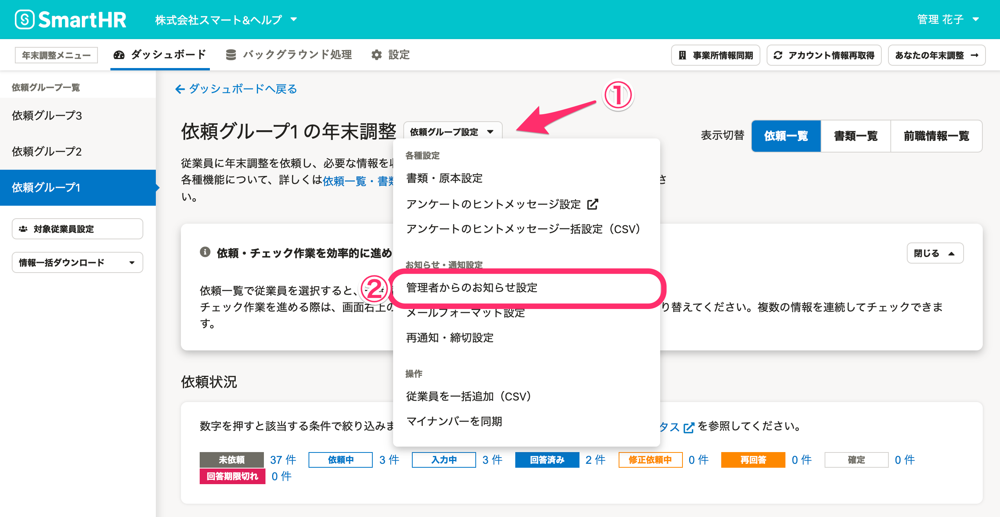
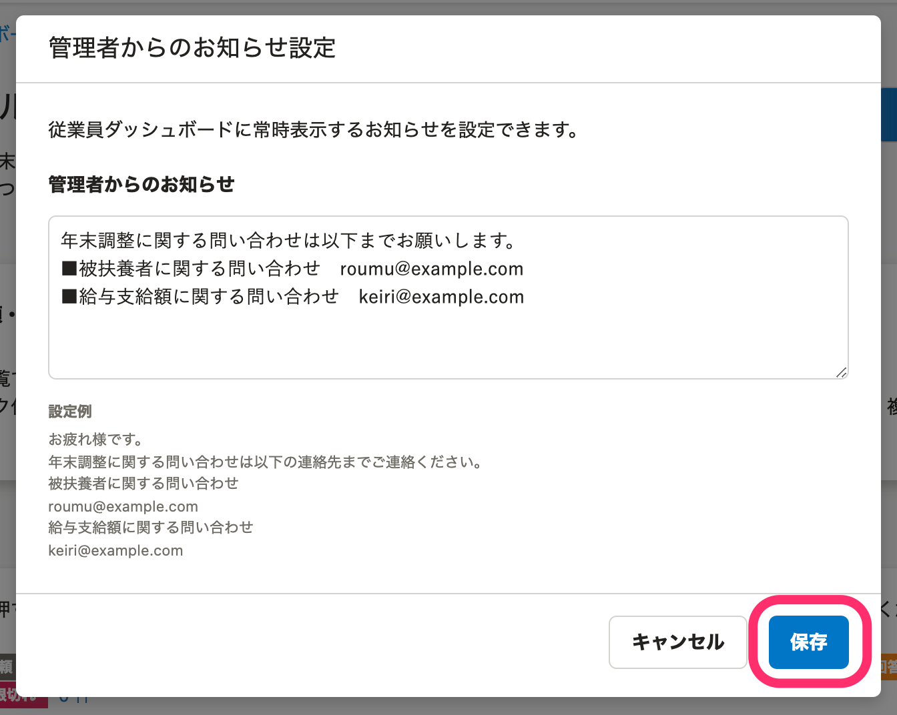
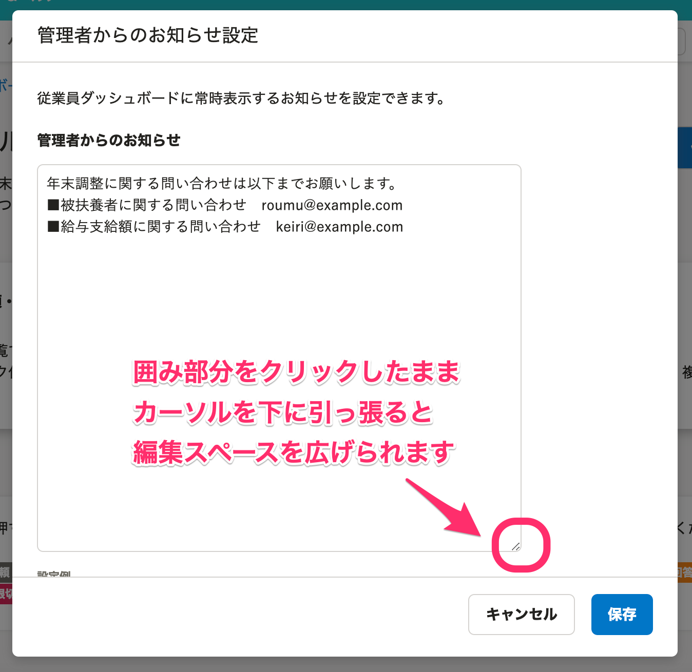
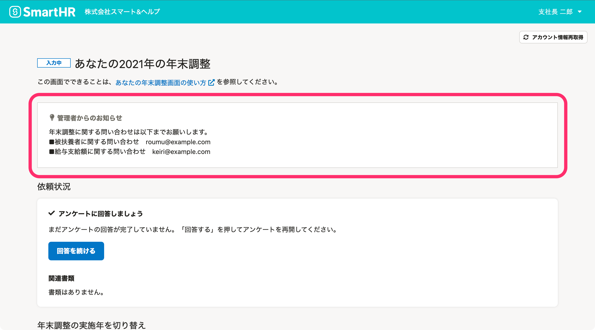

:::alert
当ページで案内しているSmartHRの年末調整機能の内容は、2021年（令和3年）版のものです。
2022年（令和4年）版の年末調整機能の公開時期は秋頃を予定しています。
なお、画面や文言、一部機能は変更になる可能性があります。
公開時期が決まり次第、[アップデート情報](https://smarthr.jp/update)でお知らせします。
:::

依頼グループごとに、従業員の年末調整画面に表示する「管理者からのお知らせ」を設定できます。

:::tips
入力可能な文字数に制限はありません。なお、リンクや画像の挿入はできない仕様です。
:::

# 1\. ［依頼グループ設定▼］>［管理者からのお知らせ設定］をクリック

依頼グループ名の横にある **［依頼グループ設定▼］>**  **［管理者からのお知らせ設定］** をクリックすると、設定画面のダイアログが表示されます。

# 2\. お知らせの文章を入力し、［保存］をクリック

従業員ダッシュボードに表示したい文章を **［管理者からのお知らせ］** 欄に入力し、 **［保存］** をクリックします。

:::tips
入力スペースの大きさは、右下にある斜線部分をクリックしたままカーソルを下に引っ張ると変更できます。

:::

# 従業員側の画面表示

管理者からのお知らせは、年末調整のトップページ（あなたの年末調整画面）に表示されます。

