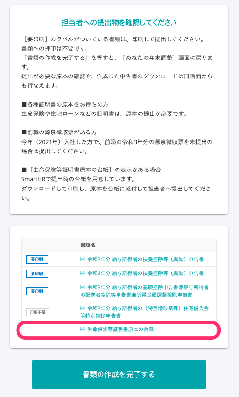
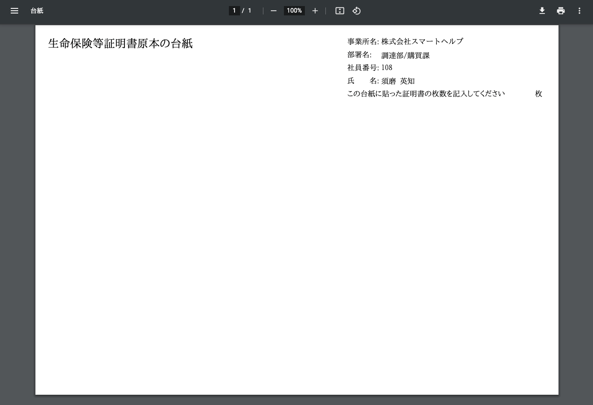
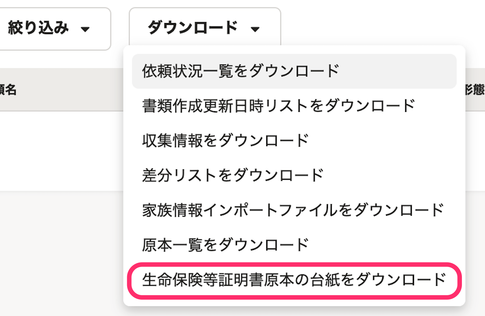
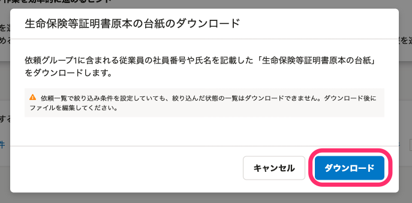

:::alert
当ページで案内しているSmartHRの年末調整機能の内容は、2021年（令和3年）版のものです。
2022年（令和4年）版の年末調整機能の公開時期は秋頃を予定しています。
なお、画面や文言、一部機能は変更になる可能性があります。
公開時期が決まり次第、[アップデート情報](https://smarthr.jp/update)でお知らせします。
:::

SmartHRでは、年末調整時に従業員が証明書などの原本を貼り付けて提出できる「生命保険等証明書原本の台紙」を用意しています。

# 従業員が台紙をダウンロードして提出する場合

## 設定方法

従業員の原本提出用の台紙として、SmartHRが用意したものを使用する場合は、年末調整の依頼グループごとに「生命保険等証明書原本の台紙」を利用するかどうかの設定ができます。

詳しくは下記のヘルプページをご確認ください。

[年末調整の依頼グループの設定と変更方法](https://knowledge.smarthr.jp/hc/ja/articles/360038197674)

## 使用方法

管理者が台紙の設定をしたうえで、従業員が年末調整のアンケートに回答すると、最後の設問で従業員が台紙のPDFファイルをダウンロードできます。

証明書を貼りつけて提出するよう、従業員に依頼してください。

# 管理者から従業員に台紙を配布する場合

従業員がダウンロードするのではなく、管理者から従業員に台紙を配布したい場合は、下記の手順で台紙を一括ダウンロードできます。

## 1.［依頼一覧］>［ダウンロード▼］>［生命保険等証明書原本の台紙をダウンロード］をクリック

 **［依頼一覧］** 画面にある **［ダウンロード▼］** をクリックするとプルダウンメニューが表示されます。

 **［生命保険等証明書原本の台紙をダウンロード］** をクリックしてください。

## 2.［ダウンロード］をクリック

台紙のダウンロードについて確認画面が表示されるので、 **［ダウンロード］** をクリックすると、バックグラウンド処理が始まります。

## 3\. PDFファイルを確認する

年末調整メニューの **［バックグラウンド処理］** をクリックします。

ステータスが **［完了］** に変わったら、 **［{依頼グループ名}生命保険等証明書原本の台紙］** をクリックすると、処理結果画面に移動します。

 **［ダウンロード］** をクリックして、PDFファイルをダウンロードしてください。

# 台紙をカスタマイズしたい場合

台紙の項目をカスタマイズしたい場合は、下記のWordファイルをお役立てください。

差し込み印刷を活用して、自社用に各項目を編集していただくと便利です。

[生命保険等証明書原本の台紙.docx](./_____________.docx)
