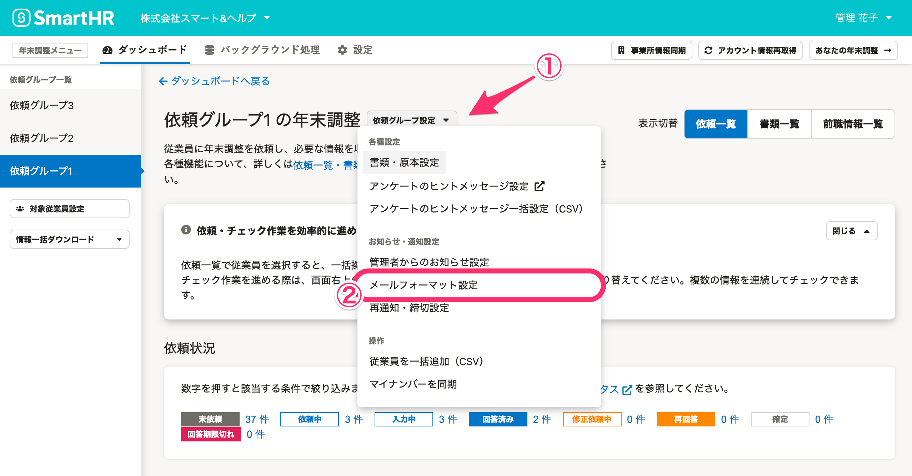
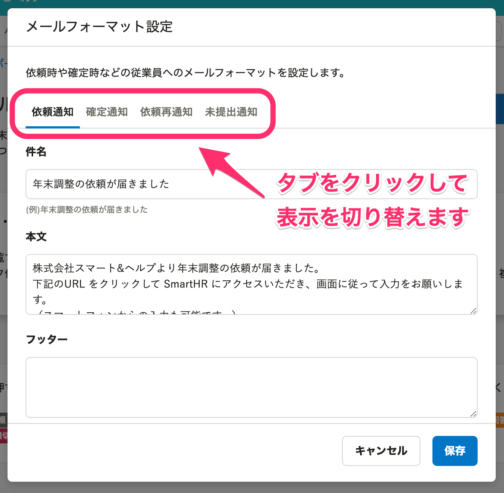
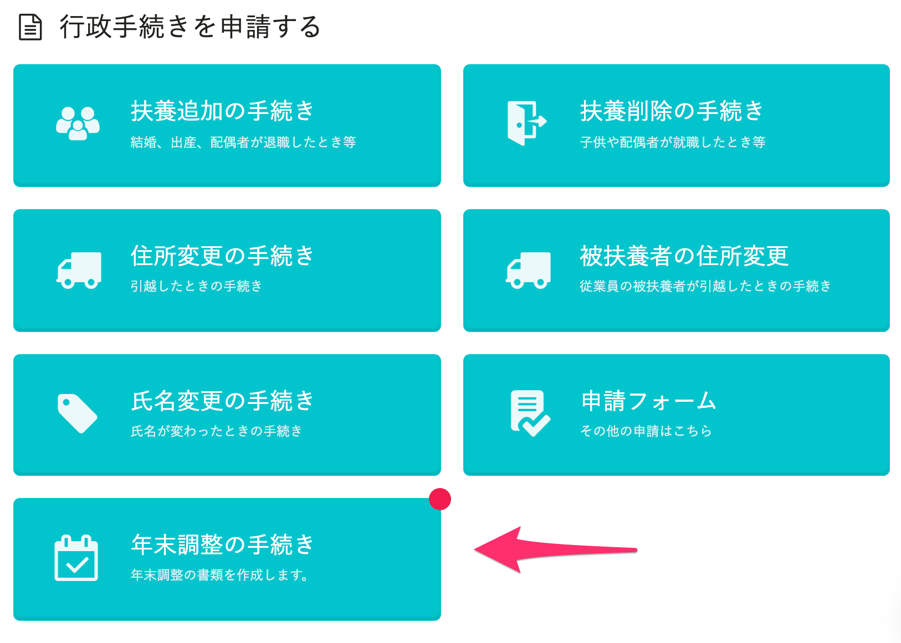

:::alert
当ページで案内しているSmartHRの年末調整機能の内容は、2021年（令和3年）版のものです。
2022年（令和4年）版の年末調整機能の公開時期は秋頃を予定しています。
なお、画面や文言、一部機能は変更になる可能性があります。
公開時期が決まり次第、[アップデート情報](https://smarthr.jp/update)でお知らせします。
:::

年末調整機能で届く通知（メール）は、従業員宛てと管理者宛てに分けられ、一部の通知内容は編集可能です。

当ページでは、各通知の内容と編集方法を説明します。

# 従業員宛ての通知

従業員宛てのメールは5つあります。メールの内容や通知タイミングの詳細は後述します。

    
| **名称** | **通知タイミング** | **送信設定** | **件名** | **メール内容** |
| --- | --- | --- | --- | --- |
| 1\. 依頼メール | 担当者が従業員に依頼をしたとき | 可 | 年末調整の依頼が届きました |   編集可能   |
| 2\. 確定通知メール | 担当者が従業員の提出した年末調整を **「確定」** したとき | 可 | 年末調整の提出内容が確定されました |
| 3\. 依頼再通知メール | 従業員に依頼の再通知をしたとき | 可 | 【再通知】年末調整の依頼が届きました |
| 4\. 未提出通知メール | 従業員が年末調整の受付終了日のAM8:00までに年末調整を提出しなかったとき | \- | 年末調整の提出期限が締め切られました |
| 5\. 差戻しメール | 担当者が依頼のステータスを **「**  **修正依頼中」** にしたとき | \- | 年末調整が差戻されました | 編集不可能 |

## 通知の編集方法

依頼グループ名横の **［依頼グループ設定▼］>［メールフォーマット設定］** をクリックします。

 **［メールフォーマット設定］** で、各通知のタブをクリックすると表示を切り替えられます。

通知の内容は、件名・本文・フッターが編集できます。

## 1\. 依頼メール

 **［依頼］** をすると下記のメールが従業員に送信され、従業員側SmartHRのトップページには赤丸が表示された **［年末調整の手続き］** ボタンが表示されます。

| **件名** | 年末調整の依頼が届きました｜ **［会社名］**  |
| --- | --- |
| **本文** |    **［従業員名］** 様   **［会社名］** より年末調整の依頼が届きました。 下記のURL をクリックして SmartHR にアクセスいただき、画面に従って入力をお願いします。 （スマートフォンからの入力も可能です。）  https://〜.smarthr.jp/   |

## 2\. 確定通知メール

担当者が年末調整を確認後、依頼一覧画面で年末調整を確定させたい従業員にチェックを入れると、依頼一覧の項目名の下に **［まとめて確定する］** ボタンが表示されるのでクリックします。

ステータスが **「確定」** になると、下記のメールが従業員へ通知されます。

| **件名** | 年末調整の提出内容が確定されました｜ **［会社名］**  |
| --- | --- |
| **本文** |    **［従業員名］** 様  ご提出いただきました、 **［会社名］** の年末調整書類を確定しました。 ご対応ありがとうございました。  https://〜.smarthr.jp/   |

## 3\. 依頼再通知メール

依頼の再通知は、再通知締切基準日を設定して自動で該当者に一括通知する方法と、担当者が任意のタイミングで個別に通知する方法があります。

依頼の再通知を行なうと、従業員には下記のメールが通知されます。

| **件名** |   【再通知】年末調整の依頼が届きました｜ **［会社名］**    |
| --- | --- |
| **本文** |    **［従業員名］** 様   **［会社名］** より年末調整の依頼が届きました。 下記のURL をクリックして SmartHR にアクセスいただき、画面に従って入力をお願いします。 （スマートフォンからの入力も可能です。）  https://〜.smarthr.jp/   |

### 自動で一括通知

一括通知は、依頼グループごとに設定できます。

詳しくは下記ヘルプページをご覧ください。

:::related
[年末調整の再通知と締切を設定する](https://knowledge.smarthr.jp/hc/ja/articles/360037373434)
:::

依頼グループ作成後に設定を変更する場合は、依頼グループ名横の **［依頼グループ設定▼］>［再通知・締切設定］** をクリックして設定を変更してください。

### 個別に通知

個々の従業員に、任意のタイミングで再通知する方法は下記ヘルプページをご覧ください。

:::related
[年末調整依頼の再通知をする](https://knowledge.smarthr.jp/hc/ja/articles/360035370273)
:::

## 4\. 未提出通知メール

従業員が年末調整の受付終了日のAM8:00までに年末調整を提出していない場合、下記のメールが従業員に通知されます。

| **件名** | 年末調整の提出期限が締め切られました \| **［会社名］**  |
| --- | --- |
| **本文** |    **［従業員名］** 様   **［会社名］** の年末調整提出期限が締め切られました。 ご不明な点がございましたら担当者までお問い合わせください。  https://〜.smarthr.jp/   |

## 5\. 差戻しメール

担当者が依頼のステータスを **「修正依頼中」** にした場合に、下記のメールが従業員に通知されます。

従業員の氏名を登録していない場合は、本文の宛名は **［従業員名］** ではなく、メールアドレスが表示されます。

| **件名** | 年末調整が差戻されました \| **［会社名］**  |
| --- | --- |
| **本文** |    **［従業員名］** 様  年末調整が差戻されました  https://〜.smarthr.jp/   |

# 管理者宛ての通知

管理者宛てのメールは2つあります。メールの内容や通知タイミングの詳細は下記のとおりです。

| **名称** | **通知タイミング** | **送信設定** | **件名** | **メール内容** |
| --- | --- | --- | --- | --- |
| 提出メール | 従業員が年末調整を提出し、 **「回答済み」** になったとき | 可 | 年末調整が提出されました | 編集不可 |
| 従業員が年末調整を再提出し、 **「再回答」** になったとき |

送信設定の手順は下記ヘルプページをご覧ください。

:::related
[年末調整の通知設定をする](https://knowledge.smarthr.jp/hc/ja/articles/360053201294)
:::

## 提出メール

従業員が年末調整を提出し、依頼ステータスが **「回答済み」「再回答」** になると、管理者宛に下記のメールが通知されます。

 
| **件名** |  **［依頼グループ名］** 年末調整が提出されました｜ **［会社名］**  |
| --- | --- |
| **本文** |  **［管理者名］** 様 社員番号: **［従業員番号］［従業員名］** さんの年末調整が提出されました https://〜.smarthr.jp/ |
