:::alert
当ページで案内しているSmartHRの年末調整機能の内容は、2021年（令和3年）版のものです。
2022年（令和4年）版の年末調整機能の公開時期は秋頃を予定しています。
なお、画面や文言、一部機能は変更になる可能性があります。
公開時期が決まり次第、[アップデート情報](https://smarthr.jp/update)でお知らせします。
:::

年末調整のアンケート画面のヒント欄は、内容の編集やオリジナルのヒントを設定できます。

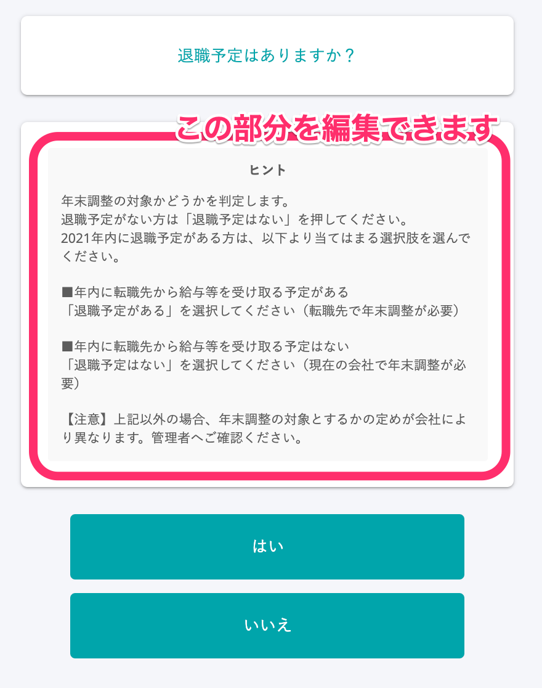

# システム標準で用意しているヒント

アンケートの下記の設問では、SmartHRが用意したシステム標準のヒントが入っています。

- 設問2
- 設問9
- 設問13
- 設問22
- 設問104
- 設問106

システム標準のヒントが設定されているものを含めて、すべての設問のヒントを編集できます。

:::alert
### 必ず事前にヒントを確認しましょう
昨年、チャットサポートへのお問い合わせにおいて、「 **設問2（年末調整の対象/対象外を確認する設問）で、従業員が誤って対象外を選択することを防ぎたい」** とのご相談を多数お寄せいただきました。
この質問について、2021年版は以下のシステム標準のヒントを設定しています。
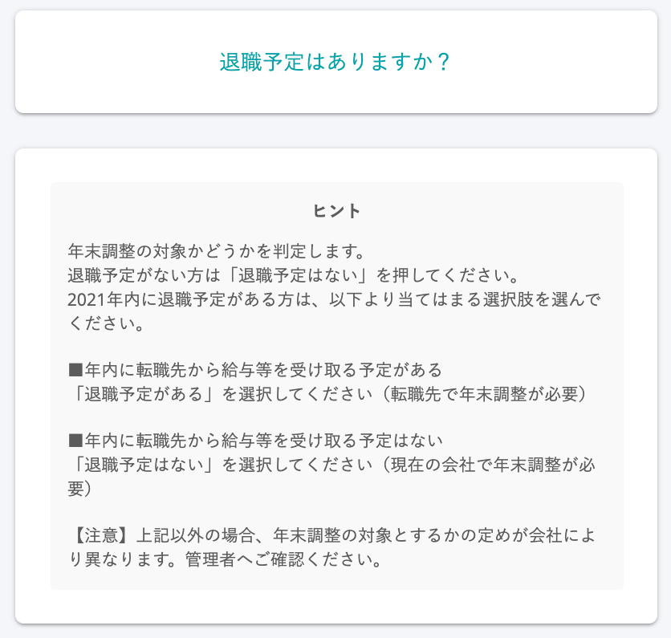
年末調整の対象とするかの定めは会社ごとに異なる場合が多いため、ヒントには一般的な内容を記載しています。
**年末調整の対象とする退職日を規定で明確に定めている** 場合や、**年末調整は対象外だが来年の扶養控除等申告書を作成する必要がある** 場合は、お手数ですが、アンケートを送付する前にシステム標準のヒントを編集してください。
:::

# ヒントの追加・編集手順

ヒントの追加・編集方法には「設問ごとに画面を確認しながらヒントを編集する」方法と「CSVアップロードで全設問のヒントを一括編集する」方法があります。

## 設問ごとに画面を確認しながらヒントを編集する

### 1\. 依頼一覧画面の［依頼グループ設定▼］>［アンケートのヒントメッセージ設定］をクリック

依頼一覧画面の **［依頼グループ設定▼］**  から、 **［アンケートのヒントメッセージ設定］** をクリックすると、アンケートのヒント編集画面が表示されます。

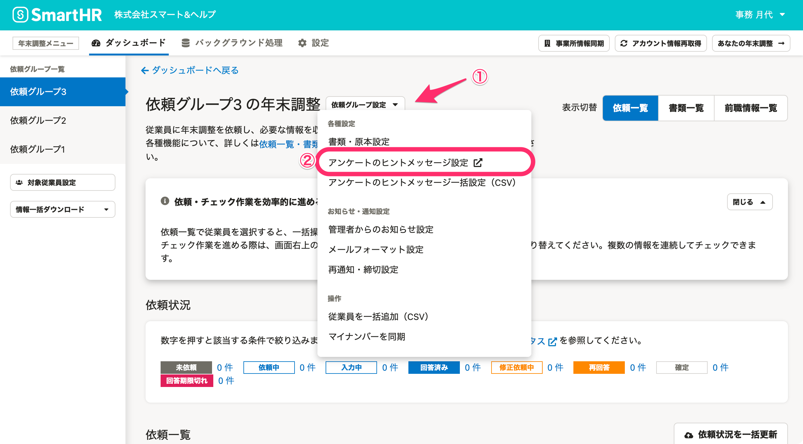

### 2\. ヒントを編集するアンケート画面を選択

アンケートのヒント編集画面の左側にある **［アンケート（画面）一覧］** から、ヒントを編集したい設問を選択します（下図①）。

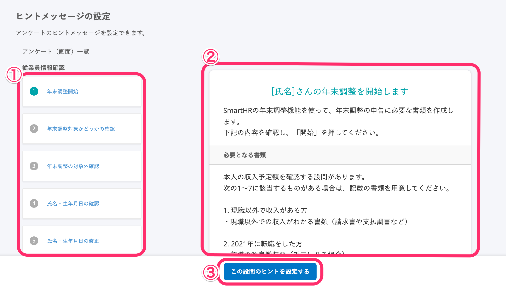

設問を選択すると画面右側に設問とヒントの内容が表示されます（上図②）。

ヒントを編集したい設問を選択した状態で、画面下部の **［この設問のヒントを設定する］** をクリックすると、ヒント入力欄が表示されます（上図③）。

### 3\. ヒントの内容を入力し、［保存する］をクリック

ヒント入力欄に、表示したい内容を入力し、［ **保存する］** をクリックします。

入力した内容がどのように表示されるかは、入力欄の右上のアンケート画面にリアルタイムで反映されます。

なお、URLを挿入する場合は、HTMLタグは、<a>タグでのリンクのみ使用できます。

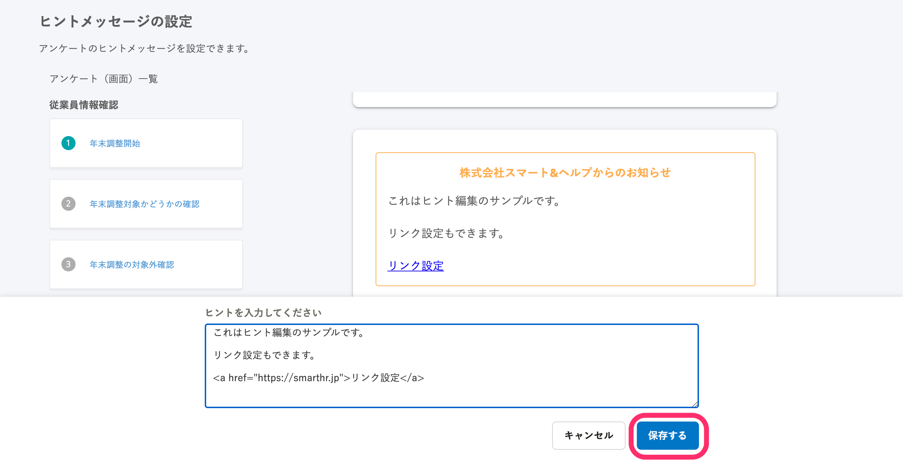

:::tips
システム標準のヒントを編集すると、アンケート画面でのヒント表示が変わります。
**ヒント編集前**
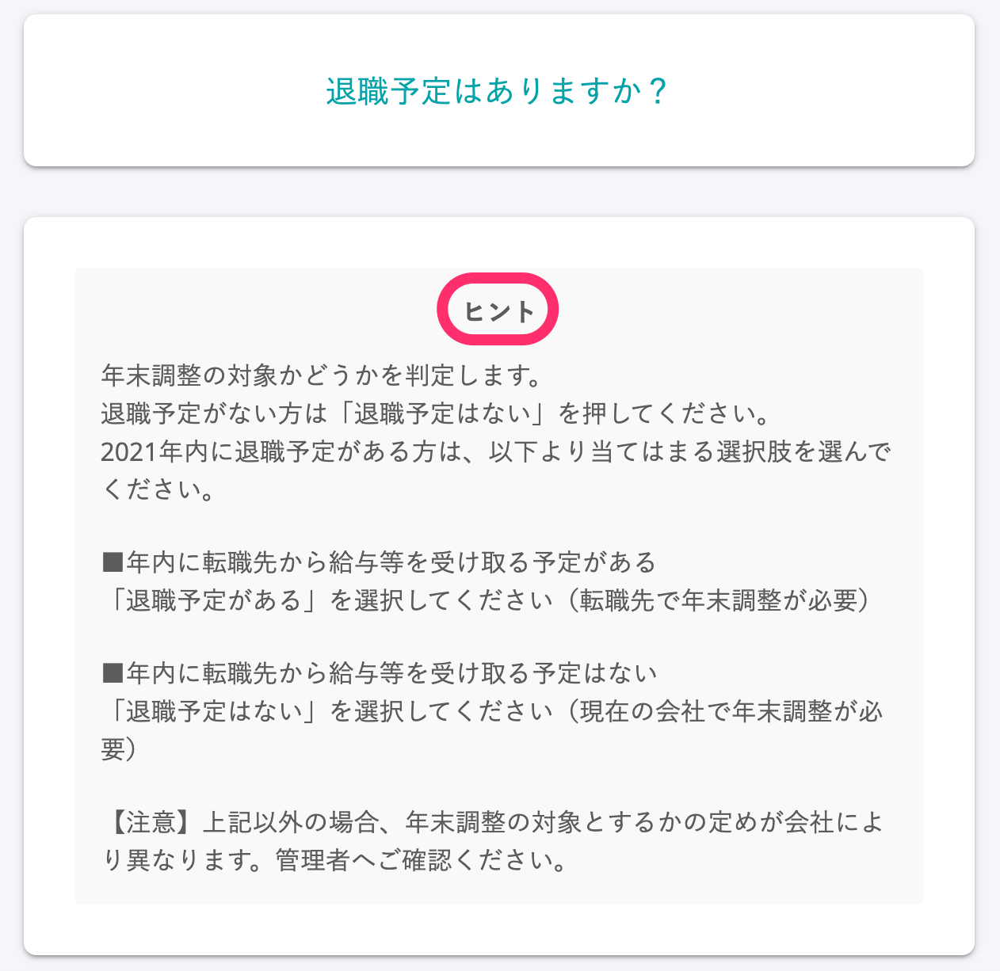
**ヒント編集後**
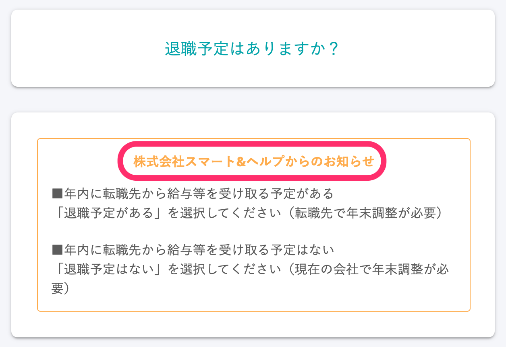
オリジナルのヒントを設定した場合は、上記ヒント編集後の画面と同じ「○○○（会社名）からのお知らせ」という表示がアンケート画面に追加されます。
:::

## CSVアップロードで全設問のヒントを一括編集する

ヒントは依頼グループごとに設定できます。

別の依頼グループ（企業アカウント）でも同じヒントを設定したい場合は、CSVアップロードを使ったヒントの一括編集が便利です。

SmartHRでは、一括編集ができるCSVテンプレートを用意しています。 **［依頼グループ設定▼］** からCSVテンプレートのダウンロードしてご活用ください。

### 1\. 依頼一覧画面の［依頼グループ設定▼］>［アンケートのヒントメッセージ一括設定（CSV）］をクリック

依頼一覧画面の **［依頼グループ設定▼］**  から、 **［アンケートのヒントメッセージ一括設定（CSV）］** をクリックすると、 **［アンケートのヒントメッセージ一括設定］** というダイアログが表示されます。

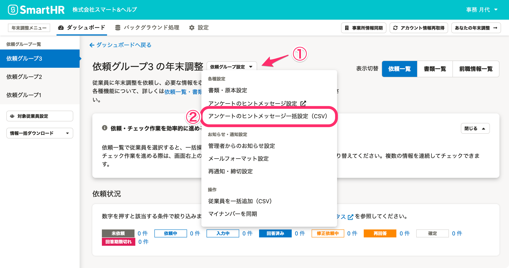

### 2\. ［サンプルCSVファイルのダウンロード］をクリックし、CSVテンプレートをダウンロード

 **［サンプルCSVファイルのダウンロード］** をクリックして、CSVファイルのテンプレートをダウンロードします。

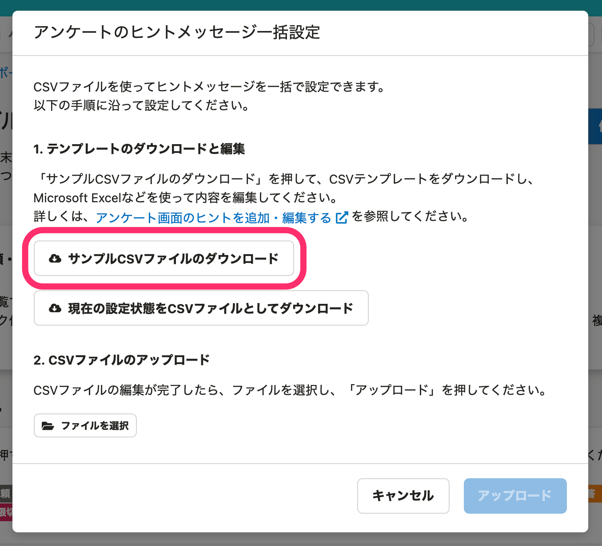

### 3\. CSVファイルを編集

「アンケートタイトル」とシステム標準の「ヒント」が一覧で確認できます。

システム標準のヒントの編集やオリジナルのヒントを追加入力して、ファイルを保存します。

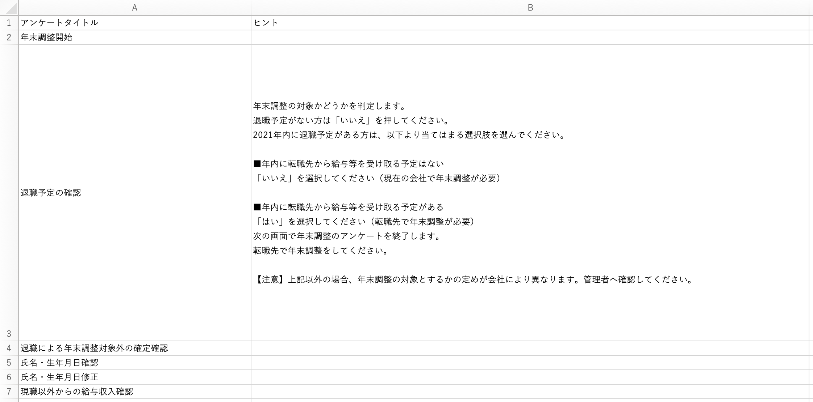

### 4\. ［ファイルを選択］>［アップロード］をクリック

 **［ファイルを選択］** をクリックして、作成したCSVファイルを選択し、 **［アップロード］** をクリックします。一括してヒントを設定できます。

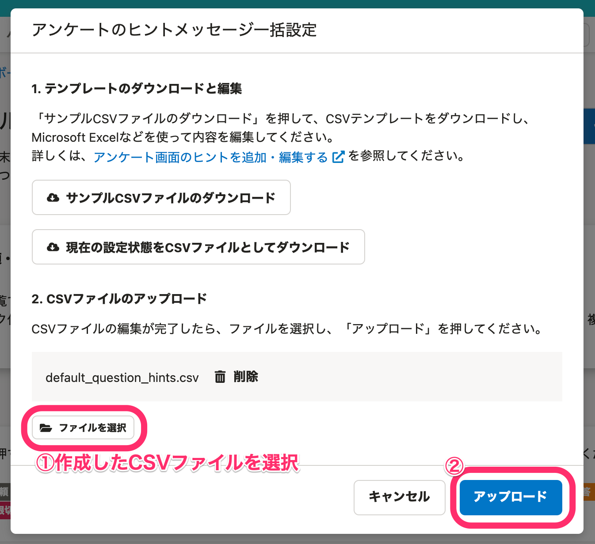
