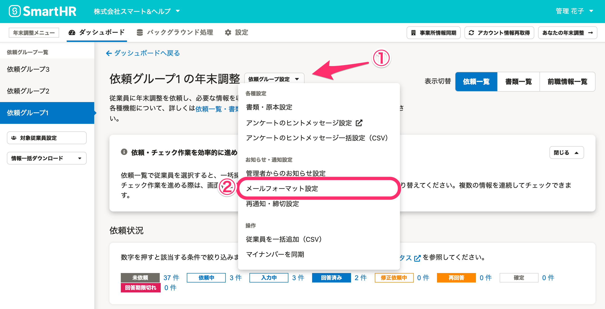
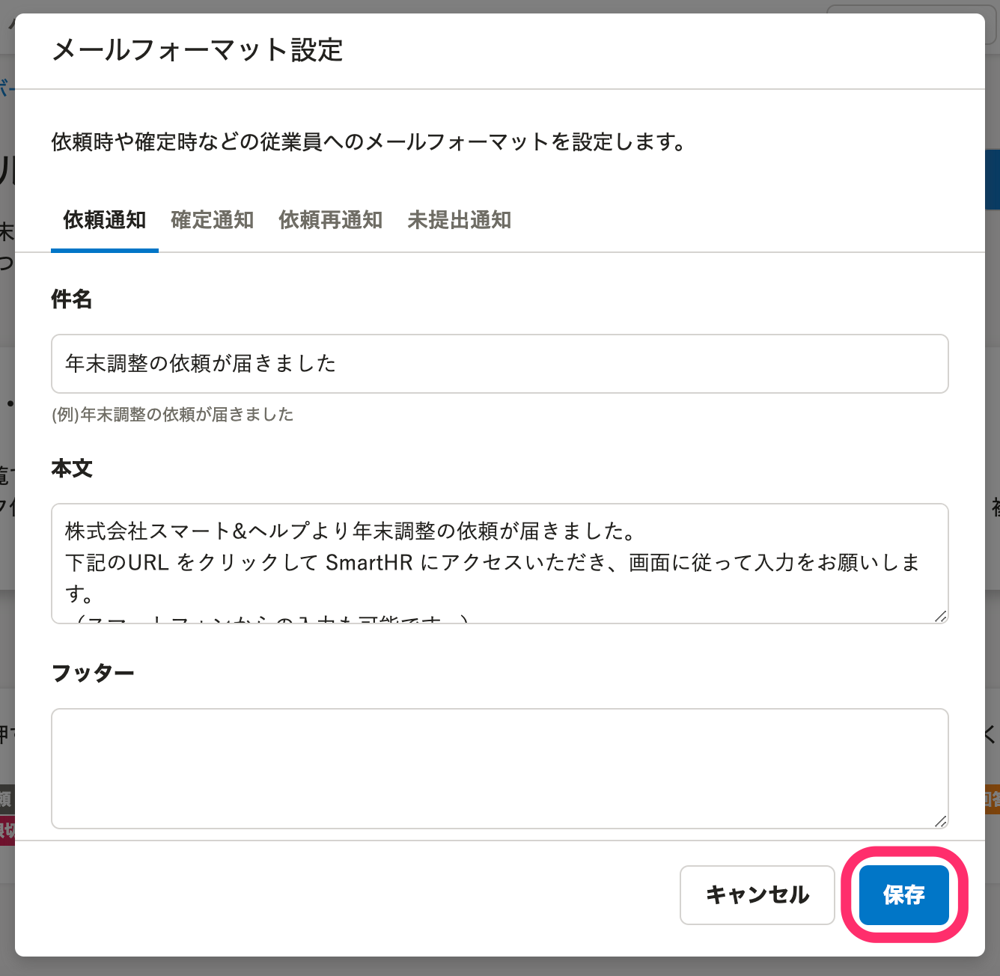
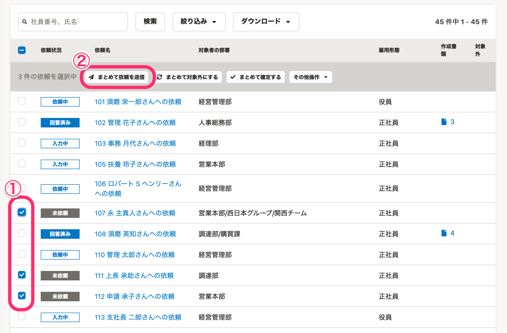
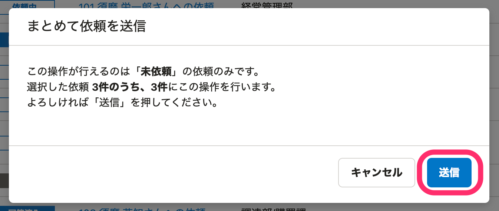
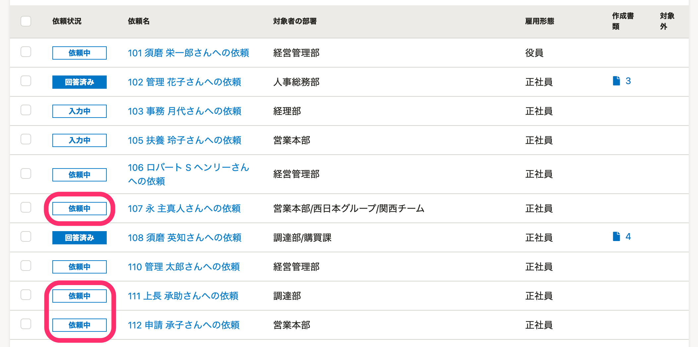
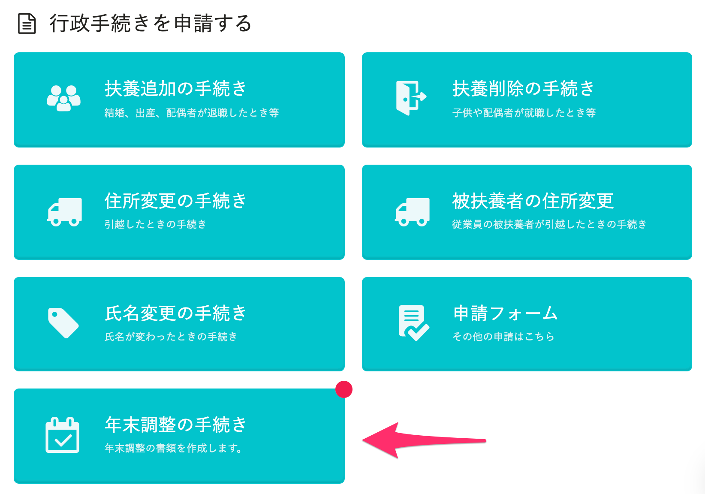

:::alert
当ページで案内しているSmartHRの年末調整機能の内容は、2021年（令和3年）版のものです。
2022年（令和4年）版の年末調整機能の公開時期は秋頃を予定しています。
なお、画面や文言、一部機能は変更になる可能性があります。
公開時期が決まり次第、[アップデート情報](https://smarthr.jp/update)でお知らせします。
:::

年末調整の依頼グループを作成すると、グループに含まれる従業員に年末調整を依頼できるようになります。

# 1\. 準備：メールフォーマットを編集する

依頼一覧にある **［依頼グループ設定▼］>［メールフォーマット設定］** をクリックします。

 **［メールフォーマット設定］** 画面が表示されるので、「件名」「本文」「フッター」に必要な情報を入力して **［保存］** をクリックします。

:::related
[【一覧】年末調整機能で届く通知（メール）の内容](https://knowledge.smarthr.jp/hc/ja/articles/360039321893)
:::

# 2\. 依頼対象にチェックを入れ、［まとめて依頼を送信］をクリック

依頼を送信する対象にチェックを入れると、依頼一覧の項目名の下にメニューボタンが表示されます。

 **［まとめて依頼を送信］** をクリックします。

確認のダイアログが表示されたら、内容を確認して **［送信］** をクリックします。

従業員に年末調整の依頼が行なわれ、ステータスが **［依頼中］** に変わります。

:::tips
ステータスが **［依頼中］** になると、従業員に入力依頼のメールが届き、SmartHRのトップページに［ **年末調整の手続き］** ボタンが表示されます。

:::

これで年末調整の依頼は完了です。

:::related
[依頼状況と確認状況を一括で変更する](https://knowledge.smarthr.jp/hc/ja/articles/900006685963)
:::

# 次の工程に進む

引き続き年末調整の業務を進める場合は、下記のヘルプページをご覧ください。

:::related
[従業員から提出された年末調整を確認する](https://knowledge.smarthr.jp/hc/ja/articles/360034870254)
:::
