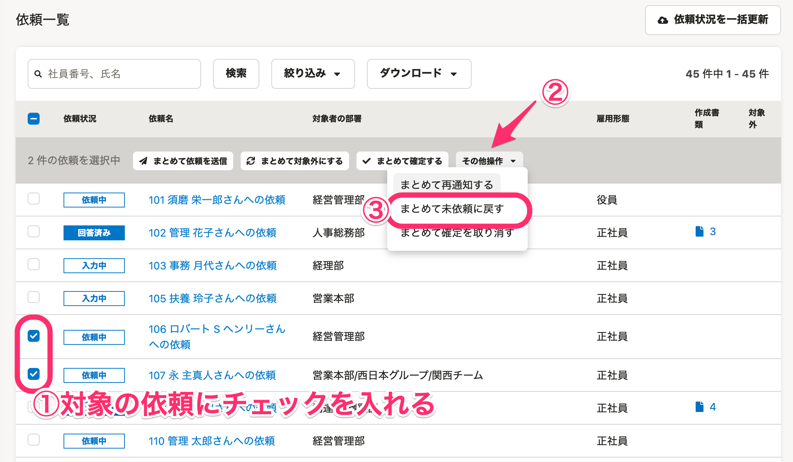
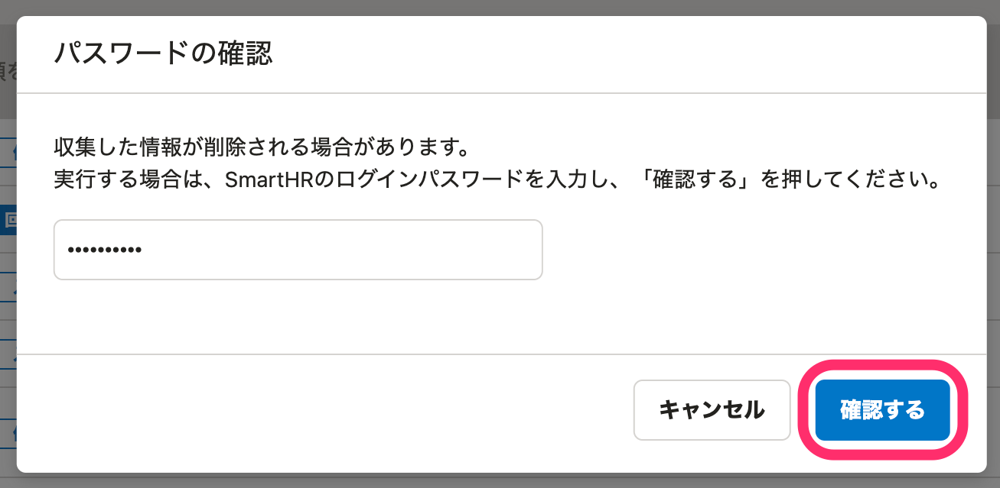
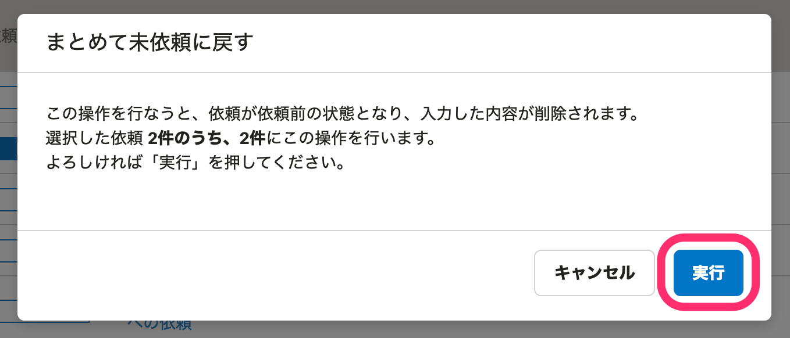
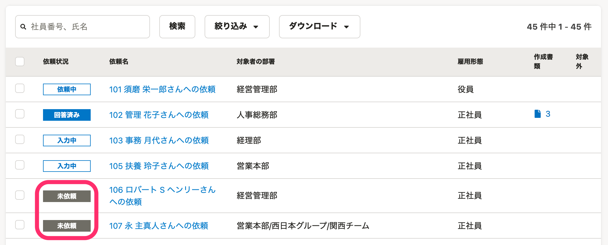

:::alert
当ページで案内しているSmartHRの年末調整機能の内容は、2021年（令和3年）版のものです。
2022年（令和4年）版の年末調整機能の公開時期は秋頃を予定しています。
なお、画面や文言、一部機能は変更になる可能性があります。
公開時期が決まり次第、[アップデート情報](https://smarthr.jp/update)でお知らせします。
:::

以下のような場合、当ページで案内している手順で、年末調整の依頼を「未依頼」に戻してください。

- 提出依頼を取りやめたい
- 依頼済みの従業員に、再度はじめから年末調整の作成を依頼したい

# 注意点

依頼を「未依頼」に戻すと、**依頼後に入力・更新された内容はすべて消去され、依頼前の状態に戻ります。**

## 本人情報、家族情報、配偶者情報

- 依頼前（［年末調整をはじめる］を押した時点）の状態に戻ります。
- 依頼前に収集情報を編集していた場合は、編集後の状態まで戻ります。
- 依頼前に従業員を一覧から削除し、［従業員情報を同期］して再度追加していた場合は、同期をした時点の状態まで戻ります。

## 保険料控除情報

- 依頼前（［年末調整をはじめる］を押した時点）の状態に戻ります。
- 依頼前にCSVファイルやDATファイルで情報をインポートしている場合は、インポート後の状態まで戻ります。
- インポート後、さらに収集情報を編集していた場合は、編集後の状態まで戻ります。

## 住宅借入金控除情報

- 依頼前（［年末調整をはじめる］を押した時点）の状態に戻ります。
- 2020年から年末調整機能を利用している場合は、2020年の年末調整機能からインポートした住宅借入金控除情報が紐づいた状態まで戻ります。
- 収集情報を編集していた場合、その内容は消去されます。

## 前職情報

一切の情報が消去されます。

# 操作手順

## 1\. 対象の従業員にチェックを入れ、［その他操作▼］>［まとめて未依頼に戻す］をクリック

依頼一覧で対象の従業員にチェックを入れると、依頼一覧の項目名の下にメニューボタンが表示されます。

 **［その他操作▼］>［まとめて未依頼に戻す］** をクリックすると、 **［パスワードの確認］** のダイアログが表示されます。

## 2\. パスワードを入力し、［確認する］をクリック

依頼を「未依頼」に戻すと、入力した内容が削除されるため、パスワードの入力が必要です。
SmartHRのログインパスワードを入力し、 **［確認する］** をクリックします。

## 3.［実行］をクリック

内容を確認し、 **［実行］** をクリックするとバックグラウンド処理が始まります。

バックグラウンド処理が完了すると、年末調整の依頼ステータスが「未依頼」に変わります。

