:::alert
当ページで案内しているSmartHRの年末調整機能の内容は、2021年（令和3年）版のものです。
2022年（令和4年）版の年末調整機能の公開時期は秋頃を予定しています。
なお、画面や文言、一部機能は変更になる可能性があります。
公開時期が決まり次第、[アップデート情報](https://smarthr.jp/update)でお知らせします。
:::

依頼一覧画面に表示される「退職対象外候補」「乙欄対象外候補」「源泉対象外候補」の各ステータスの概要を説明します。

# 年末調整の対象外となる可能性がある従業員に「対象外候補」ステータスが表示されます

年末調整のアンケート回答の結果、年末調整の対象外候補と判定された場合、依頼一覧画面の **［対象外］** 欄に、「退職対象外候補」「乙欄対象外候補」「源泉対象外候補」のいずれかが表示されます。

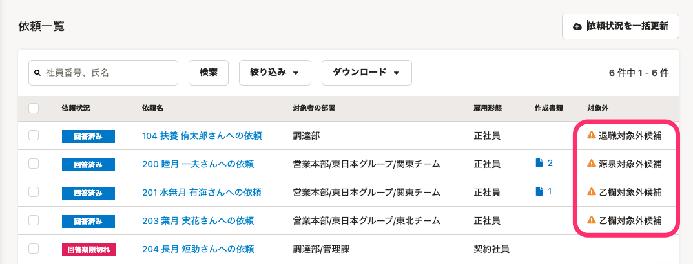

「対象外候補」と表示された従業員がいる場合、該当の従業員のアンケート回答内容を確認して、年末調整の「対象外」にするか、対象外でない場合は、再度年末調整の依頼をする必要があります。

詳しい対応方法は、下記のヘルプページをご確認ください。

:::related
[「対象外候補」ステータスが表示された従業員への対応](https://knowledge.smarthr.jp/hc/ja/articles/360034870754)
[従業員を年末調整の「対象外」にする](https://knowledge.smarthr.jp/hc/ja/articles/360039790773)
:::

# 「退職対象外候補」ステータスの概要

## 表示条件

従業員が「退職予定があるため年末調整を終了する」とアンケートで回答した場合に、表示されるステータスです。

## 判定に関わる設問

#### 設問2「退職予定はありますか？」に［はい］と回答する

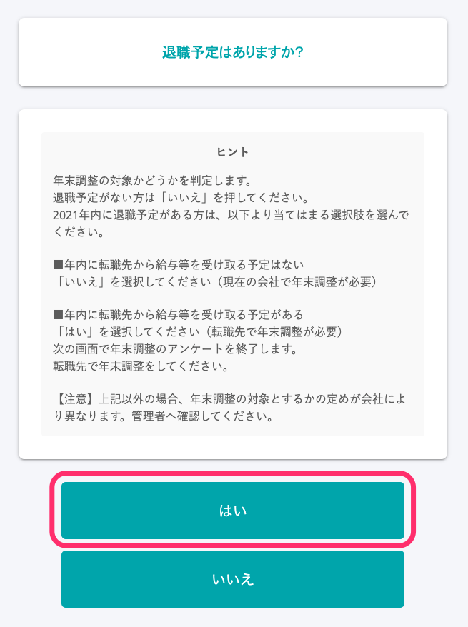

#### 設問3「年末調整のアンケートを終了します」に［退職予定があるため年末調整を終了する］と回答する

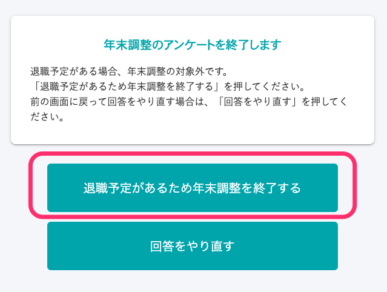

## 作成される書類

- なし

# 「乙欄対象外候補」ステータスの概要

## 表示条件

複数の会社で給与の支給を受けている従業員が、年末調整のアンケートで「他社（かけもち先）の方が収入が多い」と回答し、貴社での年末調整の対象外となる可能性がある場合に表示されるステータスです。

## 判定に関わる設問

#### 設問6「今年（2021年）1月〜12月に、{会社名}以外から給与収入はありますか？」に［はい］と回答する

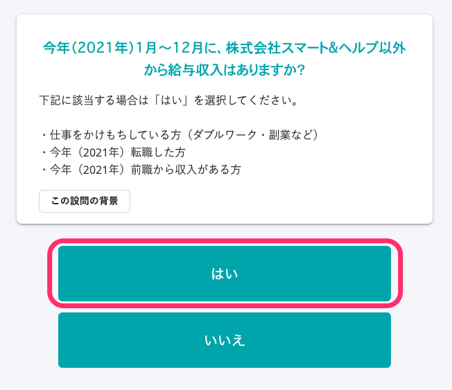

#### 設問7「現在、仕事をかけもち（ダブルワーク・副業）していますか？」に［はい］と回答する

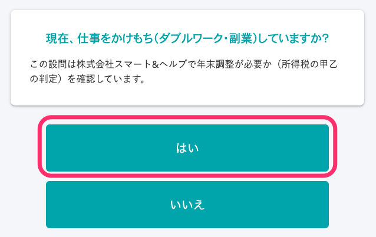

#### 設問8「{会社名}以外での雇用形態を選択してください」に［A］または［C］と回答する

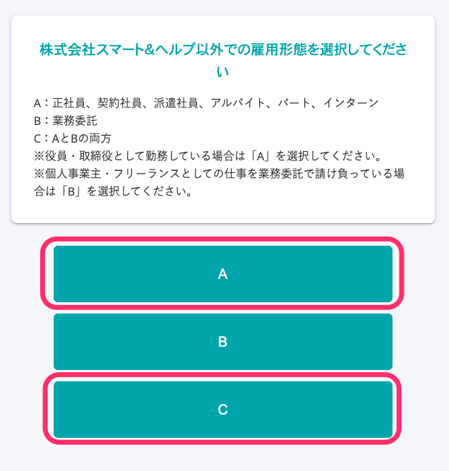

#### 設問9「今年（2021年）の収入が多いのは、{会社名}ですか？」に［いいえ］と回答する

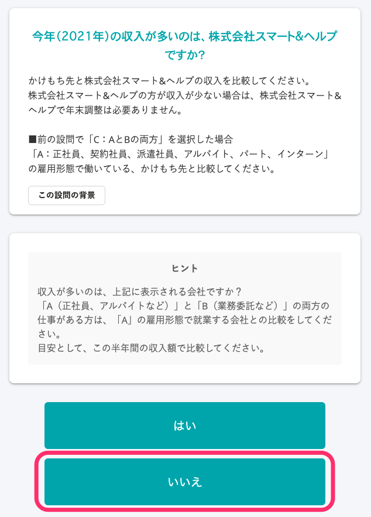

#### 設問10「来年（2022年）の収入見込みが多いのは、{会社名}ですか？」に［いいえ］と回答する

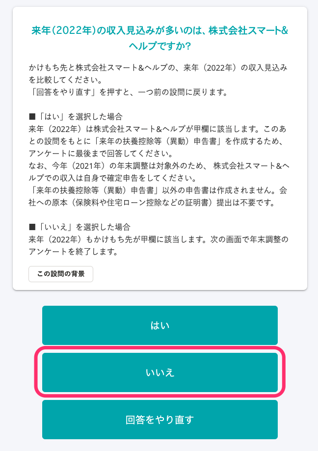

:::tips
#### 設問10に **［はい］** と回答した場合も、「乙欄対象外候補」と判定されますが、続けて表示されるアンケートへの回答が必要です
設問10に **［はい］** と回答した場合も、対象従業員は「乙欄対象外候補」と判定されます。
ただし、来年の給与所得者の扶養控除等（異動）申告書を作成する必要があるため、引き続き設問への回答が必要です。
なお、設問10以降の回答は「乙欄対象外候補」の判定には影響しません。
:::

#### 設問52「年末調整の対象外です」に［入力を終了する］と回答する

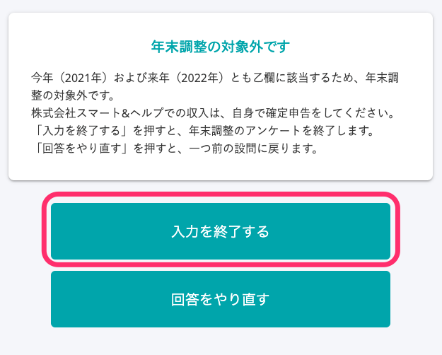

## 作成される書類

- 設問10に **［はい］** と回答した場合：来年の給与所得者の扶養控除等（異動）申告書
- 設問10に **［いいえ］** と回答した場合：なし

# 「源泉対象外候補」ステータスの概要

## 表示条件

従業員が年末調整のアンケートで、源泉徴収票を「入手できない」と回答した場合に表示されるステータスです。

## 判定に関わる設問

#### 設問6「今年（2021年）1月〜12月に、{会社名}以外から給与収入はありますか？」に［はい］と回答する

#### 

#### 設問11「前職から受け取った令和3年（2021年）の「給与所得の源泉徴収票」はありますか？」に［はい］と回答する

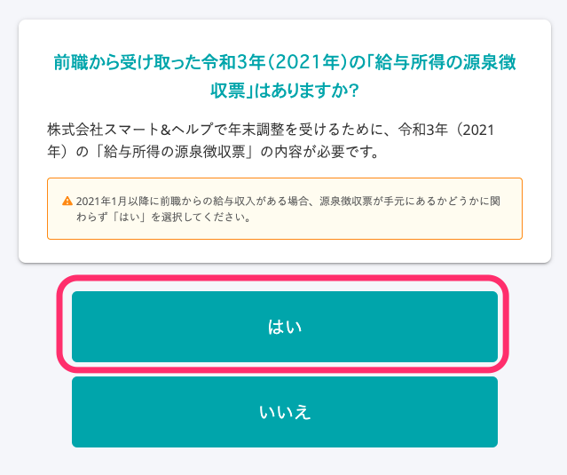

#### 設問12「前職での雇用形態を選択してください」に［A］または［C］と回答する

#### 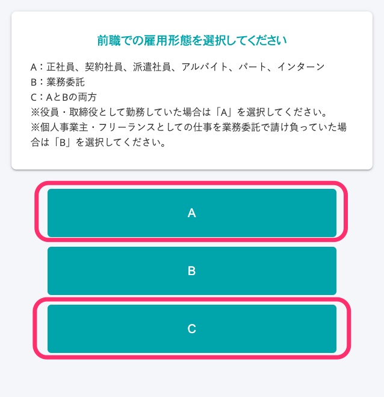

#### 設問13「令和3年（2021年）の源泉徴収票の内容を入力してください」の［源泉徴収票］欄に、［入手できない］と回答する

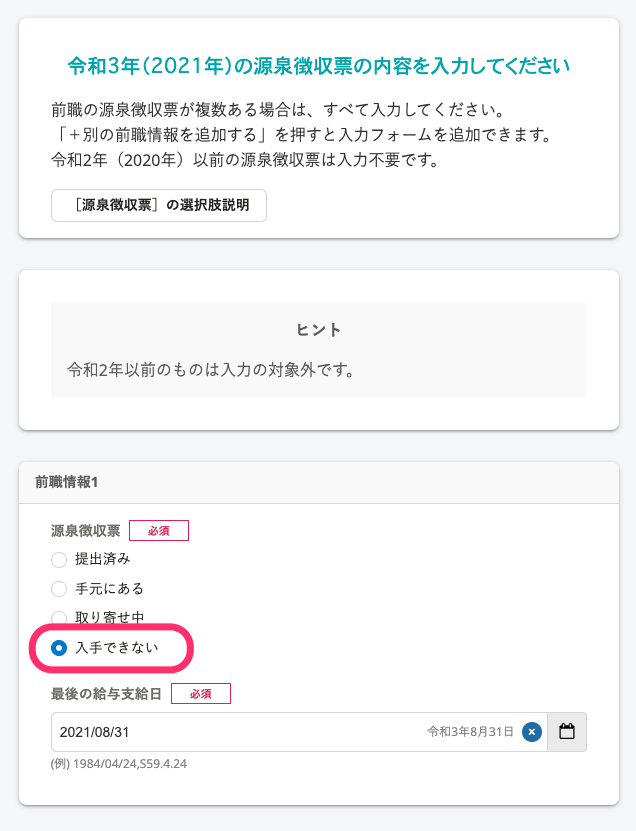

#### 設問14「源泉徴収票が提出できない場合、{会社名}で年末調整ができません」に ［次へ］と回答する

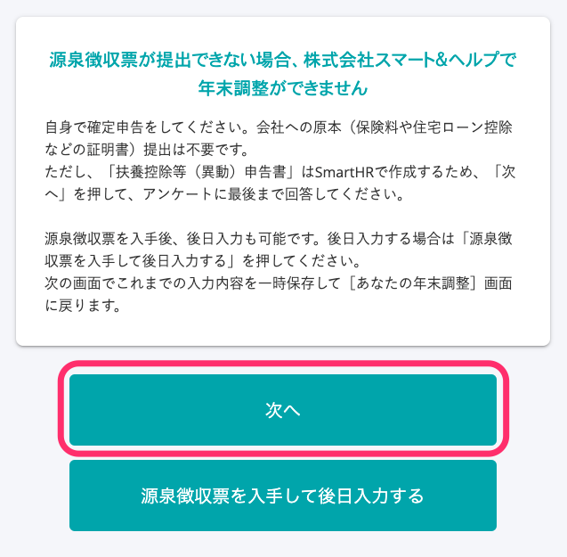

## 作成される書類

- 今年の給与所得者の扶養控除等（異動）申告書
- 来年の給与所得者の扶養控除等（異動）申告書
