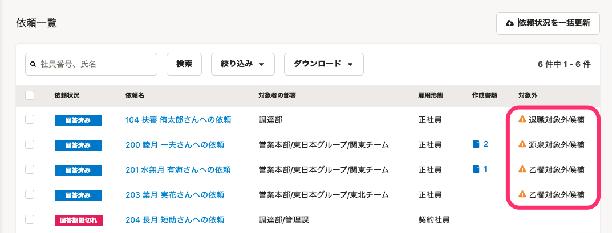

:::alert
当ページで案内しているSmartHRの年末調整機能の内容は、2021年（令和3年）版のものです。
2022年（令和4年）版の年末調整機能の公開時期は秋頃を予定しています。
なお、画面や文言、一部機能は変更になる可能性があります。
公開時期が決まり次第、[アップデート情報](https://smarthr.jp/update)でお知らせします。
:::

年末調整機能のステータスに「退職対象外候補」「乙欄対象外候補」「源泉対象外候補」と表示された従業員への対応方法を説明します。

なお、「対象外候補」ステータスの概要については、下記のヘルプページをご確認ください。

[「対象外候補」ステータスとは](https://knowledge.smarthr.jp/hc/ja/articles/4409251601561)

# 「対象外候補」ステータスが表示された場合

依頼一覧画面で「対象外候補」ステータスが表示された場合、従業員のアンケート回答内容を確認して、貴社にて年末調整を行なうかをご検討ください。

貴社にて年末調整を行なう場合は、依頼ステータスを「未依頼」に戻して、再度年末調整の依頼をしてください。年末調整を行なわない場合は、該当の従業員を「対象外」ステータスに変更してください。

:::alert
#### 「対象外候補」のステータスを「対象外」に変更する際の注意点
- 依頼一覧画面の **［まとめて対象外にする］** から、「〇〇対象外候補」を「対象外（○○）」に変更する際、対象外理由が同じものしか設定できません。「対象外候補」の理由ごとに、依頼を操作してください。
    - 例：「源泉対象外候補」の場合は、「対象外（源泉）」のみ適用可能です。
    - 異なる対象外理由を選択して、 **［まとめて対象外にする］** を行なうと、バックグラウンド処理はエラーにならず「完了」しますが、該当の依頼は対象外に変更されません。
- 対象外候補の理由を別の項目に変更したい場合は、該当の依頼を「未依頼」に変更してから、任意の対象外理由を設定してください。なお、依頼を「未依頼」に変更するため、登録されている情報や作成書類は削除されるので注意してください。
:::

「対象外候補」の理由別の対応方法は、下記のとおりです。

## 「退職対象外候補」ステータスの従業員への対応

従業員の退職予定を確認し、今年度の年末調整の「対象外」となるかを確認してください。

年内中は貴社に在籍している場合（最終出社日は年内、退職日は年明けなど）は、依頼ステータスを「未依頼」に戻して、再度年末調整の依頼をします。

年内中に退職し、貴社での年末調整の対象外となる場合は、依頼ステータスを「対象外（退職）」としてください。

## 「乙欄対象外候補」ステータスの従業員への対応

貴社で年末調整をするどうかをご確認ください。

貴社での年末調整の対象とする場合は、依頼ステータスを「未依頼」に戻して、再度年末調整の依頼をしてください。

年末調整の対象外とする場合は、依頼ステータスを「対象外（乙欄）」とし、従業員に確定申告が必要な旨を連絡してください。

## 「源泉対象外候補」ステータスの従業員への対応

前職の源泉徴収票を入手できる場合は、依頼ステータスを「未依頼」に戻して、再度年末調整の依頼をしてください。

前職の源泉徴収票を入手できない場合は、依頼ステータスを 「対象外（源泉）」とし、従業員に確定申告が必要な旨を連絡してください。

:::related
[年末調整のアンケート回答履歴を確認する](https://knowledge.smarthr.jp/hc/ja/articles/360053297094)
[従業員を年末調整の「対象外」にする](https://knowledge.smarthr.jp/hc/ja/articles/360039790773)
[年末調整の依頼を「未依頼」に戻す](https://knowledge.smarthr.jp/hc/ja/articles/360034870774)
[年末調整を依頼をする](https://knowledge.smarthr.jp/hc/ja/articles/360035370313)
:::
