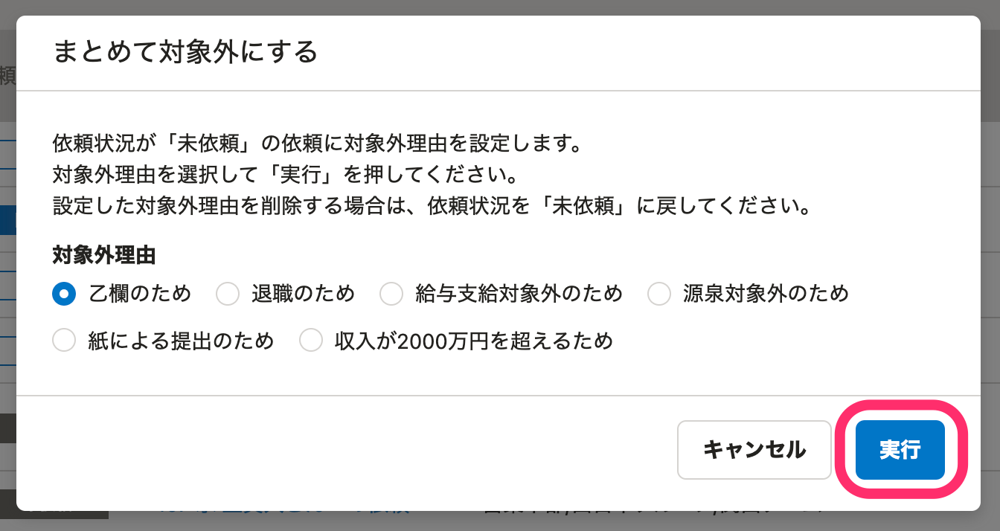

:::alert
当ページで案内しているSmartHRの年末調整機能の内容は、2021年（令和3年）版のものです。
2022年（令和4年）版の年末調整機能の公開時期は秋頃を予定しています。
なお、画面や文言、一部機能は変更になる可能性があります。
公開時期が決まり次第、[アップデート情報](https://smarthr.jp/update)でお知らせします。
:::

対象外理由を設定し、従業員を年末調整の「対象外」にする操作を説明します。

設定した対象外理由を削除するには、確定を取り消し後、依頼ステータスを「未依頼」に戻してください。

詳細は下記ヘルプページをご覧ください。

[Q. 年末調整の対象従業員を間違って「対象外」にしてしまった場合は？](https://knowledge.smarthr.jp/hc/ja/articles/360058085913)

:::alert
**今年の収入が2,000万円を超えているが「来年の給与所得者の扶養控除等（異動）申告書」の作成が必要な場合**
該当する従業員は、**ステータスを「対象外」とせず、アンケートの依頼を行なってください。**
ステータスを対象外とした場合、年末調整を依頼できなくなるため、「来年の給与所得者の扶養控除等（異動）申告書」を作成できません。
詳しくは以下のヘルプページをご覧ください。
[Q. 従業員に「来年の給与所得者の扶養控除等（異動）申告書」を作成してもらうには？](https://knowledge.smarthr.jp/hc/ja/articles/360053489734)
:::

「対象外」のステータスについては下記のヘルプページをご覧ください。

[【一覧】年末調整のステータス](https://knowledge.smarthr.jp/hc/ja/articles/360034870834)

# 1\. 依頼一覧で従業員を選択し、［まとめて対象外にする］をクリック

 **［依頼一覧］** 画面で対象の従業員にチェックを入れ、 **［まとめて対象外にする］** をクリックすると、対象外理由の設定画面が表示されます。

# 2\. 対象外理由を選択し、［実行］をクリック

対象外理由を選択して **［実行］** をクリックすると、バックグラウンド処理を開始し、依頼一覧画面に戻ります。

:::tips
上図 **［まとめて対象外にする］** にも記載のとおり、対象外にできるのは **「未依頼」** の依頼のみです。
対象外にした依頼を元に戻したい場合は、依頼を **「未依頼」** に戻してください。
依頼を **「未依頼」** のステータスに戻す場合、**依頼後に入力・更新された内容はすべて消去され、依頼前の状態に戻る**といった注意点があるので、詳しくは以下のヘルプページをご覧ください。
[年末調整の依頼を「未依頼」に戻す](https://knowledge.smarthr.jp/hc/ja/articles/360034870774)
:::

バックグラウンド処理が完了するまでお待ちください。

# 3\. 対象外の表示を確認する

バックグラウンド処理完了後、 **［依頼一覧］** の **［対象外］** 欄に対象外の表示があることを確認します。

:::tips
従業員から回答があり、対象外欄に「退職対象外候補」「乙欄対象外候補」の表示がある場合、同じ操作でステータスを「退職対象外」「乙欄対象外」に変更できます。
:::

# 応用編：対象外の従業員を1つの依頼グループでまとめて管理する

従業員の依頼グループ一括設定機能を利用して、対象外の従業員をまとめた依頼グループを作成し、従業員を振り分けて管理できます。

## 1.［対象従業員設定］をクリック

 **［対象従業員設定］** をクリックします。

## 2\. ［ダウンロード］をクリック

画面中央にある **［ダウンロード］** をクリックすると、 **［従業員一覧のダウンロード］** というダイアログが表示されます。

 **［ダウンロード］** をクリックすると、バックグラウンド処理が始まります。

年末調整メニューの **［バックグラウンド処理］>［依頼名］** をクリックすると処理結果の画面に移動します。

添付ファイル項目の下にある **［ダウンロード］** をクリックしてCSVファイルをダウンロードします。

## 3\. CSVファイルを編集する

CSVファイルを開き、対象外としたい従業員の依頼グループ列に **「依頼グループ名（例：対象外 等）」** を入力します。

依頼グループ列に入力した依頼グループ名が、新しい依頼グループとして登録されます。

:::alert
依頼グループの変更ができるのは、依頼ステータスが「未依頼」の従業員です。
:::

## 4\. CSVファイルをインポートする

画面右側にある **［インポート▼］>［依頼グループをインポート］** をクリックします。

 **［ファイルを選択］** をクリックし、編集したCSVファイルを添付します。

 **［アップロード］** をクリックすると、バックグラウンド処理が始まります。

バックグラウンド処理の状況は、先ほどと同じ手順で確認してください。

バックグラウンド処理の完了後、 **［依頼グループ一覧］** にCSVファイルで指定した依頼グループ（対象外）が作成され、従業員が割り振られたことが確認できます。

依頼グループに振り分けた従業員は、「未依頼」のままにしておく、従業員を全選択して対象外の設定をするなど、貴社の運用にあわせて管理してください。
