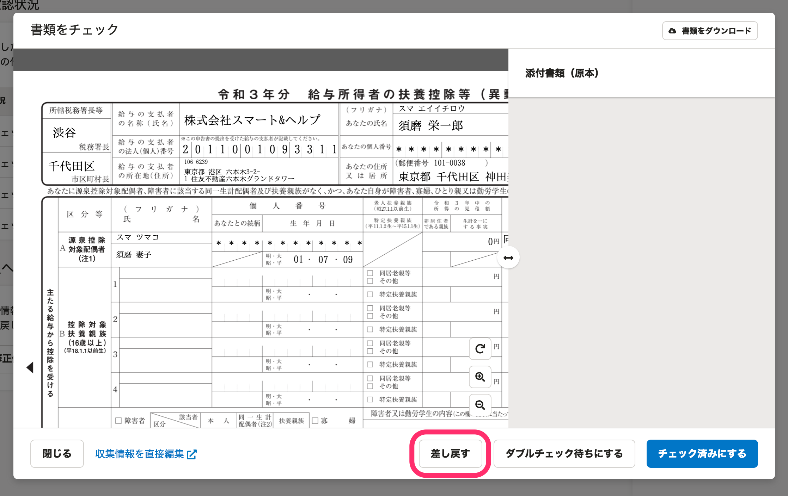
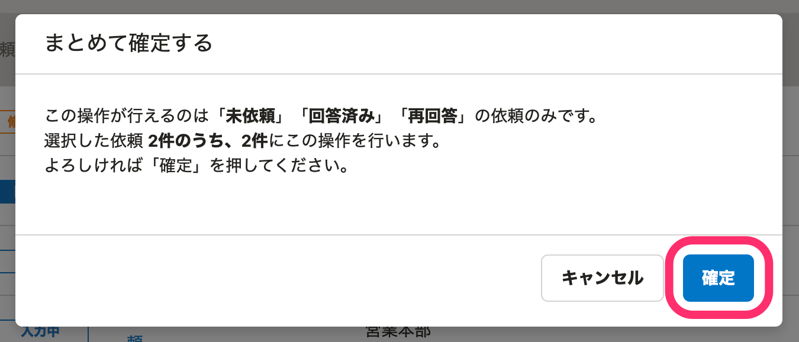

:::alert
当ページで案内しているSmartHRの年末調整機能の内容は、2021年（令和3年）版のものです。
2022年（令和4年）版の年末調整機能の公開時期は秋頃を予定しています。
なお、画面や文言、一部機能は変更になる可能性があります。
公開時期が決まり次第、[アップデート情報](https://smarthr.jp/update)でお知らせします。
:::

従業員から年末調整を提出されたら、以下の流れで確認を進めましょう。

1.  書類を確認する
2.  修正する（従業員に修正を依頼する／管理者が修正する）
3.  提出が必要な原本を確認する
4.  年末調整を確定する
5.  書類やCSVファイルをダウンロードする

# 1\. 書類を確認する

書類を1つずつ確認する方法と、複数の書類をまとめて確認する方法があります。

:::tips
書類を確認した結果、修正がある場合は「2.修正する」へ、修正がない場合は「3.提出が必要な原本を確認する」へ進んでください。
:::

## 書類を1つずつ確認する

 **［依頼一覧］** から確認する方法と、 **［書類一覧］** から確認する方法があります。

### 依頼一覧から確認する

 **［依頼一覧］** から確認する場合、 **［依頼名］** をクリックして依頼詳細画面を表示してください。

書類確認状況の **［書類チェック］** をクリックすると、書類のプレビュー画面が表示されます。

### 書類一覧から確認する

依頼一覧画面の表示を **［書類一覧］** に切り替えます。

 **［書類一覧］** にある **［書類チェック］** をクリックすると、書類のプレビュー画面が表示されます。

## 書類一覧で複数の書類をまとめて確認する

依頼一覧画面の表示を **［書類一覧］** に切り替えます。

 **［書類一覧］** のチェックボックスにチェックを入れて **［選択した書類をまとめてチェック］** をクリックすると、書類のプレビュー画面が表示され、作成した書類をまとめて確認できます。

:::tips
依頼一覧の絞り込み機能を使用すると、書類や前職情報の作成状況で絞り込めます。
詳しくは下記ヘルプページをご覧ください。
[依頼一覧から書類または前職情報の状態で依頼を絞り込む](https://knowledge.smarthr.jp/hc/ja/articles/4405432019481)
[従業員から提出された年末調整の書類をまとめて確認する](https://knowledge.smarthr.jp/hc/ja/articles/360055393313)
:::

## 書類チェックに差分リストを活用する

差分リストを使って「給与所得者の扶養控除等（異動）申告書」（マルフ）を効率よく確認できます。

確認作業は「身上情報（SmartHRに登録している従業員情報）に変更がない従業員」と「身上情報に変更がある従業員」を振り分けることから始まります。

差分リストは、リスト上で本人情報・扶養親族情報のどちらに変更があるのか、変更前後で情報がどう変わっているのかを一目で確認でき、便利です。

詳しくは下記ヘルプページをご覧ください。

:::related
[差分リストを使って「給与所得者の扶養控除等 （異動）申告書」の内容を確認する](https://knowledge.smarthr.jp/hc/ja/articles/4405540222873/)
:::

# 2\. 書類を修正する

書類の修正が必要な場合、従業員に修正を依頼する方法と、管理者が直接修正する方法があります。

## 従業員に修正を依頼する

書類確認や前職情報確認のダイアログにある **［差し戻す］** をクリックすると、差し戻し理由の入力ダイアログが表示されます。

修正内容を入力して **［差し戻す］** をクリックすると、依頼のステータスが **［修正依頼中］** になり、従業員には「年末調整が差戻されました」と通知されます。

差し戻された従業員側の操作手順は、下記のヘルプページをご覧ください。

:::related
[提出した年末調整が差戻された場合は？](https://knowledge.smarthr.jp/hc/ja/articles/360035370073)
:::

## 管理者が修正する

修正が必要な場合は、確認画面左下の **［収集情報を直接編集］** をクリックして収集情報の編集画面へ移動します。

詳しくは以下のヘルプページをご覧ください。

:::related
[収集情報を直接編集する](https://knowledge.smarthr.jp/hc/ja/articles/360035657114)
:::

# 3\. 提出が必要な原本を確認する

提出が必要な原本については、原本一覧のCSVファイルで確認できます。

原本一覧のCSVファイルのダウンロード方法や仕様については下記のヘルプページをご覧ください。

:::related
[原本一覧をダウンロードする](https://knowledge.smarthr.jp/hc/ja/articles/360054094953)
:::

# 4\. 年末調整を確定する

書類内容・原本の確認が完了したら、年末調整を確定します。

確定をしてステータスが「確定 **」** になると、従業員に「年末調整の提出内容が確定されました」と通知されます。

通知の設定を変更する場合の手順については、下記のヘルプページをご覧ください。

:::related
[従業員に年末調整のステータス変更通知を通知する](https://knowledge.smarthr.jp/hc/ja/articles/360035370373)
:::
:::alert
確定後は、管理者による収集情報編集はできなくなります。
:::

確定の方法と確定の取り消しについて説明します。

## 年末調整の確定

依頼一覧画面で年末調整を確定させたい従業員にチェックを入れると、依頼一覧の項目名の下に **［まとめて確定する］** ボタンが表示されるのでクリックしてください。

確認のダイアログが表示されるので、 **［確定］** をクリックすると、年末調整のステータスが「確定」になります。

## 確定を取り消す

確定の取り消しについては、下記ヘルプページの「確定の取り消しはできますか？」をご覧ください。

:::related
[【一覧】年末調整に関するよくある質問](https://knowledge.smarthr.jp/hc/ja/articles/360035370153)
:::

# 5\. 書類やCSVファイルをダウンロードする

年末調整で作成した書類のPDFや、さまざまな収集情報のCSVファイルがダウンロードできます。

ファイルごとのダウンロード手順やCSVファイルの凡例は、下記ヘルプページの目次からお探しください。

:::related
[年末調整機能のはじめかた（目次）](https://knowledge.smarthr.jp/hc/ja/articles/360035370013)
:::
