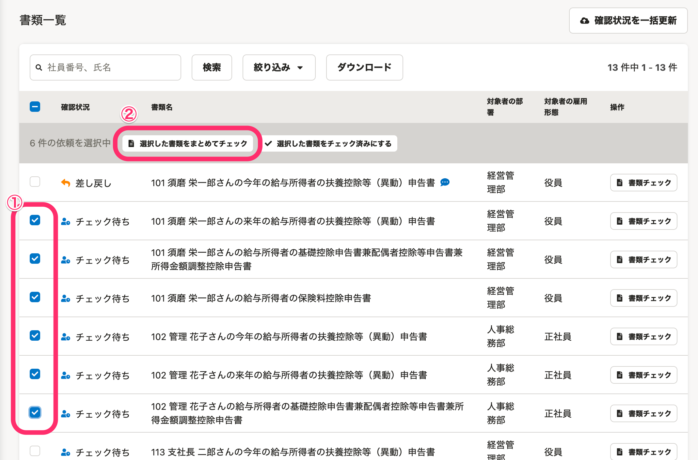
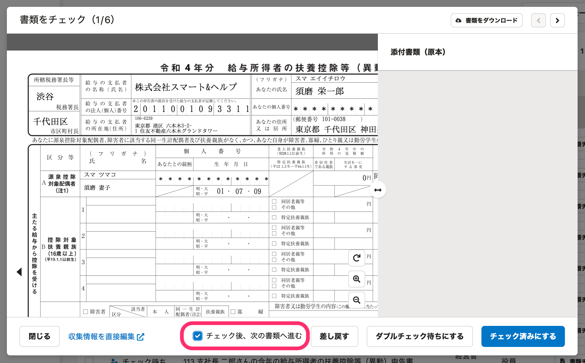
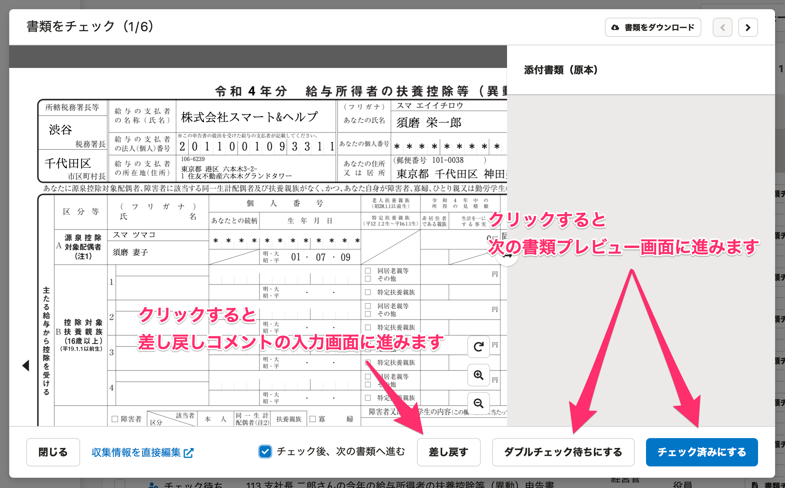
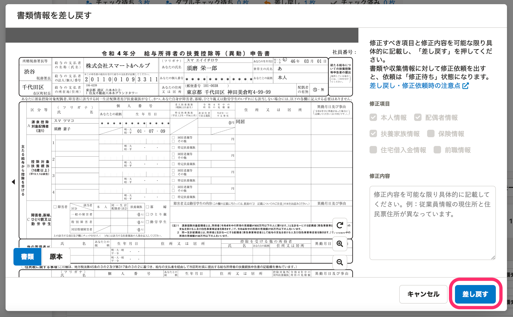
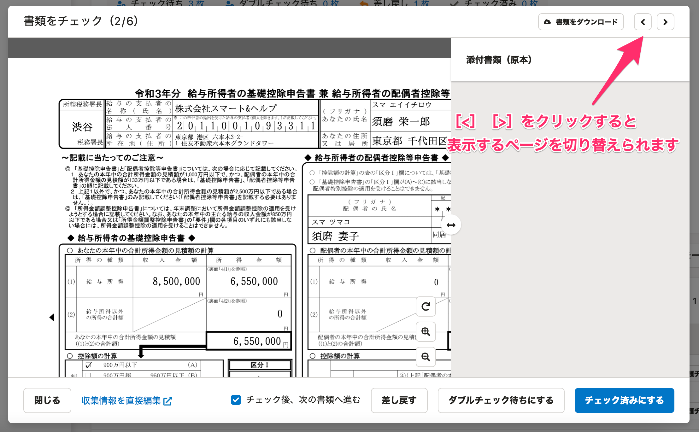

:::alert
当ページで案内しているSmartHRの年末調整機能の内容は、2021年（令和3年）版のものです。
2022年（令和4年）版の年末調整機能の公開時期は秋頃を予定しています。
なお、画面や文言、一部機能は変更になる可能性があります。
公開時期が決まり次第、[アップデート情報](https://smarthr.jp/update)でお知らせします。
:::

書類一覧画面で **［選択した書類をまとめて確認］** の機能を使うと、選択した書類を同じ画面上で連続して確認できます。

# 1.［書類一覧］で確認する書類にチェックをつけ、［選択した書類をまとめてチェック］をクリック

依頼一覧画面の表示切替で表示を **［書類一覧］** 画面に切り替えます。

 **［書類一覧］** から確認する書類にチェックをつけると、項目名の下に **［選択した書類をまとめてチェック］** ボタンが表示されるのでクリックします。

 **［選択した書類をまとめてチェック］** をクリックすると、書類のプレビュー画面が表示されます。

# 2.［チェック後、次の書類へ進む］にチェックをつける

書類のプレビュー画面下部にある **［チェック後、次の書類へ進む］** にチェックをつけます。

# 3\. 書類を確認する

書類を確認して **［チェック済みにする］** または **［ダブルチェック待ちにする］** をクリックすると、次の書類が表示され、連続して書類を確認できます。

 **［差し戻す］** をクリックすると、差し戻しコメントの編集画面が表示されます。

 **［差し戻す］** をクリックすると、 **［書類情報を差し戻す］** という画面が表示されます。

もう一度、 **［差し戻す］** をクリックすると、書類を従業員に差し戻し、元の書類のプレビュー画面に戻ります。

表示する書類を切り替えるには、画面右上に表示されている **［<］［>］** をクリックしてください。

