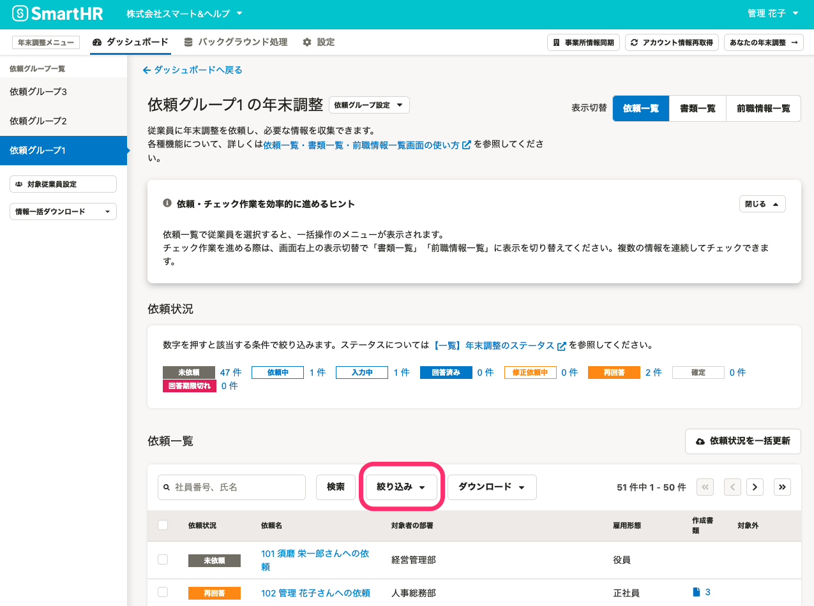
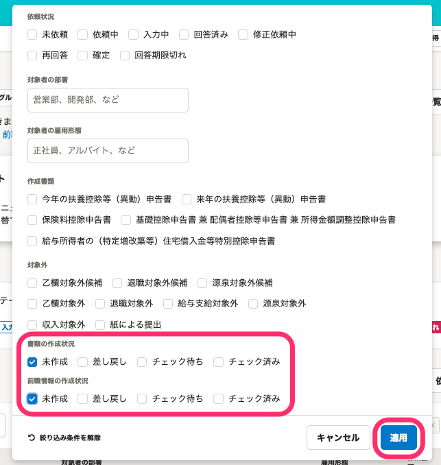
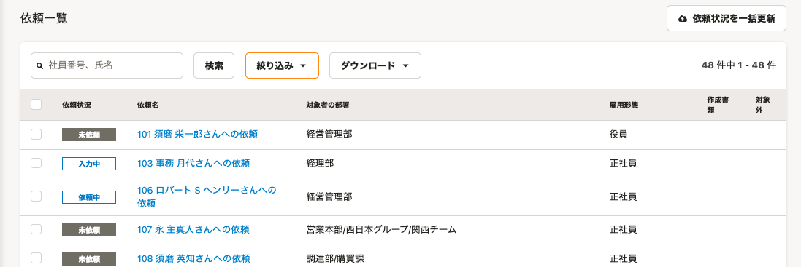

:::alert
当ページで案内しているSmartHRの年末調整機能の内容は、2021年（令和3年）版のものです。
2022年（令和4年）版の年末調整機能の公開時期は秋頃を予定しています。
なお、画面や文言、一部機能は変更になる可能性があります。
公開時期が決まり次第、[アップデート情報](https://smarthr.jp/update)でお知らせします。
:::

年末調整機能で書類または前職情報の作成状況から依頼を絞り込み、依頼一覧に表示する方法を説明します。

# 1\. 依頼一覧画面の［絞り込み▼］をクリック

依頼一覧画面の **［絞り込み▼］** をクリックすると、絞り込み条件を設定する画面が表示されます。

# 2.［書類の作成状況］［前職情報の作成状況］にチェックを入れ、［適用］をクリック

 **［書類の作成状況］［前職情報の作成状況］** に、絞り込みたいステータスにチェックを入れて、 **［適用］** をクリックします。

各ステータスの絞り込み条件は下記のとおりです。

なお、前職情報がない依頼を含める場合は「未作成」にもチェックを入れてください。

| **ステータス** | **条件** |
| --- | --- |
| 未作成 |   書類（前職情報）が1つもない   |
| 差し戻し | 書類（前職情報）のうち1つでも差し戻しがある |
| チェック待ち | 書類（前職情報）のうち1つでもチェック待ち、ダブルチェック待ちがあり、差し戻しがない |
| チェック済み | 書類（前職情報）がすべてチェック済み |

:::tips
「差し戻し」と「チェック待ち」がある場合は、「差し戻し」が優先されます。
「ダブルチェック待ち」は、表示の判定においては「チェック待ち」と同様の扱いとなります。
:::

# 3\. 依頼一覧に条件に該当する依頼が表示される

設定した絞り込み条件に該当する依頼が、依頼一覧に表示されます。

:::alert
絞り込み条件を適用した依頼一覧のデータは、ダウンロードできません。
 **［ダウンロード▼］** からデータをダウンロード後、ファイル上でデータの編集をお願いします。
:::
