:::alert
当ページで案内しているSmartHRの年末調整機能の内容は、2021年（令和3年）版のものです。
2022年（令和4年）版の年末調整機能の公開時期は秋頃を予定しています。
なお、画面や文言、一部機能は変更になる可能性があります。
公開時期が決まり次第、[アップデート情報](https://smarthr.jp/update)でお知らせします。
:::

従業員のアンケート回答により年末調整書類は作成されますが、回答次第では年末調整の書類が作成されていない、もしくは一部しか作成されていない場合があります。

このページでは、設問に対して従業員がどのように回答すると、書類の有無に関係するのかを説明しています。

必要書類が作成されていない場合は、該当するアンケートの回答内容を確認し、従業員に再確認・修正依頼をしてください。

1.  [年末調整の書類が1枚も作成されていない](#h_01FF2REF7FJYVS2X95YWG3GHAH)
2.  [来年の扶養控除等（異動）申告書だけが作成されている](#h_01FF2RF62GPAMZXGXYWG2BK9D9)
3.  [保険料控除申告書が作成されていない](#h_01FF2RFHPZ6JYPCHEG364HE1R7)
4.  [保険料控除申告書が作成されているが、内容が入力されていない](#h_01FF2RFX4G6F8BDCC4W7XRXFR5)
5.  [基礎控除申告書 兼 配偶者控除等申告書 兼 所得金額調整控除申告書が作成されていない](#h_01FF2RG79769DT07G5ZDART6JH)
6.  [住宅ローン控除申告書が作成されていない](#h_01FF2RGGV7504H8D2KRB4V7YV1)

:::tips
依頼ステータスが「回答済み」「再回答」でも、書類の作成条件を満たしていなければ、書類は作成されません。
保険料控除申告書の作成には、依頼一覧画面の **［依頼グループ設定］>［書類・原本設定］>［保険料控除申告書の作成設定］** が関係する場合があります。
詳細は「保険料控除申告書が作成されていない」項目の記載を確認してください。
:::

# 年末調整の書類が1枚も作成されていない

## アンケートで今年、来年ともに「乙欄に該当する」と回答している

### 「今年（2021年）の収入が多いのは、{会社名}ですか？」に「いいえ」と回答する

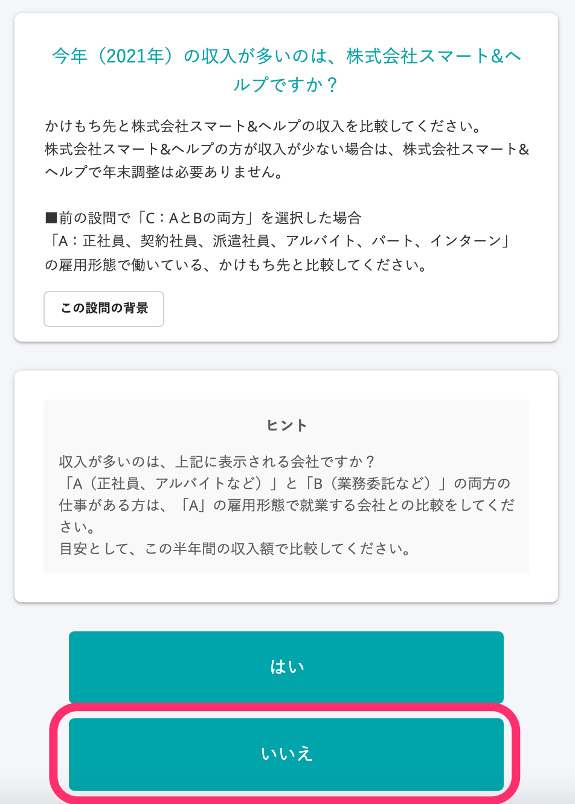

### 「来年（2022年）の収入見込みが多いのは、{会社名}ですか？」に「いいえ」と回答する

#### 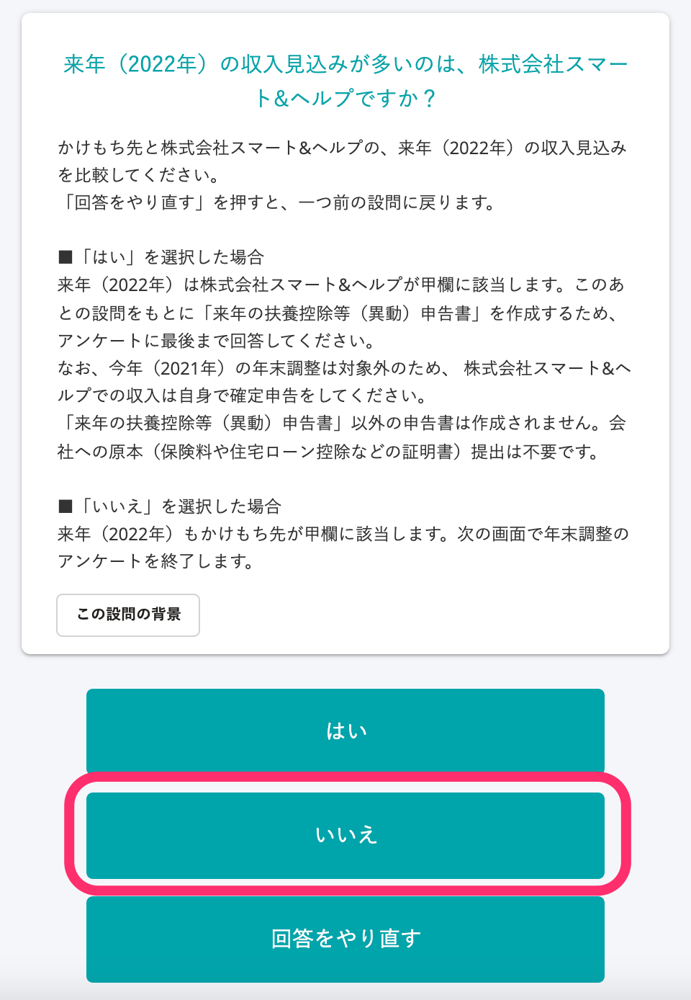

### 「年末調整の対象外です」に「入力を終了する」と回答する

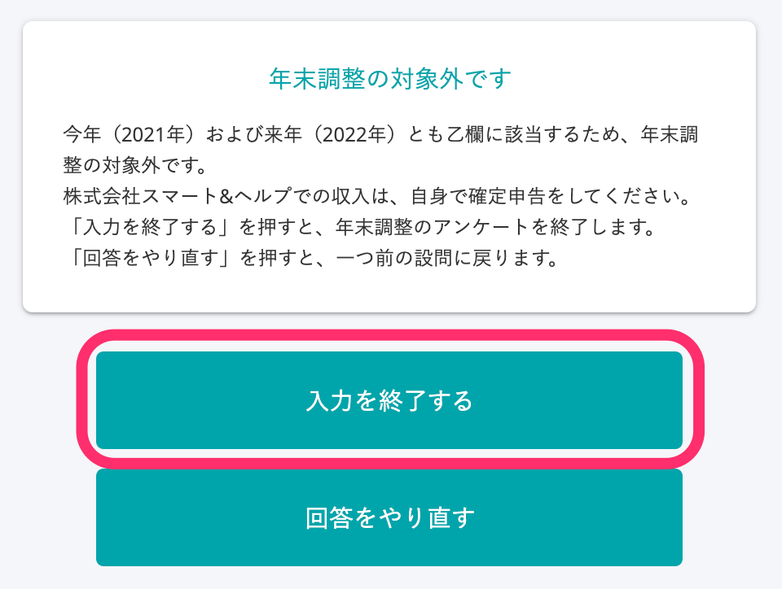

## アンケートで「退職予定あり」と回答している

### 「退職予定はありますか？」に「はい」と回答する

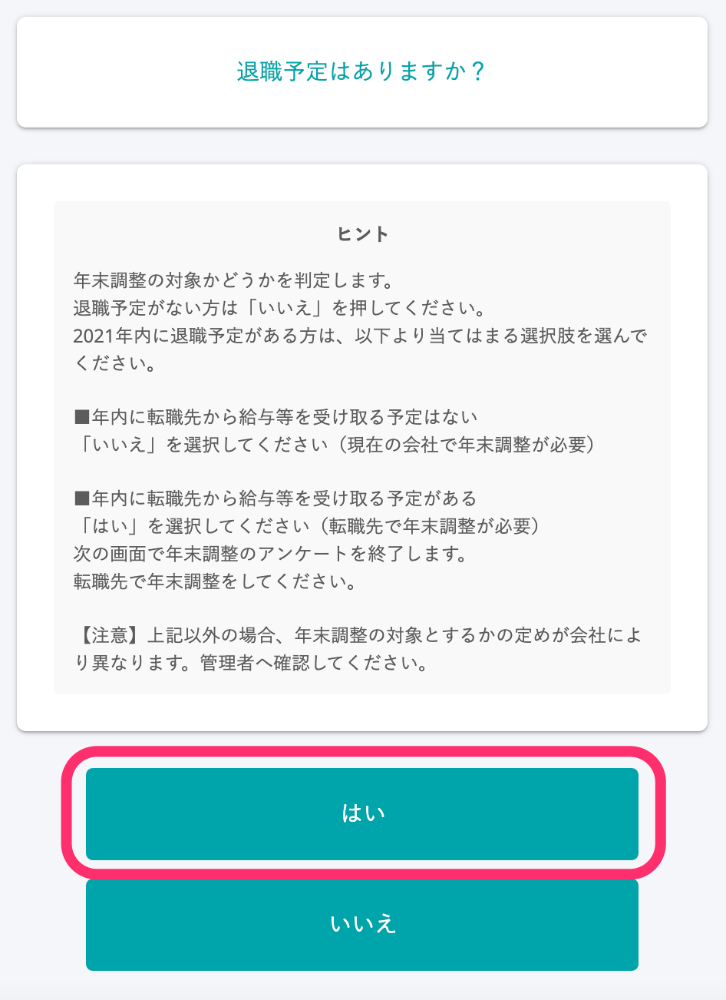

### 「年末調整のアンケートを終了します」に「退職予定があるため年末調整を終了する」と回答する

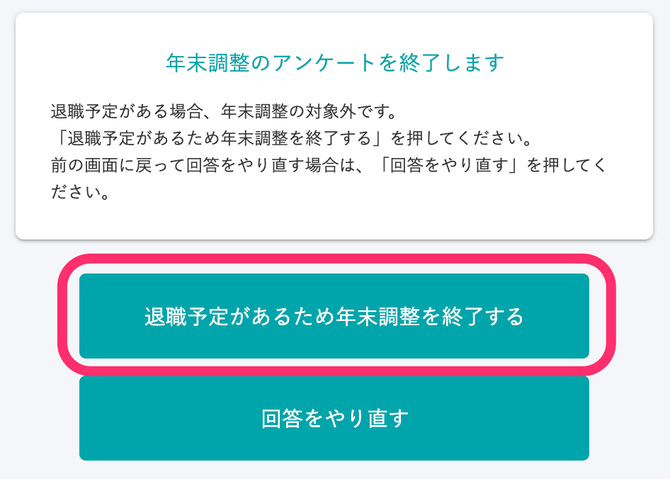

# 来年の扶養控除等（異動）申告書だけが作成されている

### 「今年（2021年）の収入が多いのは、{会社名}ですか？」に「いいえ」と回答する

### 「来年（2022年）の収入見込みが多いのは、{会社名}ですか？」に「はい」と回答する

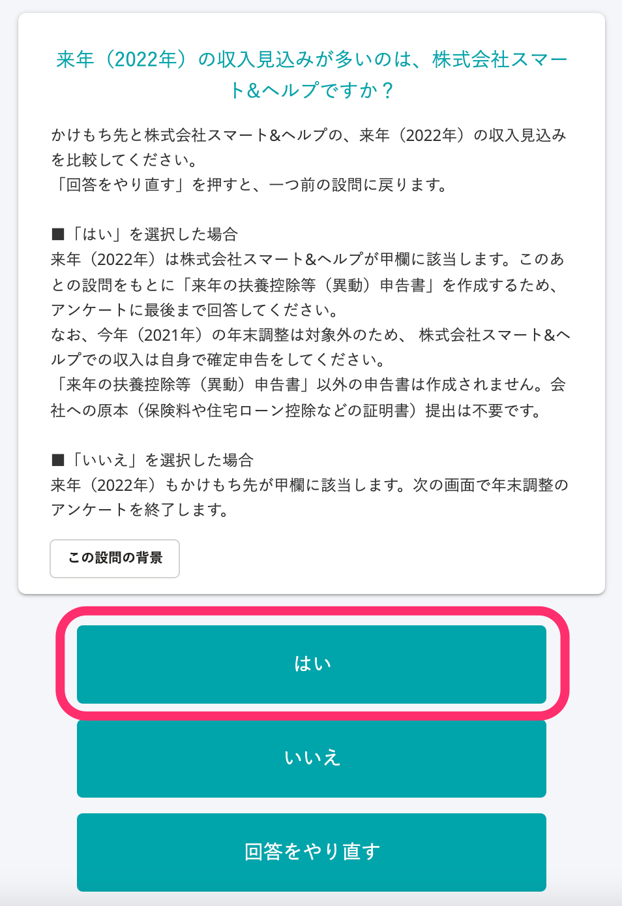

# 保険料控除申告書が作成されていない

### 依頼一覧画面の［依頼グループ設定▼］>［書類・原本設定］>［保険料控除申告書の作成設定］で、「申告書を作成しない」に設定している

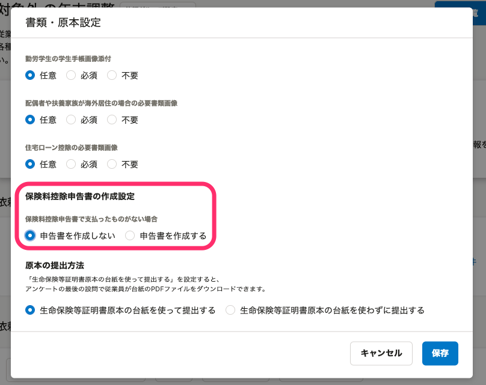

### 「今年（2021年）年末調整で保険料控除を申告しますか？」に「いいえ」と回答する

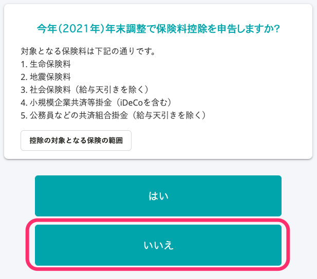

# 保険料控除申告書が作成されているが、内容が入力されていない

### 依頼一覧画面の［依頼グループ設定▼］>［書類・原本設定］>［保険料控除申告書の作成設定］で、「申告書を作成する」に設定している

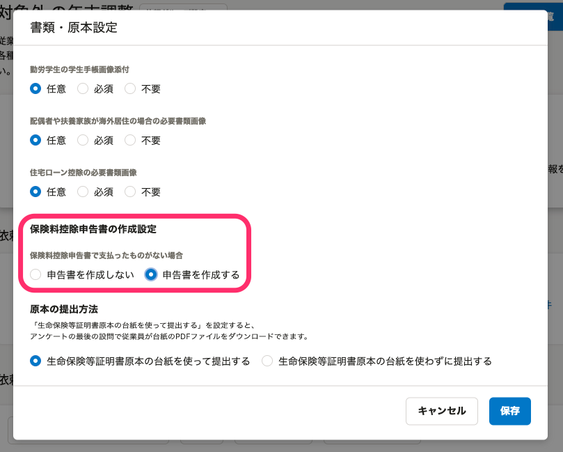

### 「今年（2021年）年末調整で保険料控除を申告しますか？」に「いいえ」と回答する

# 基礎控除申告書 兼 配偶者控除等申告書 兼 所得金額調整控除申告書が作成されていない

### 「収入の内訳を入力してください」で、入力した合計所得が2,500万円を超えている

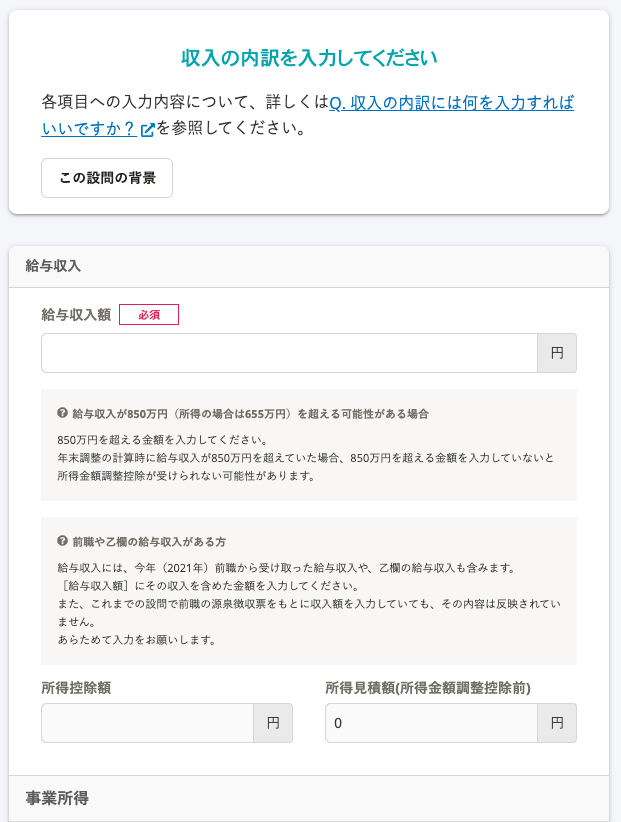

# 住宅ローン控除申告書が作成されていない

### 「年末調整で住宅ローン控除を申告しますか？」に、「いいえ」と回答する

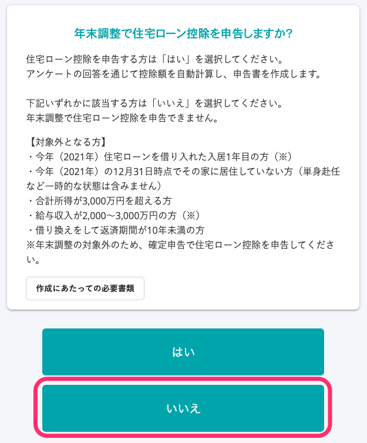

### 「SmartHRで住宅ローン控除申告書を作成できるかどうか確認します」に、「対象外に該当する」と回答する

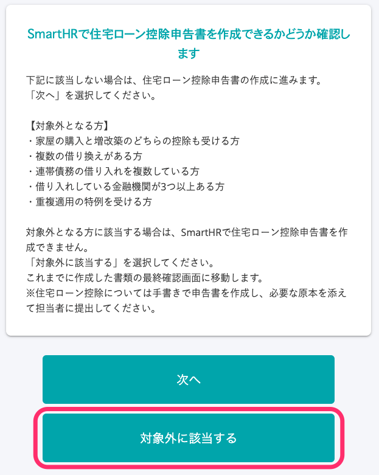

:::tips
給与収入予定額が2,000万円を超えているとアンケートで回答した場合も、住宅ローン控除申告書は作成されます。
お手数ですが、住宅ローン控除申告書は管理者が書類単位で削除をお願いします。
:::
