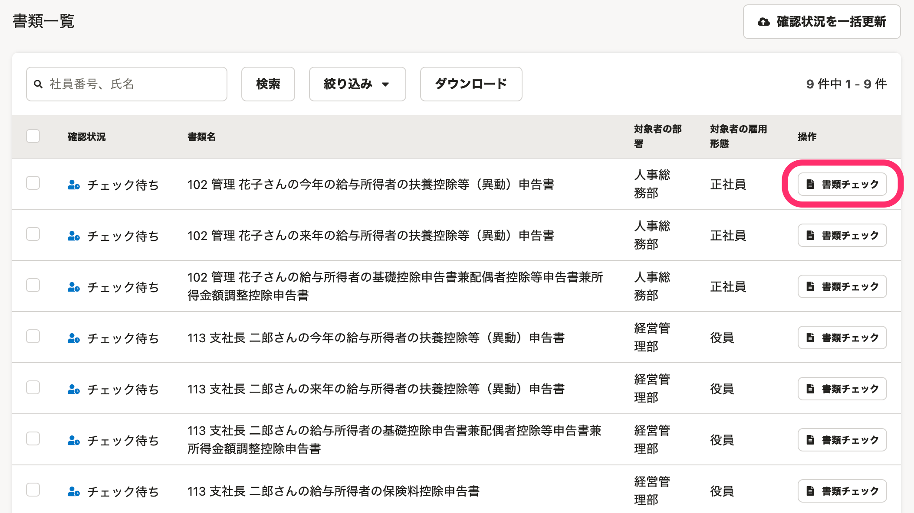
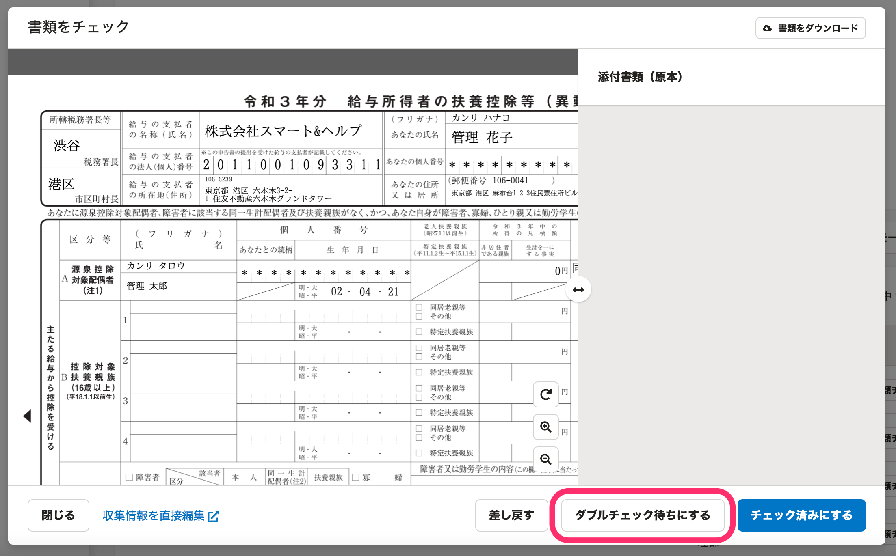
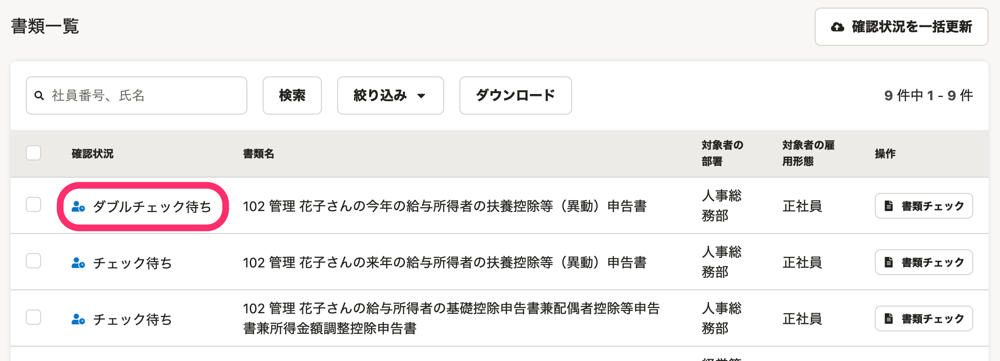
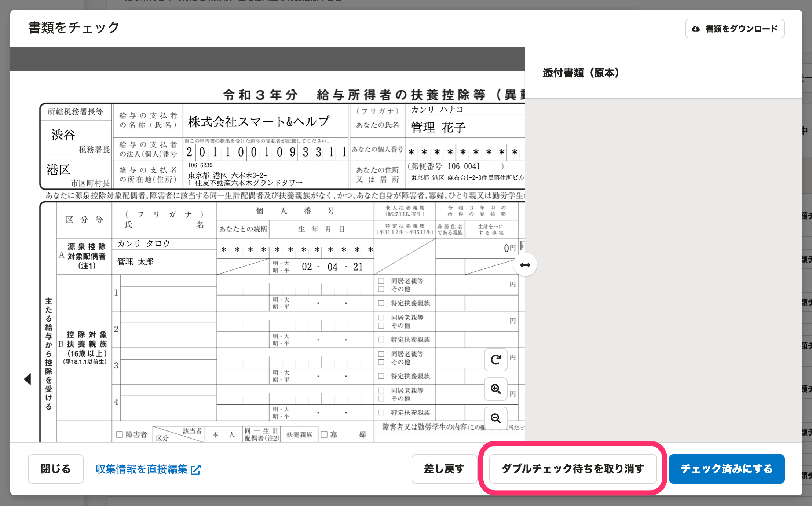

:::alert
当ページで案内しているSmartHRの年末調整機能の内容は、2021年（令和3年）版のものです。
2022年（令和4年）版の年末調整機能の公開時期は秋頃を予定しています。
なお、画面や文言、一部機能は変更になる可能性があります。
公開時期が決まり次第、[アップデート情報](https://smarthr.jp/update)でお知らせします。
:::

書類のダブルチェック機能は、年末調整の書類チェックを2名体制で進める場合に便利な機能です。

書類一覧の **［書類チェック］** 、前職情報一覧の **［前職情報チェック］** をクリックして、書類確認のダイアログで **［ダブルチェック待ちにする］** をクリックすると使えます。

下記は、書類一覧で **［書類チェック］** から内容を確認する場合を例にした操作手順です。

:::tips
1名でチェックする場合は、ダブルチェック機能は必要ありません。
:::

# 1\. 書類一覧で［書類チェック］をクリック

依頼一覧画面を **［書類一覧］** に表示を切り替えます。

画面下部の **［書類一覧］** にある **［書類チェック］** をクリックすると、書類確認のダイアログが表示されます。

:::tips
従業員から提出された年末調整の書類をまとめて確認する場合は、以下のヘルプページをご覧ください。
[従業員から提出された年末調整をまとめて確認する](https://knowledge.smarthr.jp/hc/ja/articles/360055393313)
:::

# 2\. 内容を確認し、［ダブルチェック待ちにする］をクリック

内容を確認し、2人目のチェックに回して問題ない場合は［ **ダブルチェック待ちにする］** をクリックします。

書類を **［ダブルチェック待ち］** にすると、書類一覧の **［確認状況］** が **［チェック待ち］** から **［ダブルチェック待ち］** に変わります。

:::tips
誤って操作した場合は、再度、書類確認の画面を開き、 **［ダブルチェック待ちを取り消す］** をクリックして、 **［チェック待ち］** に戻してください。

:::
