:::alert
当ページで案内しているSmartHRの年末調整機能の内容は、2021年（令和3年）版のものです。
2022年（令和4年）版の年末調整機能の公開時期は秋頃を予定しています。
なお、画面や文言、一部機能は変更になる可能性があります。
公開時期が決まり次第、[アップデート情報](https://smarthr.jp/update)でお知らせします。
:::

年末調整機能でCSVファイルを使用して依頼状況を一括更新する方法と、書類・前職情報の確認状況を一括更新する方法を説明します。

一括して「依頼する」「確定する」などを行ないたい場合や、従業員による年末調整の回収後、変更がない書類を一括して「チェック済み」にしたい場合に便利です。

# 依頼状況を一括で更新する

## 1\. 依頼一覧画面の［依頼状況を一括更新］をクリック

依頼一覧画面の **［依頼状況を一括更新］** をクリックすると、 **［依頼状況の一括更新（CSVファイルの取り込み）］** 画面が表示されます。

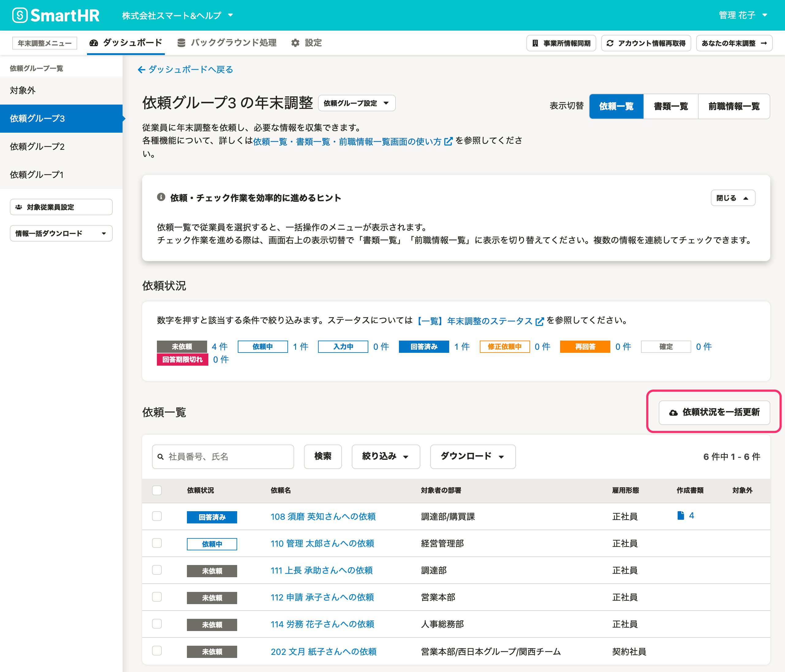

## 2\. サンプルCSVファイルをダウンロード

 **［サンプルCSVファイルのダウンロード］** をクリックして、テンプレートをダウンロードします。

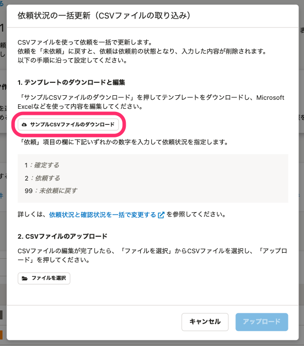

## 3\. 依頼状況を変更したい従業員を確認し、CSVファイルを編集する

依頼状況を変更したい従業員の、現在の依頼状況と社員番号を確認します。

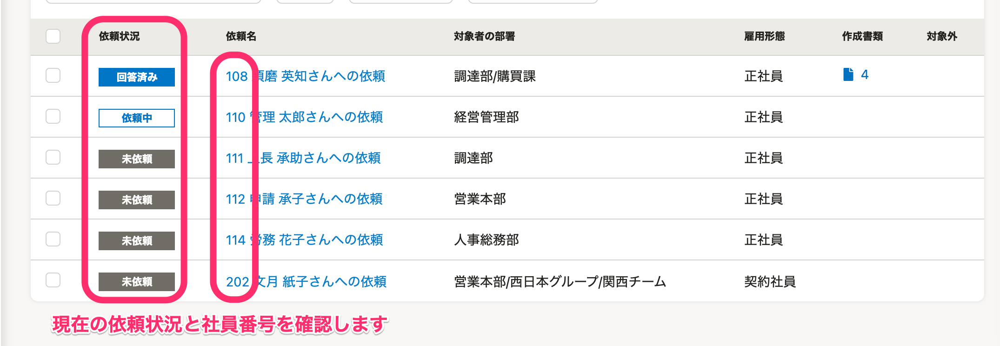

次にサンプルCSVファイルを開き、依頼状況を変更したい従業員の「社員番号」を入力し、「依頼」欄には変更後の依頼ステータスを数字で指定します。

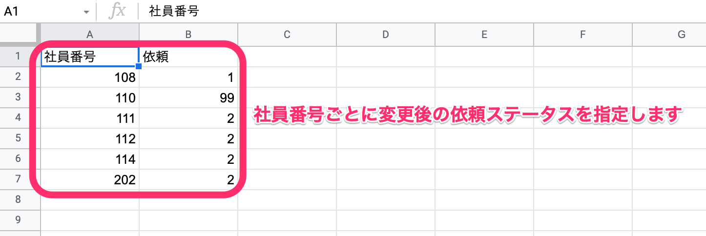

### 「依頼」欄に指定する数字と変更内容

|    **「依頼」欄に指定する数字**    | **変更内容** | **条件** |
| --- | --- | --- |
| 1 | 年末調整の依頼を確定する（依頼ステータスが「確定」になる） |   - 操作者が、年末調整機能の「依頼の確定」の権限がある - 対象の依頼ステータスが「未依頼」「回答済み」「再回答」   |
| 2 |   年末調整を依頼する（依頼ステータスが「依頼中」になる）   | 対象の依頼ステータスが「未依頼」 |
| 99 | 年末調整を未依頼に戻す（依頼ステータスが「未依頼」になる） |   - 操作者が、SmartHRの管理者権限がある - 対象の依頼ステータスが「依頼中」「入力中」「回答済み」「再回答」   |
| 空欄 | 変更なし | \- |

## 4\. 編集したCSVファイルをアップロード

 **［依頼状況の一括更新（CSVファイルの取り込み）］** 画面の **［ファイルを選択］** をクリックし、編集したCSVファイルを選択します。

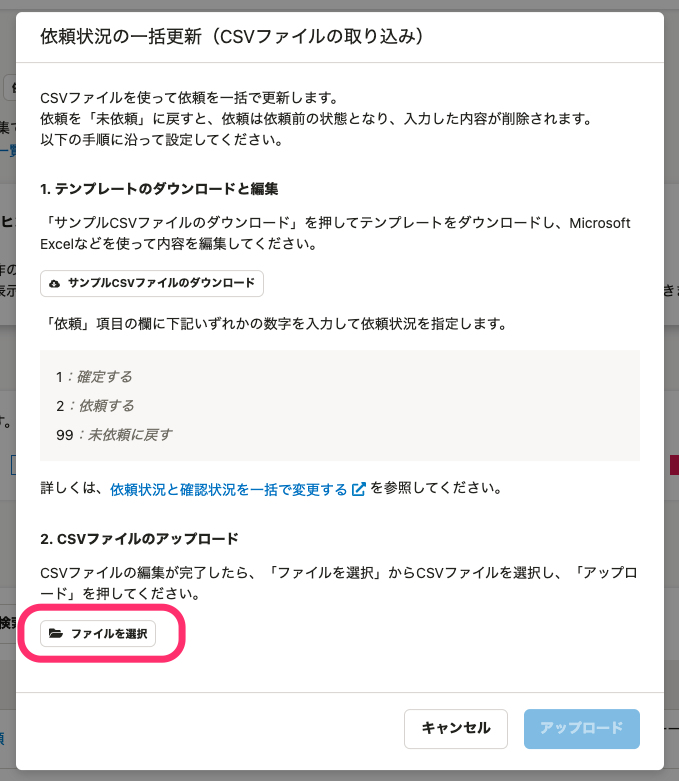

 **［アップロード］** をクリックすると、ログインパスワードの入力が求められます。

パスワードを入力し、 **［確認する］** をクリックすると、バックグラウンド処理が始まります。

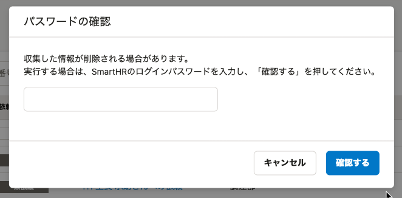

## 5\. ［依頼一覧］画面に戻り、対象従業員の依頼状況が変更されているか確認する

バックグラウンド処理後、 **［依頼一覧］** 画面で対象従業員の依頼状況が、指定した内容に変わっているか確認します。

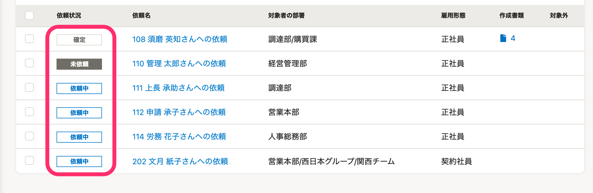

# 書類・前職情報の確認状況を一括更新する

:::tips
 **［書類一覧］** 画面でも、 **［前職情報一覧］** 画面でも、操作手順やCSVファイルに入力する数字は同様です。
ここでは、 **［書類一覧］** 画面を用いて説明します。
:::

## 1\. 依頼一覧画面の表示を［書類一覧］に切り替える

依頼一覧画面の表示を **［書類一覧］** に切り替えます。

 **［確認状況を一括更新］** をクリックすると、 **［書類・前職情報確認状況の一括更新（CSVファイルの取り込み）］** 画面が表示されます。

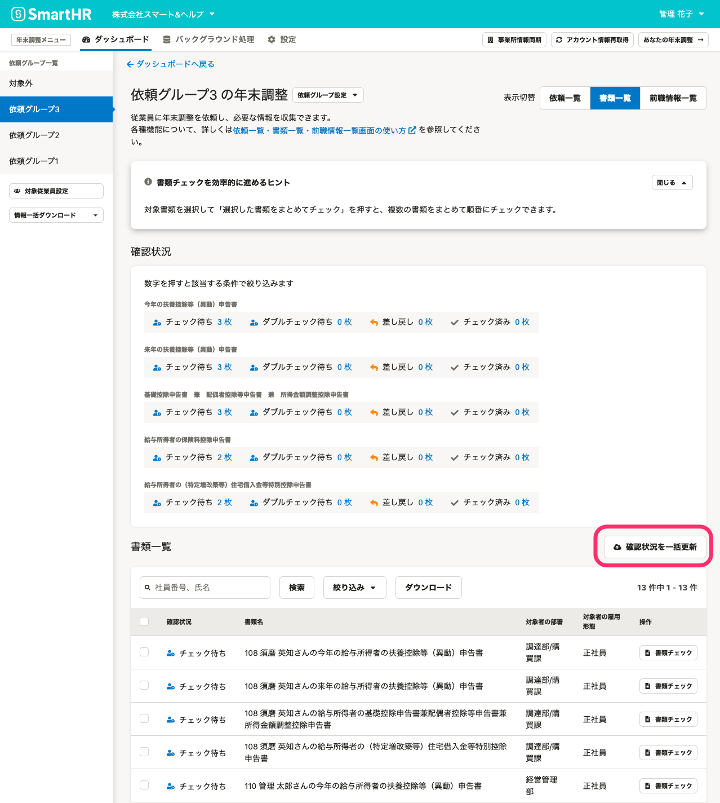

## 2\. サンプルCSVファイルをダウンロード

 **［サンプルCSVファイルのダウンロード］** をクリックして、テンプレートをダウンロードします。

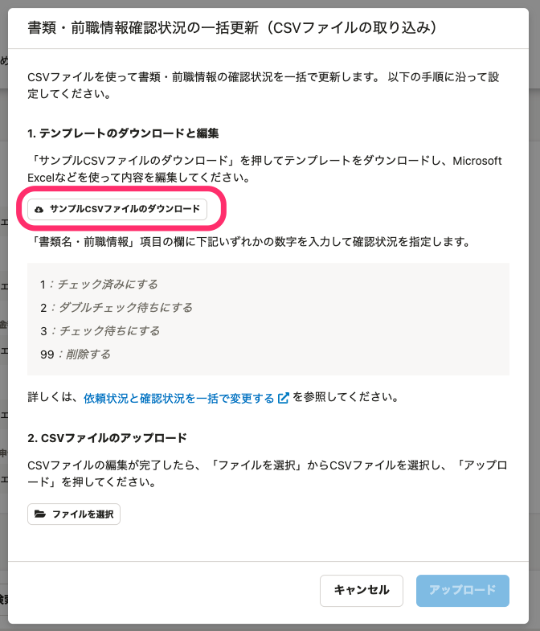

## 3\. 書類の［確認状況］を変更したい従業員を確認し、CSVファイルを編集する

 **［確認状況］** を変更したい従業員の、現在の書類確認状況と社員番号を確認します。

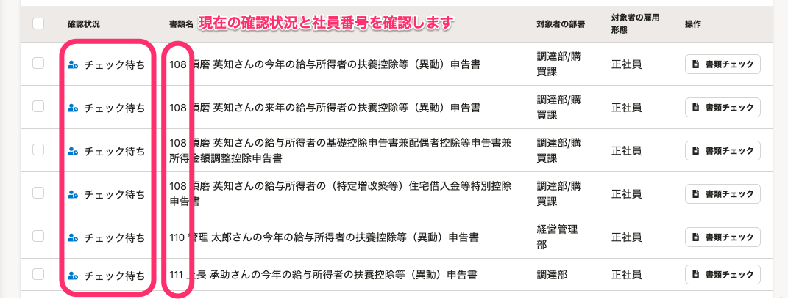

次に、サンプルCSVファイルを開き、書類の確認状況を変更したい従業員の「社員番号」を入力し、「今年のマルフ」「来年のマルフ」「基配所」「保険料控除申告書」「住宅借入金等控除申告書」欄には、変更後の **［確認状況］** を数字で指定します。

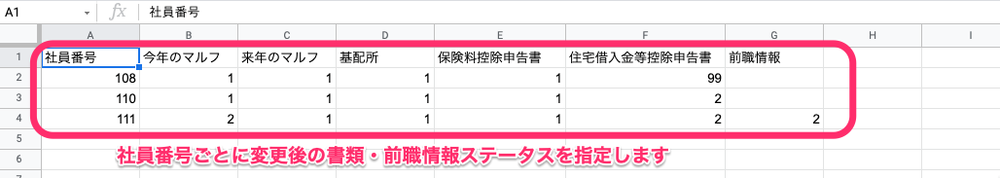

:::tips
書類の **［確認状況］** と、前職情報の **［確認状況］** を同時に変更することも可能です。
上記の場合、社員番号111の従業員の「前職情報」欄にも変更後の数字を指定し、書類と前職情報を同時に変更するようCSVファイルを編集しています。
:::

### 「書類」欄と「前職情報」欄に指定する数字と変更内容

|  **「書類」欄と「前職情報」欄に指定する数字**  | **書類・前職情報の変更内容** | **条件** |
| --- | --- | --- |
| 1 | 書類を「チェック済み」にする |   - 対象の依頼ステータスが「未依頼」「回答済み」「再回答」「修正依頼中」 - 対象の書類・前職情報が「チェック待ち」もしくは「ダブルチェック待ち」   |
| 2 | 書類を「ダブルチェック待ち」にする |   - 対象の依頼ステータスが「未依頼」「回答済み」「再回答」「修正依頼中」 - 対象の書類・前職情報が「チェック待ち」   |
| 3 | 書類を「チェック待ち」にする |   - 対象の依頼ステータスが「未依頼」「回答済み」「再回答」「修正依頼中」 - 対象の書類・前職情報が「ダブルチェック待ち」もしくは「チェック済み」   |
| 99 | 書類を「削除」する ※前職情報の場合は、削除されません |   - 操作者が、SmartHRの管理者権限がある - 対象の依頼ステータスが「未依頼」「回答済み」「再回答」 - 対象の書類・前職情報が「チェック待ち」もしくは「ダブルチェック待ち」   |
| 空欄 | 変更なし | \- |

## 4\. 編集したCSVファイルをアップロード

 **［書類・前職情報確認状況の一括更新（CSVファイルの取り込み）］** 画面の **［ファイルを選択］** をクリックし、編集したCSVファイルを選択します。

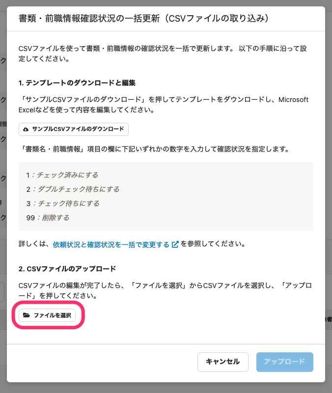

 **［アップロード］** をクリックすると、ログインパスワードの入力が求められます。

パスワードを入力し、 **［確認する］** をクリックすると、バックグラウンド処理が始まります。

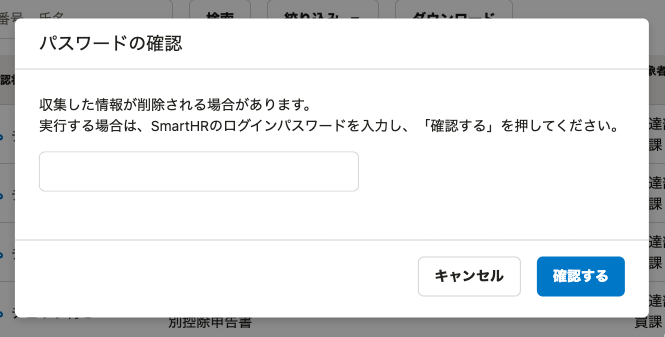

## 5\. 書類一覧画面に戻り、対象従業員の書類の［確認状況］が変更されているか確認する

バックグラウンド処理後、書類一覧で対象従業員の **［確認状況］** が、指定した内容に変わっているか確認します。

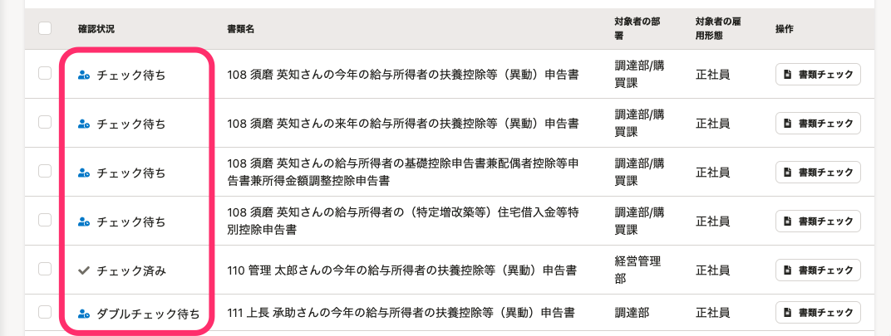

:::tips
「3. 書類の［確認状況］を変更したい従業員を確認し、CSVファイルを編集する」で、社員番号111の従業員の「前職情報」欄にも変更後の数字を指定しました。
書類の **［確認状況］** と同時に、前職情報の **［確認状況］** も更新されます。
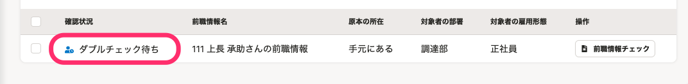
:::
