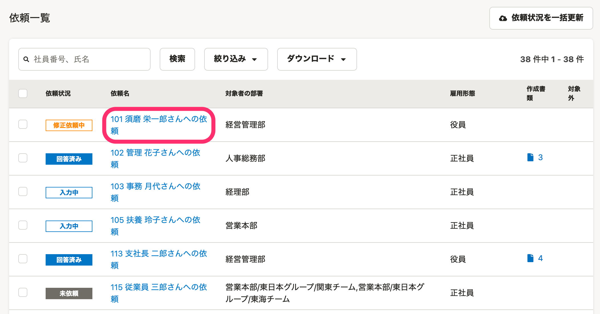
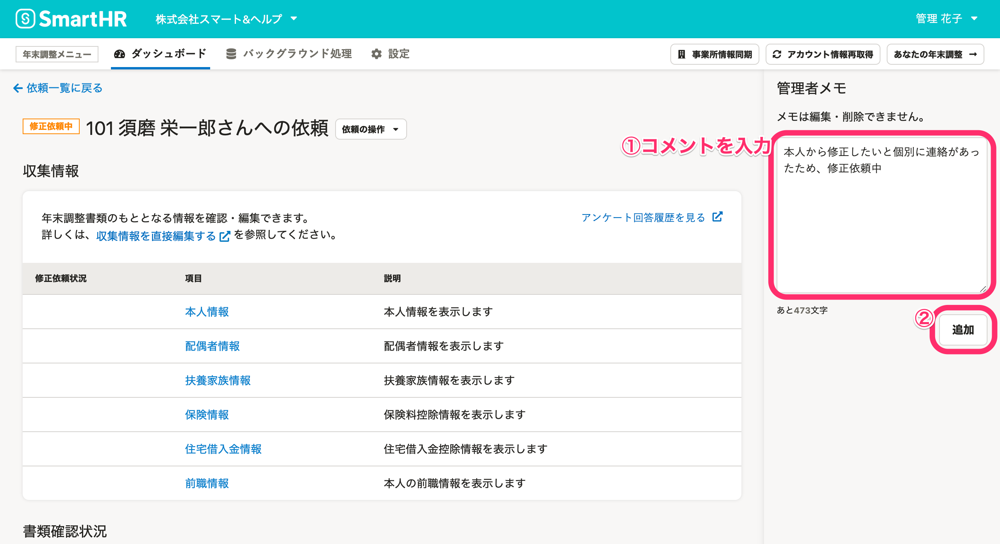
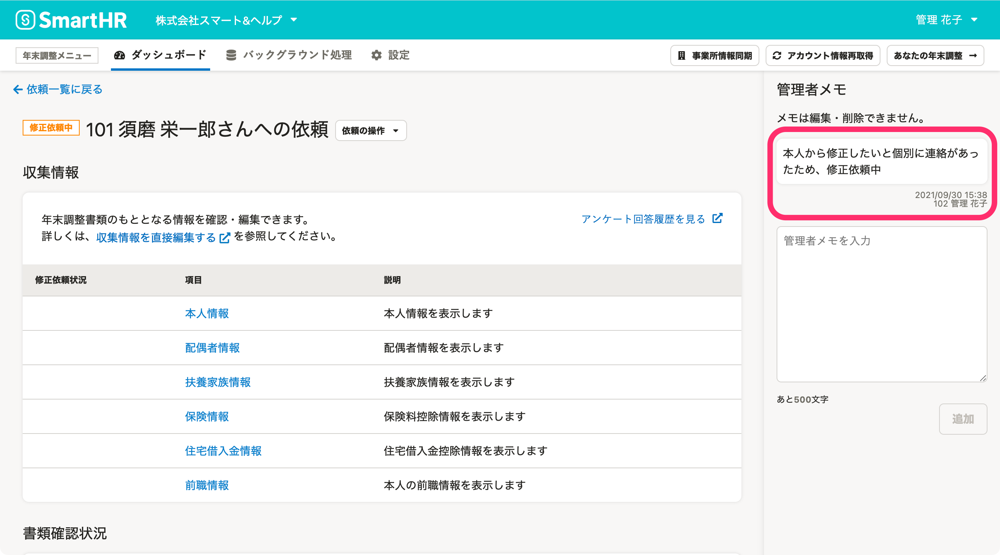

:::alert
当ページで案内しているSmartHRの年末調整機能の内容は、2021年（令和3年）版のものです。
2022年（令和4年）版の年末調整機能の公開時期は秋頃を予定しています。
なお、画面や文言、一部機能は変更になる可能性があります。
公開時期が決まり次第、[アップデート情報](https://smarthr.jp/update)でお知らせします。
:::

年末調整の依頼一覧で、従業員への依頼ごとに管理者メモを残し、確認できます。

複数の担当者間の情報共有や、備忘録などにご活用ください。

:::alert
一度投稿したコメントの編集と削除はできません。
:::

# 1\. 依頼一覧の［依頼名］をクリック

依頼一覧画面の **［依頼名］** をクリックし、依頼詳細画面へ移動します。

# 2.［管理者メモ］にコメントを入力する

依頼詳細画面の右側にある **［管理者メモ］** にコメントを入力し、 **［追加］** をクリックするとコメントが登録されます。

コメントを追加すると、コメントをした日時と担当者名が表示されます。

担当者のアカウントが設定されていない場合は、担当者名のかわりにメールアドレスが表示されます。

担当者名を表示するには、従業員を招待してアカウントを設定してください。

:::related
[従業員をSmartHRに招待する](https://knowledge.smarthr.jp/hc/ja/articles/360026264133)
[社員番号アカウントを作成する](https://knowledge.smarthr.jp/hc/ja/articles/360026263373)
:::
:::tips
**管理者メモの仕様**
- 管理者メモに入力できる文字数の上限は500文字です。
- 管理者メモの入力欄では改行できます。
- コメント数の上限はありません。
- 依頼一覧画面の **［依頼状況一覧をダウンロード］** からダウンロードできるCSVファイルには、最新のコメントが表示されます。
:::
