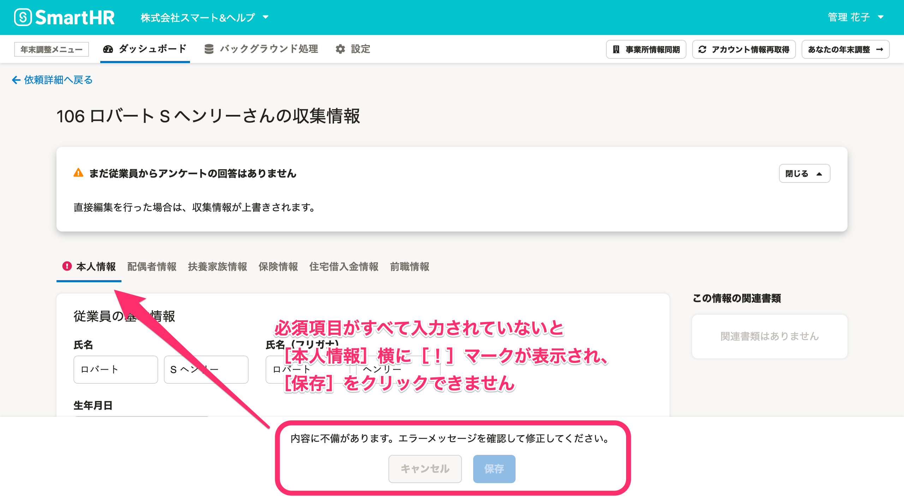
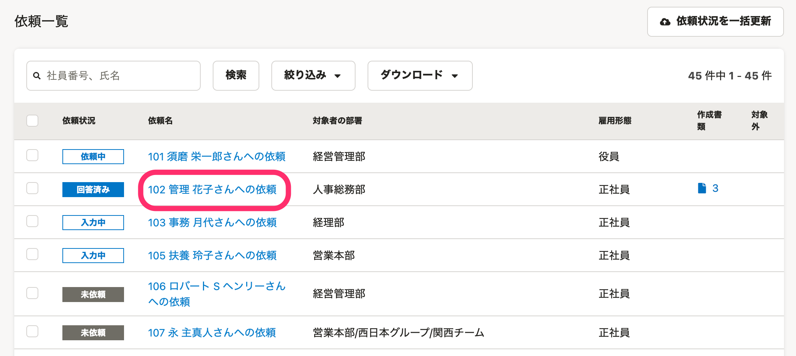
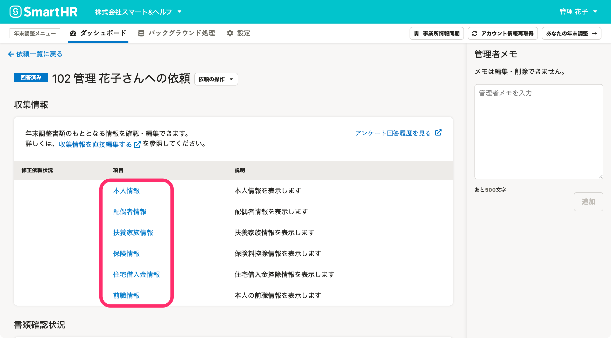
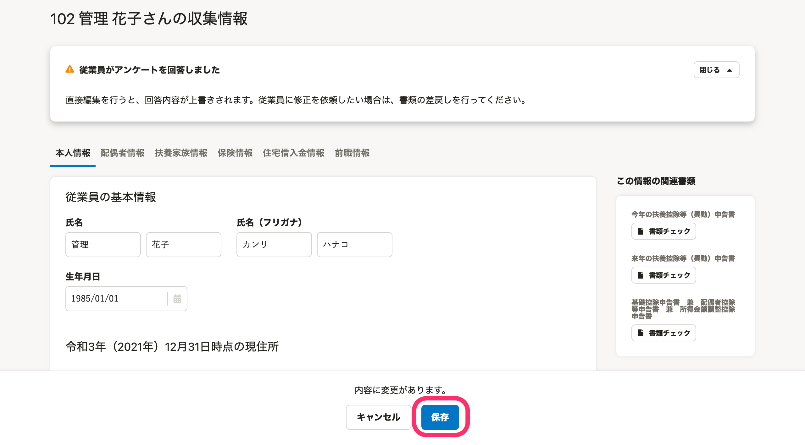
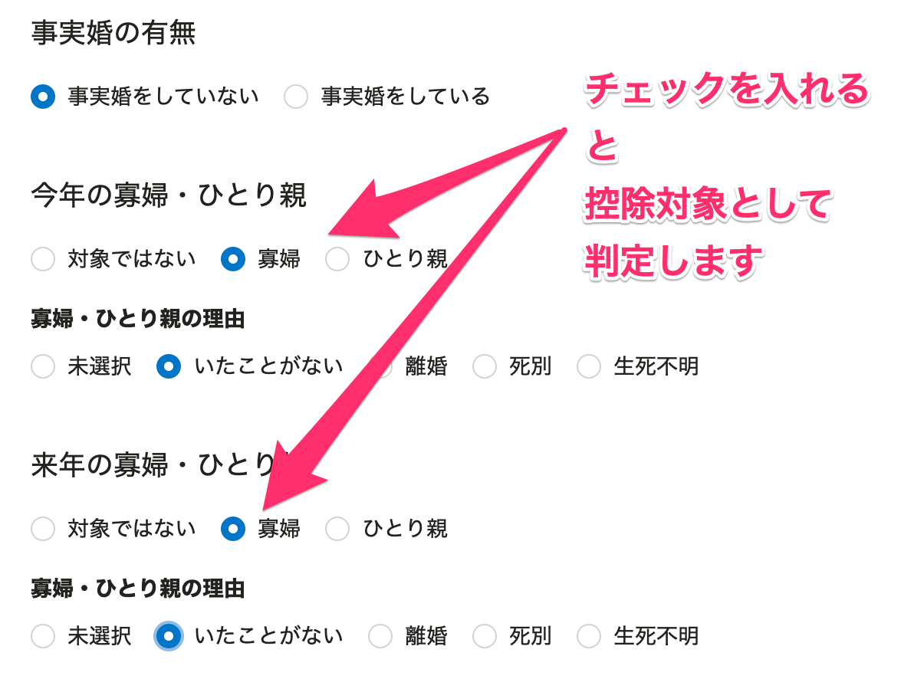

:::alert
当ページで案内しているSmartHRの年末調整機能の内容は、2021年（令和3年）版のものです。
2022年（令和4年）版の年末調整機能の公開時期は秋頃を予定しています。
なお、画面や文言、一部機能は変更になる可能性があります。
公開時期が決まり次第、[アップデート情報](https://smarthr.jp/update)でお知らせします。
:::

従業員の年末調整の書類は、従業員がアンケートに回答して作成するほか、管理者が収集情報を直接編集して作成する方法もあります。

当ページでは、管理者が収集情報を直接編集する方法を案内します。

:::alert
なお、依頼のステータスが「入力中」の場合、管理者による編集はできません。
ステータスを「未依頼」に戻すか、従業員に最後までアンケートを回答してもらい「回答済み」の状態で操作してください。
:::
:::related
[年末調整の依頼を「未依頼」に戻す](https://knowledge.smarthr.jp/hc/ja/articles/360034870774)
:::

# 年末調整の依頼前に収集情報を編集する場合の注意点

## 必須項目が未入力の場合、すべて入力してください。

収集情報を編集する際、必須項目をすべて入力しなければ情報の保存ができません。

 **［本人情報］** の「世帯主の氏名」「世帯主の続柄」「来年の収入」は入力必須項目です。

:::tips
管理者が入力した収集情報は、従業員が年末調整のアンケートに回答することで書き換えできますのでご安心ください。
:::

# 1\. 依頼一覧の［依頼名］をクリック

年末調整の依頼一覧画面で、書類を作成したい従業員の［ **依頼名］** をクリックすると、依頼詳細画面に移動します。

# 2\. 情報を編集する［項目名］をクリック

情報を編集する **［項目名］** をクリックすると、収集情報の編集画面に移動します。

# 3\. 情報を入力し、［保存］をクリック

編集画面で必要な情報を入力し、 **［保存］** をクリックすると、画面左下に「収集情報を保存しました」というメッセージが表示され、入力した内容が保存されます。

:::alert
**1\. 入力した内容に応じて書類の内容および控除対象が書き換わります。**
例えば、源泉控除対象の配偶者が存在する状態で、本人情報の給与収入を「1,095万1円以上」に変更した場合、配偶者は源泉控除対象ではなくなります。
**2\. 寡婦・ひとり親については、情報を書き換えても控除対象として自動で判定されません。**
例えば、合計所得金額が500万円以下で「ひとり親控除」に該当する従業員の合計所得金額を500万1円に変更しても、「ひとり親控除」情報は削除されません。
寡婦・ひとり親控除の対象とするには、手動で区分を変える必要があります。
情報を編集後、本人情報の［**今年の寡婦・ひとり親］ ［来年の寡婦・ひとり親］の項目に必ずチェックを入れてください。**

従業員の回答を確認し、寡婦・ひとり親控除の対象とさせる手順については下記のヘルプページで案内しています。
[Q. 年末調整の書類に寡婦・ひとり親が表示されない場合は？](https://knowledge.smarthr.jp/hc/ja/articles/360039191593)
:::
