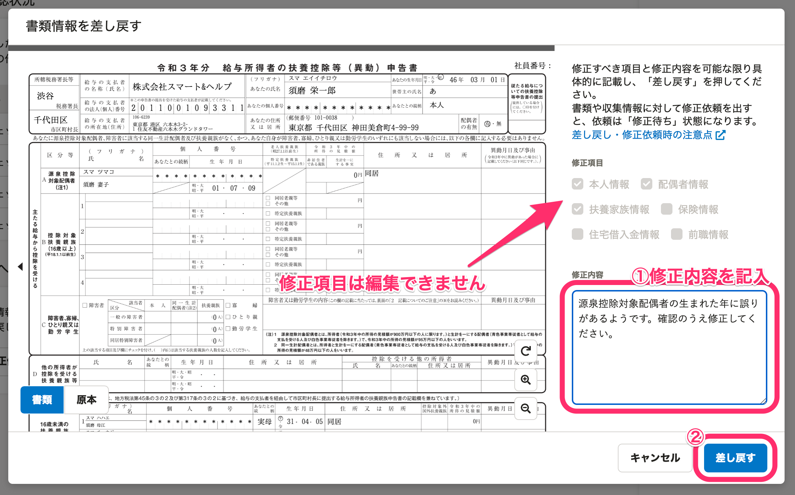
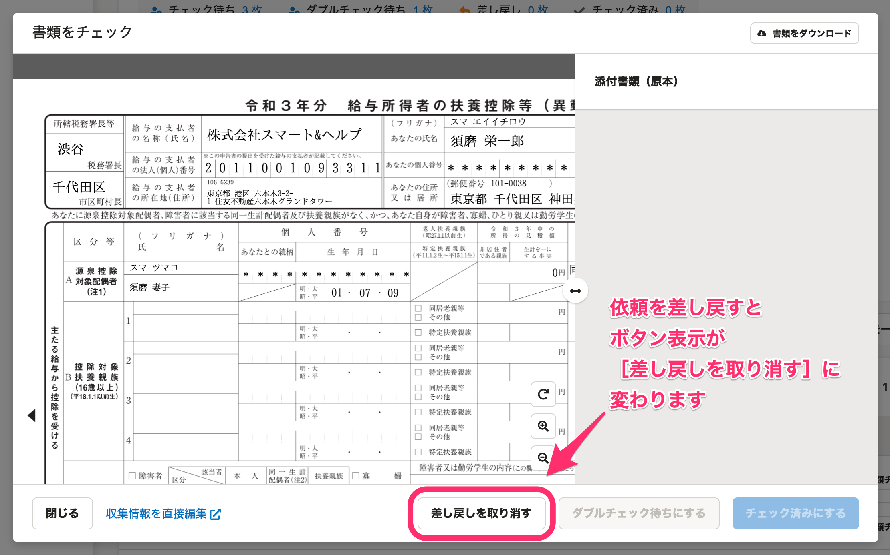
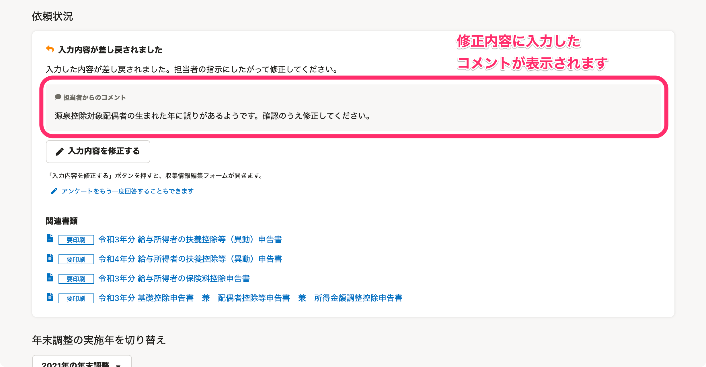

:::alert
当ページで案内しているSmartHRの年末調整機能の内容は、2021年（令和3年）版のものです。
2022年（令和4年）版の年末調整機能の公開時期は秋頃を予定しています。
なお、画面や文言、一部機能は変更になる可能性があります。
公開時期が決まり次第、[アップデート情報](https://smarthr.jp/update)でお知らせします。
:::

年末調整機能では、修正が必要な書類だけを従業員に差し戻しできます。

従業員に書類の修正を依頼するには、書類チェック画面にある **［差し戻す］** をクリックしてください。

提出書類の確認方法は以下のヘルプページをご覧ください。

:::related
[従業員から提出された年末調整を確認する](https://knowledge.smarthr.jp/hc/ja/articles/360034870254)
[書類のダブルチェック機能を使う](https://knowledge.smarthr.jp/hc/ja/articles/360054031913)
[Q. 年末調整の修正依頼と差し戻しの違いは？](https://knowledge.smarthr.jp/hc/ja/articles/4404343461785)
:::

# 差し戻し手順

## 1\. 書類チェック画面の［差し戻す］をクリック

書類チェック画面の右下にある **［差し戻す］** をクリックすると、修正内容の編集画面が表示されます。

## 2\. 修正内容を入力し、［差し戻す］をクリック

 **［修正内容］** 欄に修正内容を入力し、 **［差し戻す］** をクリックすると、書類チェック画面に戻ります。

差し戻しをすると、ボタン表示が［ **差し戻しを取り消す］** に変わります。

差し戻しを取り消すには、 **［差し戻しを取り消す］** をクリックします。

# 差し戻された従業員側の画面表示

書類を差し戻しすると、従業員の年末調整画面に「入力内容が差し戻されました」と表示され、 **［修正内容］** 欄に入力したコメントが表示されます。

また、差し戻しの操作と同時に、従業員には「年末調整が差戻されました」というタイトルのメールが送信されます。

:::alert
差し戻しをすると、従業員の年末調整画面に **［アンケートをもう一度回答することもできます］** という文字が表示され、年末調整のアンケートに再度一から回答できるようになります。
従業員がアンケートの再回答をした場合、再回答を開始した時点で以下の情報が削除されます。
- アンケートの回答履歴
- アンケートに回答した結果、作成された書類
- 処理日時
また、ステータスや処理日時にも影響があります。
-  **［前職情報一覧］** の確認状況
    -  **［ダブルチェック待ち］［チェック済み］** だった場合、 **［チェック待ち］** に変わります。
-  **［依頼一覧］** の確認状況
    -  **［修正依頼中］** に変わります。
書類を差し戻された従業員の操作や画面表示について、詳しくは下記のヘルプページをご覧ください。
:::
:::related
[Q. 提出した年末調整が差し戻された場合は？](https://knowledge.smarthr.jp/hc/ja/articles/360035370073)
:::
