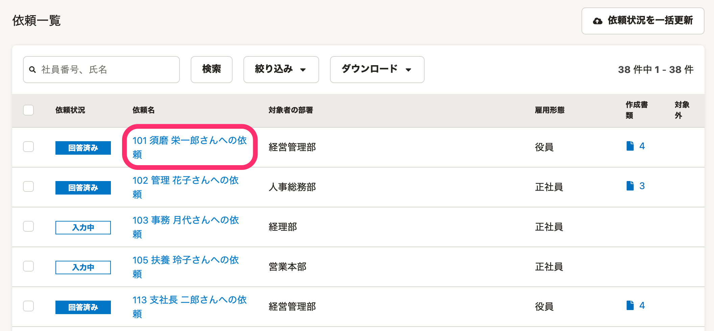
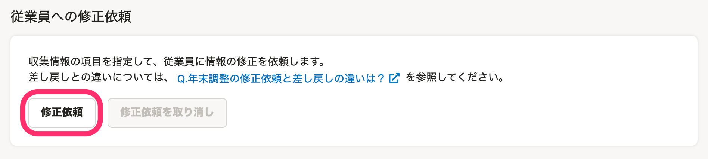
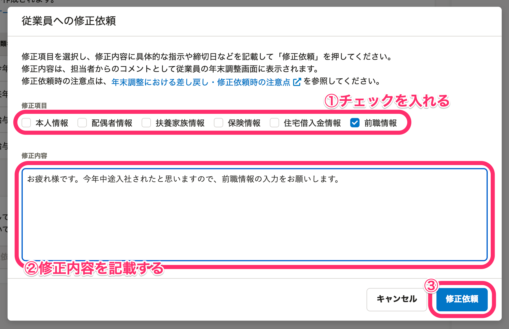
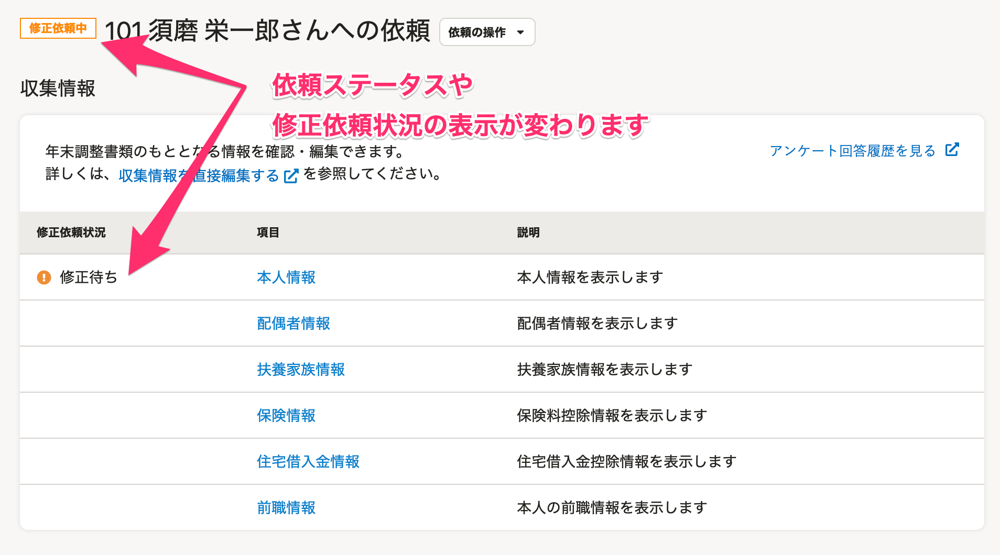
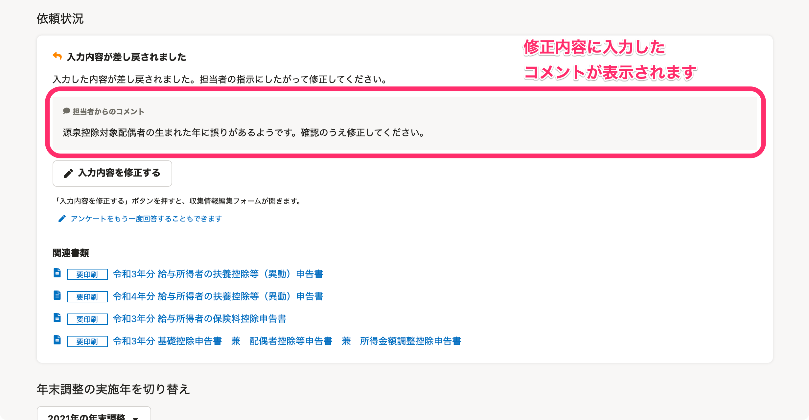
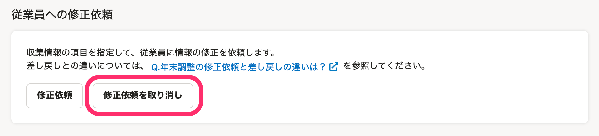

:::alert
当ページで案内しているSmartHRの年末調整機能の内容は、2021年（令和3年）版のものです。
2022年（令和4年）版の年末調整機能の公開時期は秋頃を予定しています。
なお、画面や文言、一部機能は変更になる可能性があります。
公開時期が決まり次第、[アップデート情報](https://smarthr.jp/update)でお知らせします。
:::

年末調整機能で依頼詳細画面から修正依頼を出す方法を説明します。

従業員に年末調整の修正を依頼する方法は2つあり、書類の作成状況により対応が異なります。

当ページで案内するのは、年末調整のアンケートに生命保険情報や住宅ローンの情報の入力がなく、「給与所得者の保険料控除等申告書」や「住宅ローン控除申告書」が作成されなかった場合の修正依頼方法です。

書類が作成されている場合は、修正が必要な書類だけを従業員に差し戻しできます。

詳しくは下記のヘルプページをご覧ください。

:::related
[提出された書類を従業員に差し戻す](https://knowledge.smarthr.jp/hc/ja/articles/360053238834)
[Q. 年末調整の修正依頼と差し戻しの違いは？](https://knowledge.smarthr.jp/hc/ja/articles/4404343461785)
:::

# 1\. 依頼一覧画面で［依頼名］をクリック

依頼一覧画面で対象従業員の **［依頼名］** をクリックすると、依頼詳細画面に移動します。

# 2.［修正依頼］をクリック

依頼詳細画面を下にスクロールし、ページ下部にある **［修正依頼］** をクリックすると、 **［従業員への修正依頼］** 画面が表示されます。

:::tips
 **［修正依頼］** ボタンの表示条件は以下の通りです。
- 依頼ステータスが「回答済み」「再回答」「修正依頼中」のいずれかであること
:::

# 3.［修正項目］と［修正内容］を入力し、［修正依頼］をクリック

 **［修正項目］** にチェックを入れ、 **［修正内容］** 欄に具体的な修正内容を記載し、 **［修正依頼］** をクリックすると従業員へ修正依頼が行なわれます。

 **［修正依頼］** をクリックすると、依頼ステータスが「修正依頼中」に変わり、修正を依頼した項目の **［修正依頼状況］** 欄には「修正待ち」と表示されます。

従業員の画面では下図のように「入力内容が差し戻されました」というメッセージとともに、修正内容に入力したコメントが表示されます。

:::tips
すでに書類を差し戻している状態でも、修正依頼を出せます。
また、修正依頼は複数出すこともできます。
修正依頼が重複した場合、従業員が再回答すると、書類と収集情報の両方に修正した内容が適用されます。
:::

# 修正依頼を取り消す

依頼詳細画面を下にスクロールし、ページ最下部にある **［修正依頼を取り消し］** をクリックすると、修正依頼の取り消しができます。

:::tips
複数回修正依頼を出していた場合は、そのすべてが取り消されます。
修正依頼と並行して「書類の差戻し」をしていた場合、書類の差戻しは取り消されません。
:::
