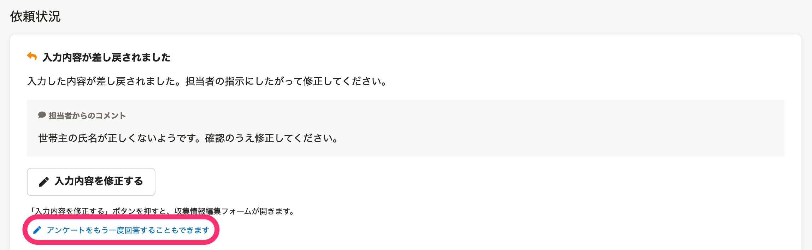

:::alert
当ページで案内しているSmartHRの年末調整機能の内容は、2021年（令和3年）版のものです。
2022年（令和4年）版の年末調整機能の公開時期は秋頃を予定しています。
なお、画面や文言、一部機能は変更になる可能性があります。
公開時期が決まり次第、[アップデート情報](https://smarthr.jp/update)でお知らせします。
:::

年末調整機能で従業員に差し戻し・修正依頼をする際、特定の状況においては担当者による対応が必要になる場合があります。

差し戻しと修正依頼に共通する注意点と、それぞれの注意点を案内します。

:::tips
差し戻しと修正依頼は、どちらも「情報の修正・確認を依頼する」という点では同じですが、修正依頼方法や修正単位の考え方が異なります。
詳しくは、下記のヘルプページをご覧ください。
[Q. 年末調整の修正依頼と差し戻しの違いは？](https://knowledge.smarthr.jp/hc/ja/articles/4404343461785)
:::

# 共通の注意点

## 差し戻し・修正依頼した従業員に「情報の修正がなかった」場合、取り消しが必要です

差し戻し・修正依頼をしたが、従業員が確認した結果、提出した内容に誤りがなく、修正すべき項目がなかった場合は担当者による差し戻し・修正依頼の取り消しが必要です。

SmartHRの年末調整機能では、収集情報に変更がない場合、従業員による情報の保存・再提出ができません。

従業員の画面には「変更点がない場合は保存できません。担当者に差し戻しの取り消しを連絡してください。」と表示されます。

連絡があった場合は取り消しの対応をお願いします。

## 差し戻し・修正依頼をすると、従業員が年末調整のアンケートをもう一度回答できるようになります

差し戻し・修正依頼をすると、従業員の年末調整画面に **［アンケートをもう一度回答することもできます］** という文字が表示され、年末調整のアンケートに再度一から回答できるようになります。

アンケートの再回答は従業員の負担が大きく、ステータスや処理日時への影響があるため、担当者にとっても管理が煩雑になります。

具体的に情報修正の指示ができる場合や、一部の項目修正で済む場合は、従業員には「入力内容を修正する」から修正するようコメントを添えて依頼することをおすすめします。

:::tips
従業員がアンケートの再回答をした場合、再回答を開始した時点で下記の情報が削除されます。
- アンケートの回答履歴
- アンケートに回答した結果、作成された書類
- 処理日時
また、ステータスや処理日時にも影響があります。
-  **［前職情報一覧］** の確認状況
    -  **［ダブルチェック待ち］［チェック済み］** だった場合、 **［チェック待ち］** に変わります。
-  **［依頼一覧］** の確認状況
    -  **［修正依頼中］** に変わります。
:::

## 寡婦・ひとり親の表示の有無は、控除条件に関係なく設定できるため、書類確認時は注意してください

収集情報の **［今年の寡婦・ひとり親］［来年の寡婦・ひとり親］** の項目で、「寡婦」または「ひとり親」を選択すると、所得条件や扶養親族の条件を満たしていない場合でも、寡婦・ひとり親の対象として自動で書類に反映されます。

 **［対象ではない］** を選択すると、所得条件や扶養親族の条件を満たしている場合でも、寡婦・ひとり親控除の対象として判定されません。

寡婦・ひとり親控除の対象となる従業員が、書類の提出・再提出などを行なった際に、寡婦・ひとり親控除の対象外になっていた場合は、該当項目のチェックと従業員への確認をお願いします。

詳しくは、下記ヘルプページをご覧ください。

:::related
[Q. 年末調整の書類に寡婦・ひとり親が表示されない場合は？](https://knowledge.smarthr.jp/hc/ja/articles/360039191593)
:::

# 差し戻しに関する注意点

## 差し戻しでは修正項目が自動で設定されます

 **［差し戻し］** は、書類単位での修正依頼のため、該当の書類に紐づく修正項目が自動で設定されます。

修正項目が複数あり、書類に関わる情報以外にも修正が必要な場合は、「修正依頼」の機能を使用してください。

## 書類の差し戻し中に、修正依頼を出す場合

書類を差し戻している状態で、修正依頼を出すことは可能です。

この場合、従業員は「差し戻し」と「修正依頼」の両方の修正指示を踏まえて、情報を修正し、再提出を行ないます。

「差し戻し」に関する詳しい手順などは、下記をご覧ください。

:::related
[提出された書類を従業員に差し戻す](https://knowledge.smarthr.jp/hc/ja/articles/360053238834)
:::

# 修正依頼に関する注意点

## 従業員に修正依頼を複数回出した場合

従業員に、修正依頼を複数回出すことが可能です。

この場合、従業員が再回答すると、書類と収集情報の両方に修正した内容が適用されます。

なお、従業員画面には、複数回分の担当者からのコメントが表示されます。

:::alert
従業員に修正依頼を複数回出している状態で、依頼詳細画面の **［修正依頼を取り消し］** を行なうと、すべての修正依頼が取り消されます。
ただし、修正依頼と並行して書類の差し戻しをしていた場合、書類の差し戻しは取り消されません。
:::

「修正依頼」に関する詳しい手順などは、下記をご覧ください。

:::related
[従業員に年末調整の修正依頼を出す](https://knowledge.smarthr.jp/hc/ja/articles/360057982273)
[アンケートの回答に応じて年末調整書類が作成される条件](https://knowledge.smarthr.jp/hc/ja/articles/4405093044249)
:::
