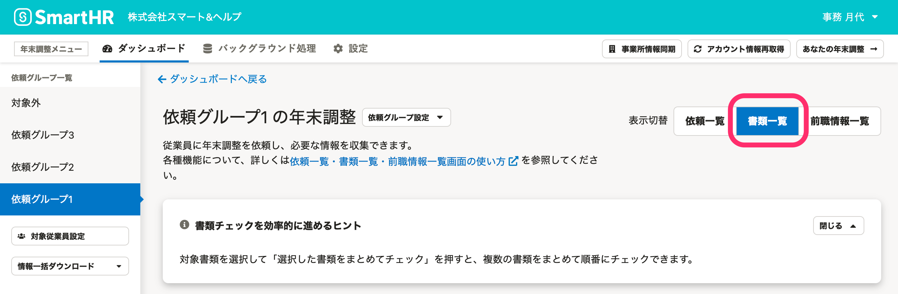
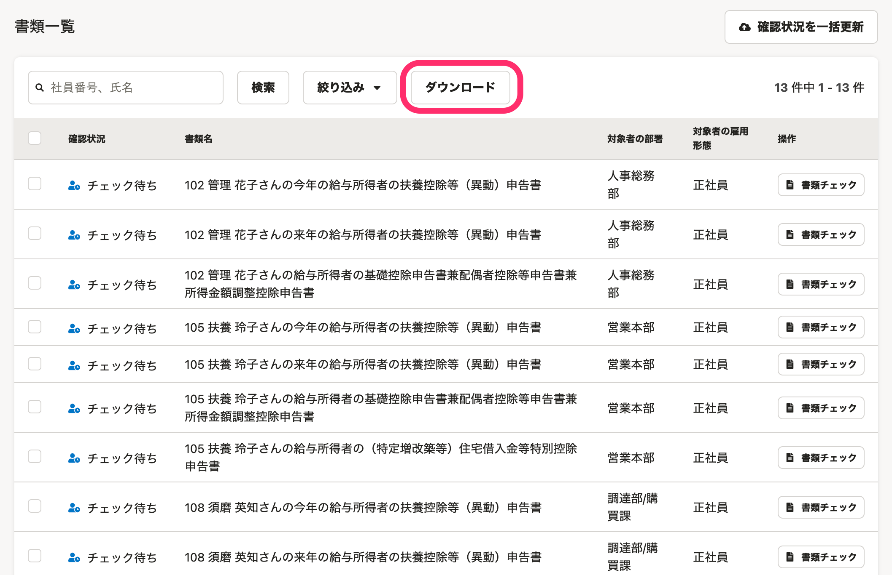
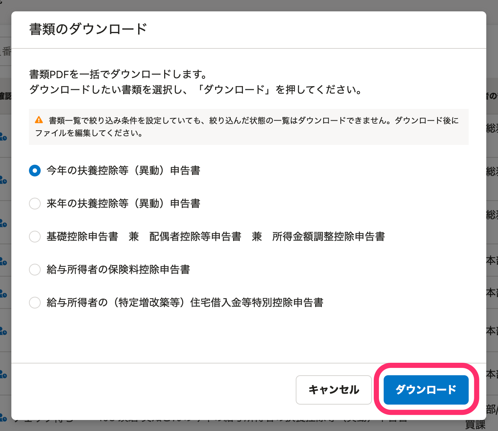
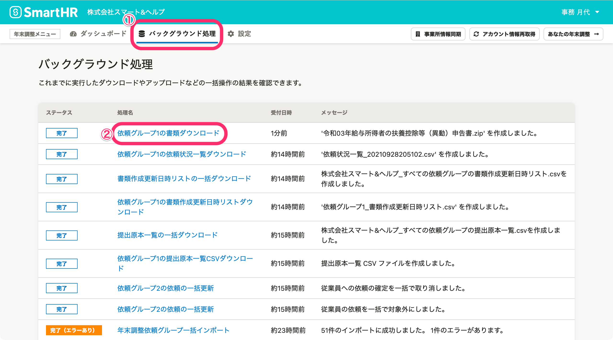
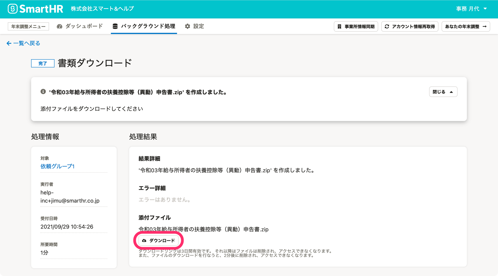

:::alert
当ページで案内しているSmartHRの年末調整機能の内容は、2021年（令和3年）版のものです。
2022年（令和4年）版の年末調整機能の公開時期は秋頃を予定しています。
なお、画面や文言、一部機能は変更になる可能性があります。
公開時期が決まり次第、[アップデート情報](https://smarthr.jp/update)でお知らせします。
:::

年末調整機能で作成した各種書類は、依頼グループごとにPDFファイルで一括ダウンロードできます。

ダウンロードした書類のPDFファイルを一括で印刷する方法については、以下のヘルプページをご覧ください。

Windows 10とMacを利用する場合について、それぞれの手順を案内しています。

:::related
[複数のPDFファイルを一括で印刷する方法](https://knowledge.smarthr.jp/hc/ja/articles/360059070533)
:::

# 1\. 依頼一覧画面の［表示切替］から［書類一覧］をクリック

依頼一覧画面の右上にある **［表示切替］** から **［書類一覧］** をクリックすると、表示が切り替わり、書類一覧画面が表示されます。

# 2.［ダウンロード］をクリック

 **［ダウンロード］** をクリックすると、 **［書類のダウンロード］** 画面が表示されます。

# 3\. 書類を選択して［ダウンロード］をクリック

 **［書類のダウンロード］** 画面で、ダウンロードする書類を選択し、 **［ダウンロード］** をクリックするとバックグラウンド処理が始まります。

# 4\. PDFファイルをダウンロードする

年末調整メニューの **［バックグラウンド処理］** をクリックします。

ステータスが **［完了］** に変わったら、 **［｛依頼グループ名｝の書類ダウンロード］** をクリックし、処理結果画面に移動します。

 **［処理結果］** 内の **［ダウンロード］** をクリックして、PDFファイルをダウンロードします。

PDFはzipファイルでまとめてダウンロードできます。

