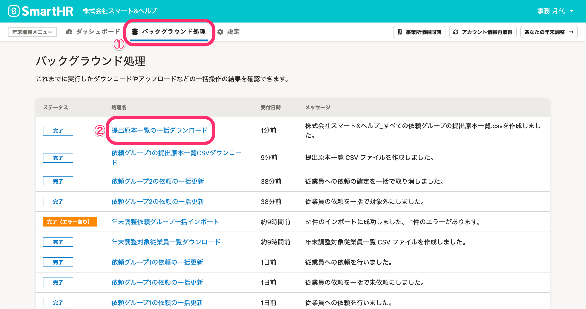

:::alert
当ページで案内しているSmartHRの年末調整機能の内容は、2021年（令和3年）版のものです。
2022年（令和4年）版の年末調整機能の公開時期は秋頃を予定しています。
なお、画面や文言、一部機能は変更になる可能性があります。
公開時期が決まり次第、[アップデート情報](https://smarthr.jp/update)でお知らせします。
:::

年末調整機能で従業員の「提出が必要な原本一覧」CSVファイルをダウンロードする方法を説明します。

「誰がどの原本を提出する予定なのかを確認したい」場合等にご活用ください。

:::tips
CSVファイルには、依頼ステータスが **「回答済み」「再回答」「確定」** の依頼に関する原本の情報を出力します。
:::

# CSVファイルのダウンロード方法

CSVファイルのダウンロード方法には、「特定の依頼グループ分の原本一覧をダウンロードする方法」と「すべての依頼グループ分の原本一覧を一括ダウンロードする方法」の2つがあります。

## 特定の依頼グループ分の原本一覧をダウンロードする方法

### 1\. 依頼一覧の［ダウンロード▼］>［原本一覧をダウンロード］をクリック

依頼一覧画面の **［ダウンロード▼］>［原本一覧をダウンロード］** をクリックすると、 **［原本一覧のダウンロード］** 画面が表示されます。

### 2\. ［ダウンロード］をクリック

 **［ダウンロード］** をクリックすると、バックグラウンド処理が始まります。

### 3\. 提出原本一覧ファイルを確認する

年末調整メニューの **［バックグラウンド処理］** をクリックします。

ステータスが **［完了］** に変わったら、 **［{依頼グループ名}の提出原本一覧CSVダウンロード］** をクリックすると、処理結果画面に移ります。

 **［ダウンロード］** をクリックして、CSVファイルをダウンロードします。

CSVファイルを開き、内容を確認してください。

## すべての依頼グループ分の原本一覧を一括ダウンロードする方法

### 1\. 依頼グループ一覧の［情報一括ダウンロード▼］>［原本一覧をダウンロード］をクリック

依頼グループ一覧の **［情報一括ダウンロード▼］>［原本一覧をダウンロード］** をクリックすると、 **［原本一覧のダウンロード］** 画面が表示されます。

### 2\. ［ダウンロード］をクリック

 **［ダウンロード］** をクリックすると、バックグラウンド処理が始まります。

### 3\. 提出原本一覧ファイルを確認する

年末調整メニューの **［バックグラウンド処理］** をクリックします。

ステータスが **［完了］** に変わったら、 **［提出原本一覧の一括ダウンロード］** をクリックすると、処理結果画面に移ります。

 **［ダウンロード］** をクリックして、CSVファイルをダウンロードします。CSVファイルの内容を確認してください。

# CSVファイルの内容

CSVファイルの内容は、下記のヘルプページを参照してください。

:::related
[【一覧】提出原本一覧CSV凡例](https://knowledge.smarthr.jp/hc/ja/articles/4405798339865)
:::
