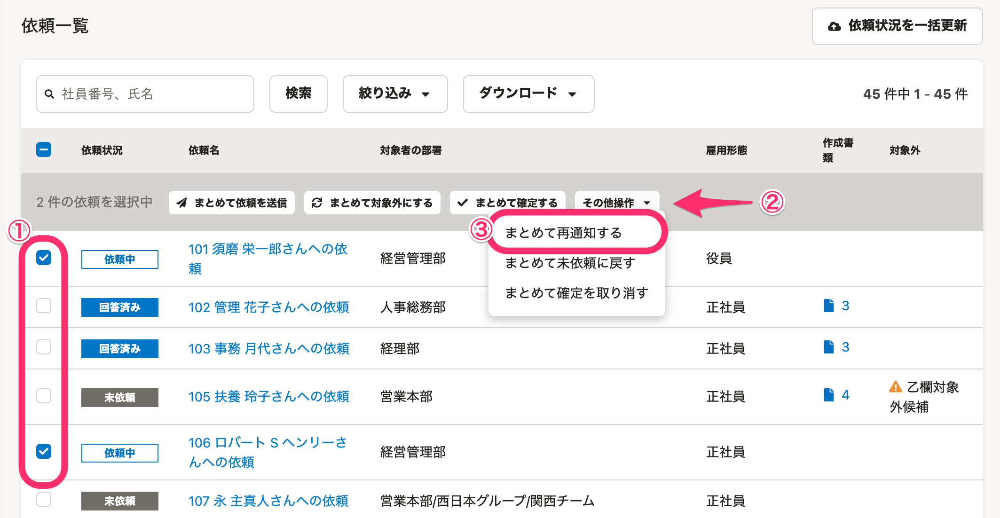
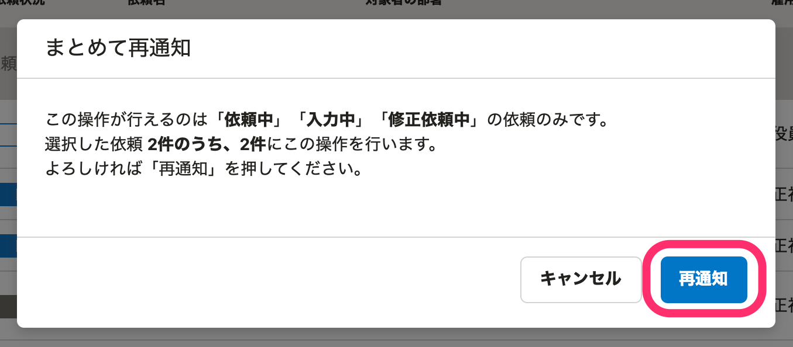

:::alert
当ページで案内しているSmartHRの年末調整機能の内容は、2021年（令和3年）版のものです。
2022年（令和4年）版の年末調整機能の公開時期は秋頃を予定しています。
なお、画面や文言、一部機能は変更になる可能性があります。
公開時期が決まり次第、[アップデート情報](https://smarthr.jp/update)でお知らせします。
:::

年末調整依頼は、再通知が可能です。

通知もしくは差し戻しをしたあと、従業員側で入力が行なわれない場合に使用してください。

:::tips
再通知ができるのは、依頼ステータスが **［依頼中］［入力中］** もしくは **［修正依頼中］** の従業員のみです。
:::

# 1\. 依頼一覧画面で再通知をしたい依頼にチェックをして、［その他操作▼］>［まとめて再通知する］をクリック

依頼一覧画面で再通知をしたい従業員にチェックをつけると、従業員一覧の項目名の下にメニューボタンが現れます。

 **［その他操作▼］** **\>** **［まとめて再通知する］** の順にクリックすると、依頼の再通知設定画面が表示されます。

# 2.［再通知］をクリック

表示内容を確認して **［再通知］** をクリックすると、チェックを入れた従業員に再通知が行なわれます。

再通知を自動で送る設定方法と、メール内容の変更方法は、下記のヘルプページをご覧ください。

:::related
[年末調整の再通知と締切を設定する](https://knowledge.smarthr.jp/hc/ja/articles/360037373434)
[【一覧】年末調整機能で届く通知（メール）の内容](https://knowledge.smarthr.jp/hc/ja/articles/360039321893)
:::
