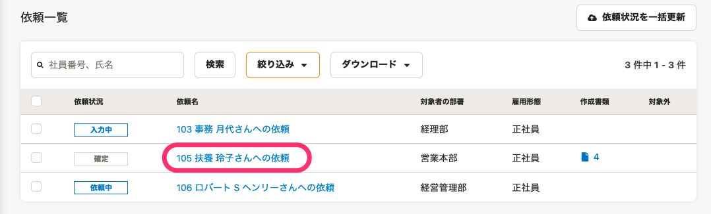
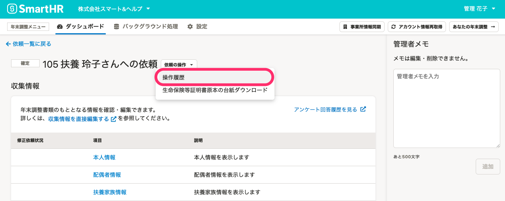
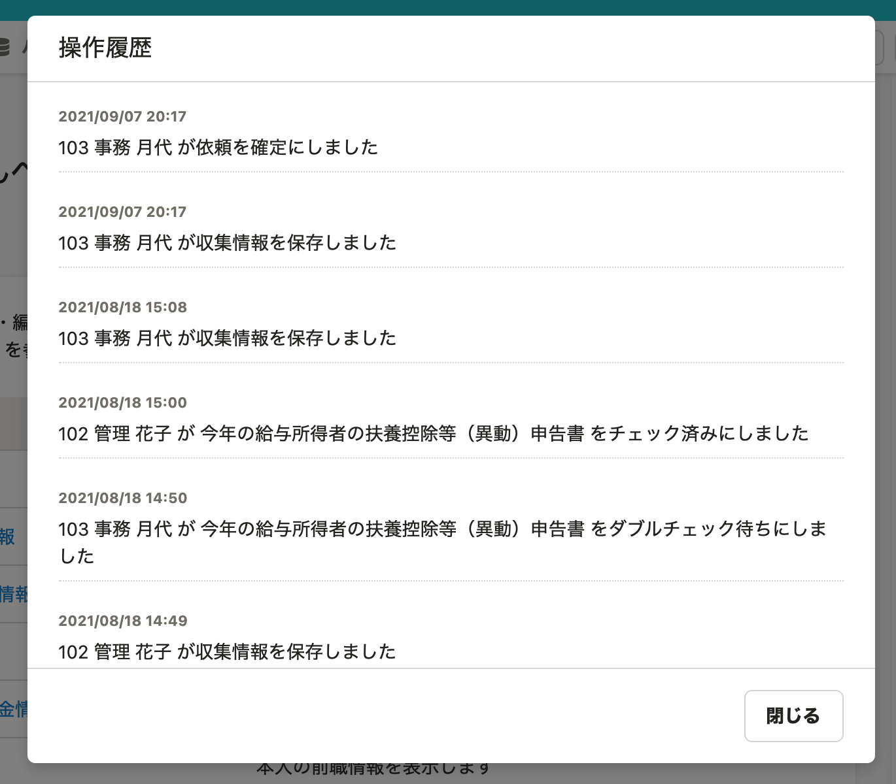
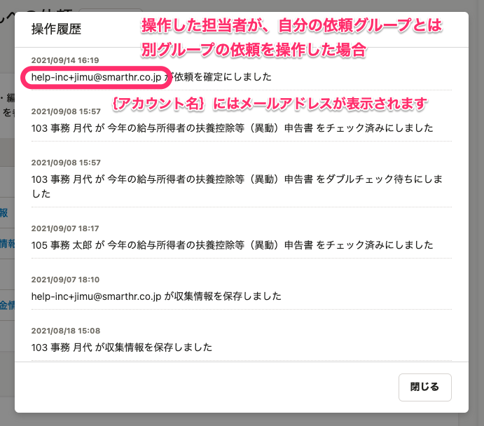
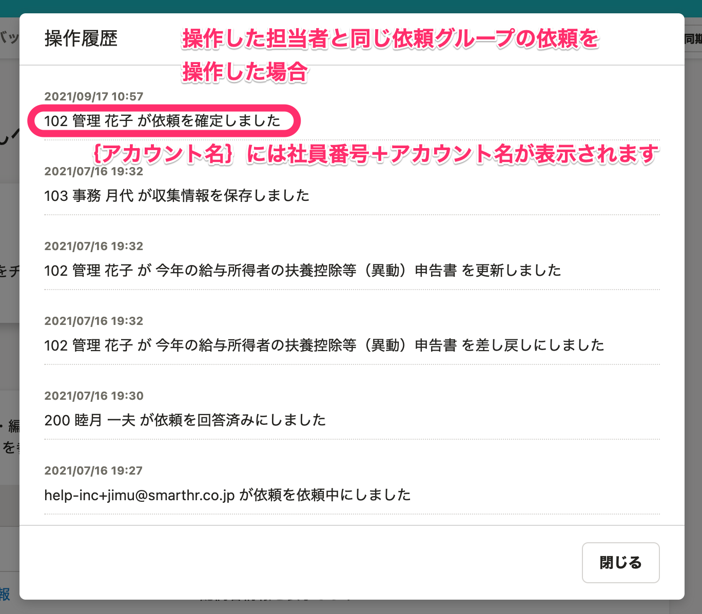

:::alert
当ページで案内しているSmartHRの年末調整機能の内容は、2021年（令和3年）版のものです。
2022年（令和4年）版の年末調整機能の公開時期は秋頃を予定しています。
なお、画面や文言、一部機能は変更になる可能性があります。
公開時期が決まり次第、[アップデート情報](https://smarthr.jp/update)でお知らせします。
:::

年末調整を依頼した従業員ごとに、いつ・誰が・どんな操作をしたかを確認する方法を案内します。

チームでの情報共有にご活用ください。

# 1\. 依頼一覧から対象の［依頼名］をクリック

依頼一覧から対象の **［依頼名］** をクリックして、依頼詳細画面に移動します。

# 2\. 依頼詳細画面の［依頼の操作▼］>［操作履歴］をクリック

依頼詳細画面の **［依頼の操作▼］メニュー**  にある **［操作履歴］** をクリックします。

 **［操作履歴］** のダイアログが表示されるので、内容を確認してください。

# 操作履歴に記録される内容

操作履歴に記録される内容と、操作履歴の表示内容は以下の通りです。

| **種別** | **操作内容** | **操作した人** | **操作履歴の表示内容** |
| --- | --- | --- | --- |
| 収集情報 | 保存 | 担当者 | {アカウント名}が収集情報を保存しました |
| 書類を差し戻され、収集情報で再回答 | 従業員 | {アカウント名}が収集情報を保存しました |
| {アカウント名}が{書類名}を更新しました |
| 修正依頼された収集情報への入力 | 担当者 | {アカウント名}が収集情報を保存しました |
| 依頼 | 依頼の送信 | 担当者 | {アカウント名}が依頼を依頼中にしました |
| アンケートを回答 （依頼ステータスが「回答済み」に変わった） | 従業員 | {アカウント名}が依頼を回答済みにしました |
| 差し戻されたアンケートを再回答 | 従業員 | {アカウント名}がアンケートのやり直しをしました |
|   差し戻されたアンケートの再回答を完了 （依頼ステータスが「再回答」に変わった）   | 従業員 | {アカウント名}がアンケートの再回答を完了しました |
| 再通知 | 担当者 | {アカウント名}が依頼を再通知しました |
| 対象外を設定 | 担当者 | {アカウント名}が依頼を対象外にしました |
| 依頼ステータスを「未依頼」にした | 担当者 | {アカウント名}が依頼を未依頼にしました |
| 確定 | 担当者 | {アカウント名}が依頼を確定にしました |
| 確定の取り消し | 担当者 | {アカウント名}が依頼を確定取り消ししました |
| 収集情報を修正依頼 | 担当者 | {アカウント名}が収集情報を修正依頼しました ※修正内容にコメントを入力している場合、入力内容は差し戻しコメントとして表示されます。 |
| 収集情報の修正依頼の取り消し | 担当者 | {アカウント名}が収集情報の修正依頼を取り消しました |
|   設定した受付終了日を過ぎた（依頼ステータスが「回答期限切れ」に変わった）   | システム | 設定した受付終了日を過ぎたため、システムにより依頼が［回答期限切れ］に変更されました |
| 「回答期限切れ」の依頼を移動 | 担当者 | {アカウント名}が［回答期限切れ］の依頼を移動しました |
| 「回答期限切れ」の依頼を移動し、依頼ステータスが変わった | 担当者 | {アカウント名}が「回答期限切れ」の依頼を移動しました。移動先の依頼グループの締切設定にあわせて、依頼は［{回答期限切れになる前のステータス}］に変更されました |
| 書類 | チェック済みにする | 担当者 | {アカウント名}が{書類名}をチェック済みにしました |
| ダブルチェック待ちにする | 担当者 | {アカウント名}が{書類名}をダブルチェック待ちにしました |
| 差し戻す | 担当者 | {アカウント名}が{書類名}を差し戻しにしました ※修正内容にコメントを入力している場合、入力内容は差し戻しコメントとして表示されます。 |
| ダブルチェック待ちを取り消す | 担当者 | {アカウント名}が{書類名}のダブルチェック待ちを取り消しました |
| チェック済みを取り消す | 担当者 | {アカウント名}が{書類名}のチェック済みを取り消しました |
| 差し戻しを取り消す | 担当者 | {アカウント名}が{書類名}の差し戻しを取り消しました |
| 削除する | 担当者 | {アカウント名}が{書類名}を削除しました |
| 前職情報 | チェック済みにする | 担当者 | {アカウント名}が前職情報をチェック済みにしました |
| ダブルチェック待ちにする | 担当者 | {アカウント名}が前職情報をダブルチェック待ちにしました |
| 差し戻す | 担当者 | {アカウント名}が前職情報を差し戻しました ※修正内容にコメントを入力している場合、入力内容は差し戻しコメントとして表示されます。 |
| ダブルチェック待ちを取り消す | 担当者 | {アカウント名}が前職情報のダブルチェック待ちを取り消しました |
| チェック済みを取り消す | 担当者 | {アカウント名}が前職情報のチェック済みを取り消しました |
| 差し戻しを取り消す | 担当者 | {アカウント名}が前職情報の差し戻しを取り消しました |

:::tips
**｛アカウント名｝の部分にメールアドレスが表示される場合**
依頼グループ1にいる担当者Aさんが、依頼グループ2の操作をした場合、｛アカウント名｝の部分に **メールアドレス** が表示されます。

**｛アカウント名｝の部分に社員番号＋アカウント名が表示される場合**
担当者が、自分と同じ依頼グループの操作をした場合は、｛アカウント名｝の部分に **社員番号＋アカウント名** が表示されます。

:::
