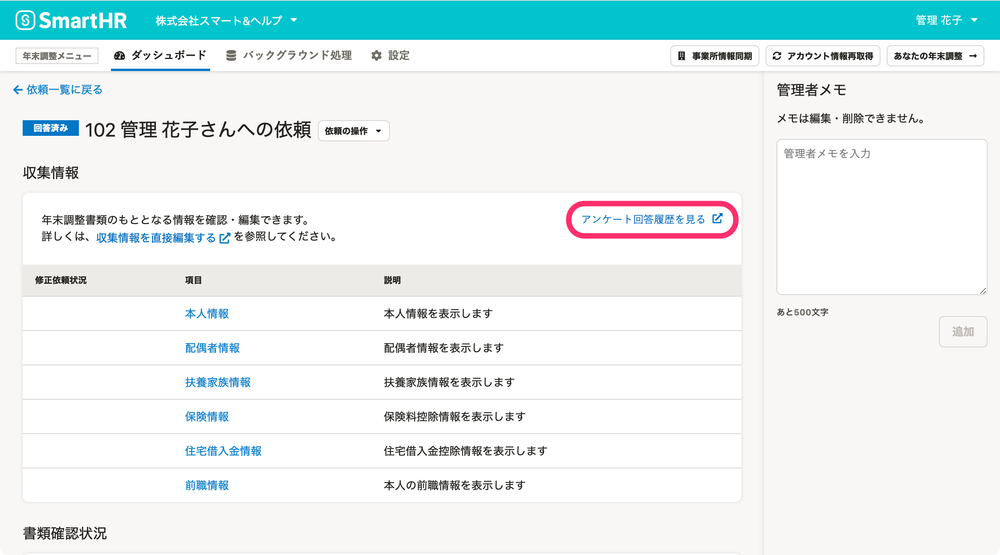

:::alert
当ページで案内しているSmartHRの年末調整機能の内容は、2021年（令和3年）版のものです。
2022年（令和4年）版の年末調整機能の公開時期は秋頃を予定しています。
なお、画面や文言、一部機能は変更になる可能性があります。
公開時期が決まり次第、[アップデート情報](https://smarthr.jp/update)でお知らせします。
:::

年末調整を依頼した従業員ごとに、年末調整のアンケート回答履歴を確認できます。

# 1\. 依頼一覧で［依頼名］をクリック

依頼一覧でアンケート回答履歴を確認したい従業員の **［依頼名］** をクリックすると、従業員の依頼詳細画面に移動します。

# 2.［アンケート回答履歴を見る］をクリック

依頼詳細画面の収集情報欄に表示されている **［アンケート回答履歴を見る］** をクリックすると、新しいウィンドウでアンケート回答履歴の画面が開きます。

# 3\. 任意の設問をクリックし、アンケート回答履歴を確認する

画面左側に、設問と回答（従業員がどの選択肢を選んだか）を表示しています。

画面左側にある設問内容をクリックすると、画面右側に表示している設問も切り替わります。

画面右側には、画面左側で指定した設問について、実際の入力内容を確認できるアンケートの入力画面を表示しています。

従業員が入力した情報の詳細を確認したいときは、画面右側で確認してください。

:::alert
年末調整のアンケート回答履歴が確認できない場合は、対象従業員の依頼ステータスをご確認ください。
依頼ステータスが「未依頼」「依頼中」「回答期限切れ」のときは、アンケート回答履歴は確認できません。
| **依頼ステータス** | **回答履歴の閲覧** |
| --- | --- |
| 未依頼 | 不可 |
| 依頼中 | 不可 |
| 入力中 | 可能 |
| 回答済み | 可能 |
| 修正依頼中 | 可能 |
| 再回答 | 可能 |
| 確定 | 可能 |
| 回答期限切れ | 不可 |
:::
:::tips
アンケート回答履歴は、従業員が回答した内容をそのまま保持する仕様です。
従業員がアンケートを再回答した場合のみ、再回答した内容で上書きされます。
管理者が収集情報を直接編集しても、アンケートの回答履歴には反映されません。
:::
