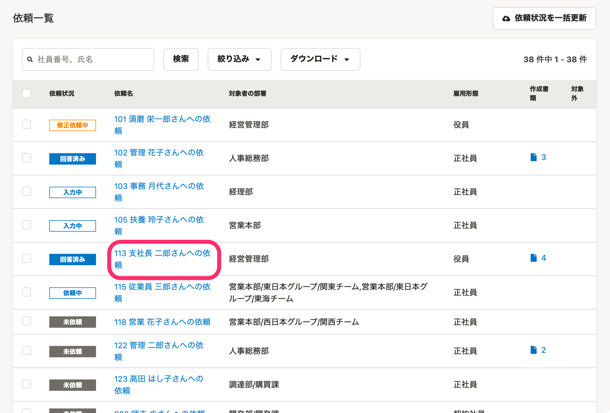
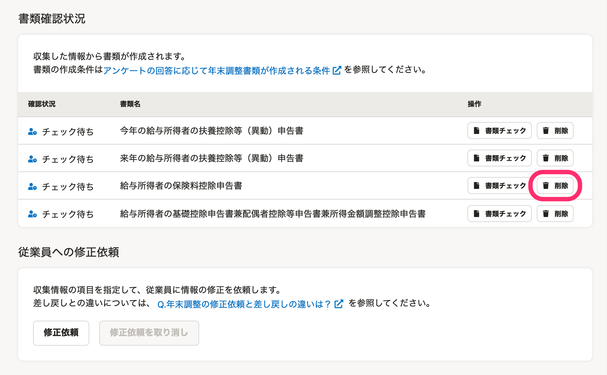
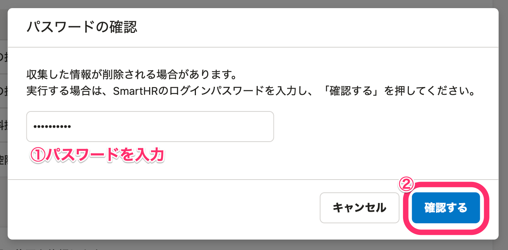
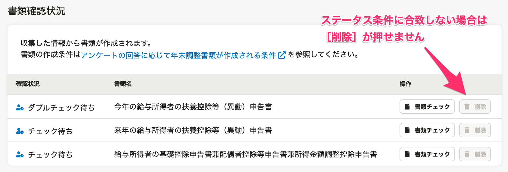
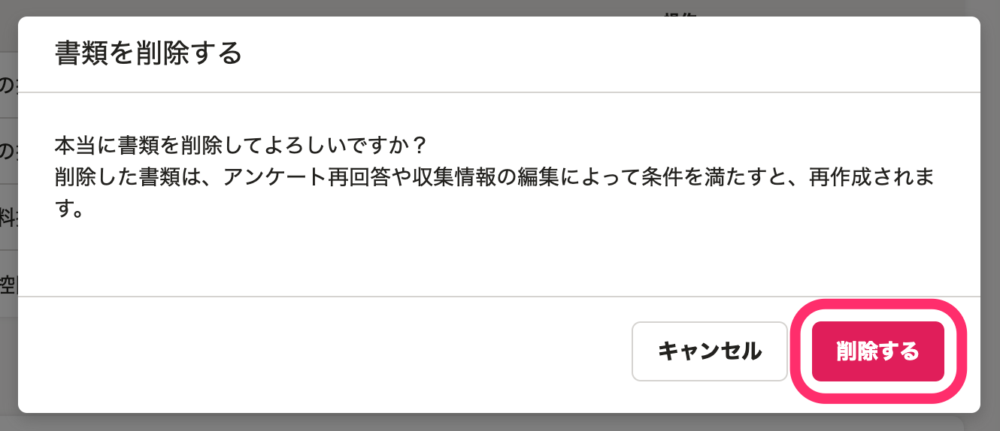
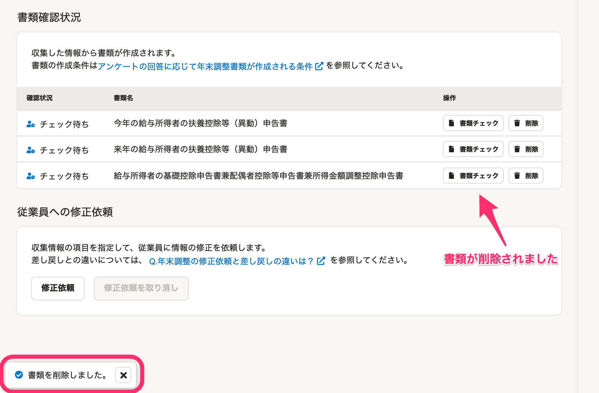

:::alert
当ページで案内しているSmartHRの年末調整機能の内容は、2021年（令和3年）版のものです。
2022年（令和4年）版の年末調整機能の公開時期は秋頃を予定しています。
なお、画面や文言、一部機能は変更になる可能性があります。
公開時期が決まり次第、[アップデート情報](https://smarthr.jp/update)でお知らせします。
:::

依頼詳細画面から、下記の書類を削除できます。

- 今年の給与所得者の扶養控除等（異動）申告書
- 来年の給与所得者の扶養控除等（異動）申告書
- 給与所得者の保険料控除申告書
- 給与所得者の（特定増改築等）住宅借入金等特別控除申告書
- 給与所得者の基礎控除申告書兼配偶者控除等申告書兼所得金額調整控除申告書

# 1\. 依頼一覧で書類を削除したい［依頼名］をクリック

依頼一覧画面中央の **［依頼一覧］** で、書類を削除したい **［依頼名］** をクリックすると、依頼詳細画面が表示されます。

# 2\. 削除したい書類の［削除］をクリック

依頼詳細画面をスクロールし、 **［書類確認状況］** の **［操作］** 欄にある **［削除］** をクリックすると、 **［パスワードの確認］** 画面が表示されます。

# 3\. SmartHRのログインパスワードを入力し、［確認する］をクリック

SmartHRのログインパスワードを入力し、 **［確認する］** をクリックします。

:::tips
 **［削除］** ボタンは、書類ステータスが **［チェック待ち］［ダブルチェック待ち］** のいずれかで、依頼ステータスが **［未依頼］［回答済み］［再回答］** のいずれかの場合にクリックできます。
ステータス条件に合致しない場合は **［削除］** が押せません。

依頼ステータスが **［確定］** の書類を削除する場合は、下記ヘルプページに記載の手順を参考に、ステータスを変更してから削除してください。
[Q. 確定の取り消しはできますか？（【一覧】年末調整に関するよくある質問内））](https://knowledge.smarthr.jp/hc/ja/articles/360035370153#11-0-0)
:::

# 4.［削除する］をクリック 

 **［書類を削除する］** 画面が表示されるので、 **［削除する］** をクリックしてください。

 **［削除する］** をクリックすると依頼詳細画面に戻り、画面に **［書類を削除しました］** というメッセージが表示されます。

書類が削除されていることを確認してください。

:::tips
書類削除後に収集情報を更新した場合は、収集情報の内容に応じて、書類が再度作成されます。
:::

# 書類削除後の補足事項

- 各種CSVファイルには、削除した書類について「未作成」もしくは「0」と表示されます。
    - ただし、書類作成更新日時リストからは、削除した書類のデータが削除されます。
- マネーフォワードクラウド給与と連携している場合、削除した書類の情報がマネーフォワードクラウド給与と連携されなくなります。
- 操作履歴から削除した書類の履歴は消えず、そのまま残ります。
- 書類に紐づく収集情報の原本画像添付データは削除されません。
