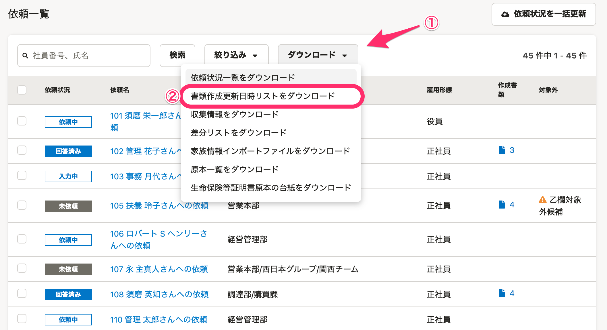
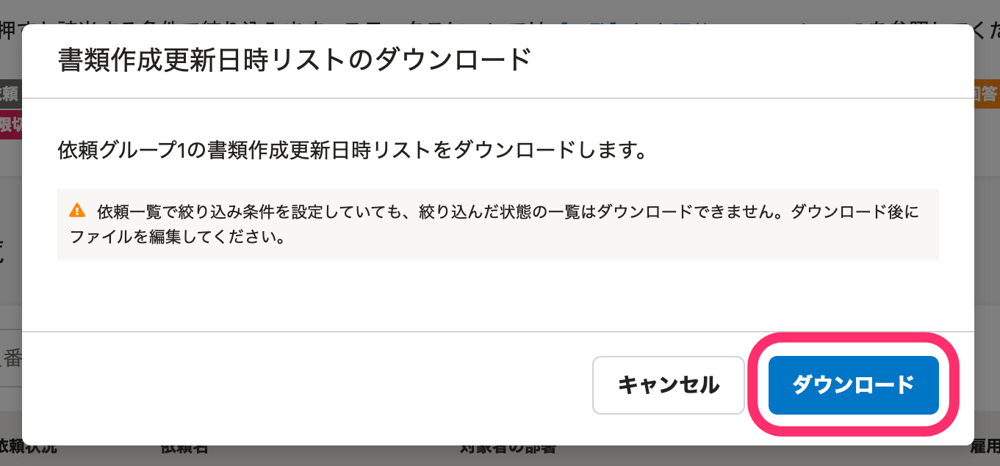
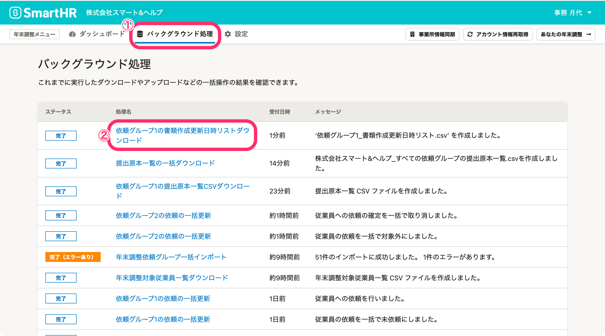
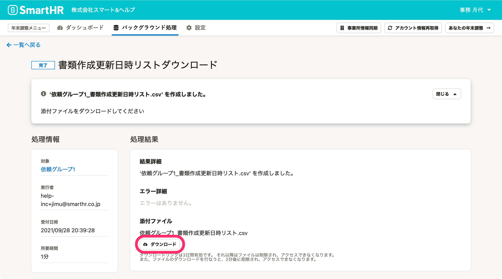
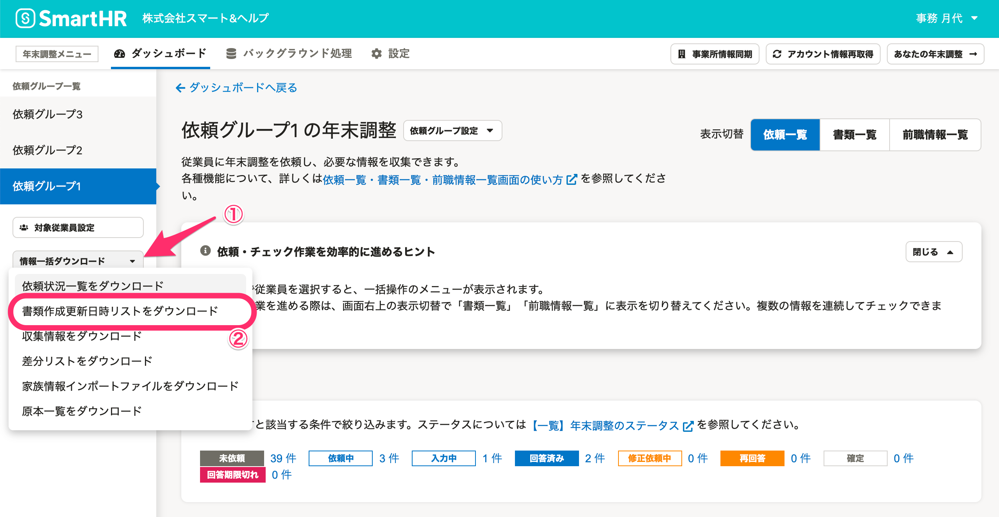
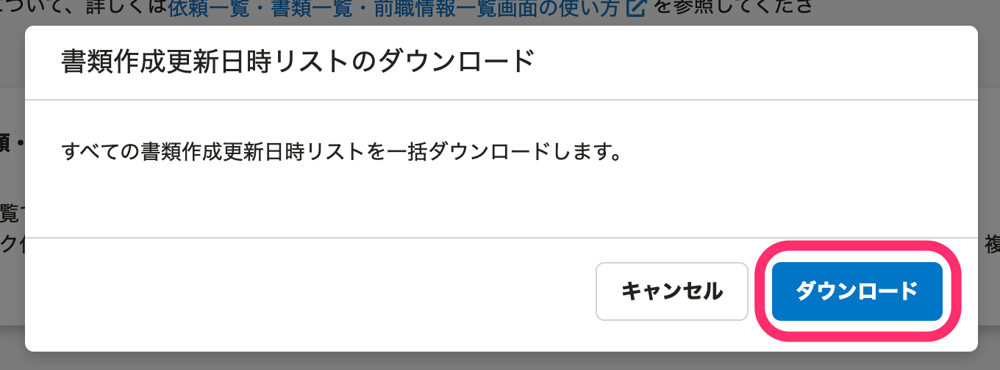
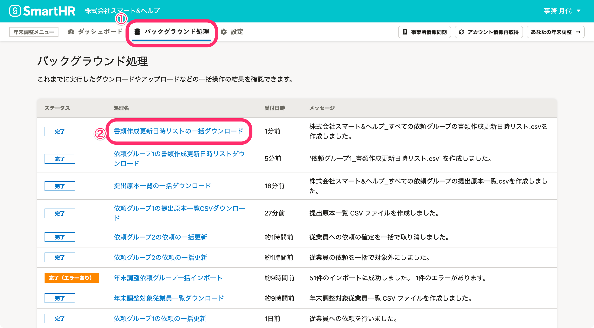
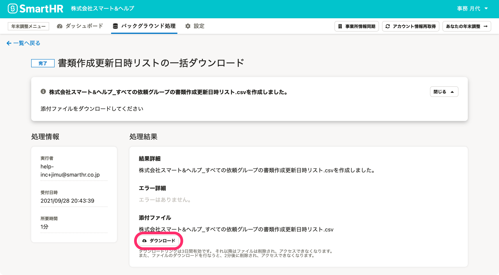

:::alert
当ページで案内しているSmartHRの年末調整機能の内容は、2021年（令和3年）版のものです。
2022年（令和4年）版の年末調整機能の公開時期は秋頃を予定しています。
なお、画面や文言、一部機能は変更になる可能性があります。
公開時期が決まり次第、[アップデート情報](https://smarthr.jp/update)でお知らせします。
:::

年末調整の「書類作成更新日時リスト」のCSVファイルをダウンロードする方法を説明します。

「書類が提出された日と、その書類が修正・差し戻された日を一覧で把握したい」場合などにご活用ください。

従業員ごとに操作履歴を確認する方法は、以下のヘルプページをご覧ください。

:::related
[年末調整の操作履歴を確認する](https://knowledge.smarthr.jp/hc/ja/articles/360037875833)
:::

# CSVファイルのダウンロード方法

CSVファイルのダウンロード方法には、「特定の依頼グループの書類作成更新日時リストをダウンロードする方法」と「すべての依頼グループの書類作成更新日時リストを一括ダウンロードする方法」の2つがあります。

## 特定の依頼グループ分の書類作成更新日時リストをダウンロードする方法

### 1\. 依頼一覧で［ダウンロード▼］>［書類作成更新日時リストをダウンロード］をクリック

依頼一覧画面の **［ダウンロード▼］>［書類作成更新日時リストをダウンロード］** をクリックすると、 **［書類作成更新日時リストのダウンロード］** 画面が表示されます。

### 2.［ダウンロード］をクリック

 **［ダウンロード］** をクリックすると、バックグラウンド処理が始まります。

### 3\. CSVファイルを確認する

年末調整メニューの［ **バックグラウンド処理］** をクリックします。

ステータスが **［完了］** に変わったら、 **［{依頼グループ名}の書類作成更新日時リストダウンロード］** をクリックすると、処理結果画面に移ります。

 **［ダウンロード］** をクリックして、CSVファイルをダウンロードします。

## すべての依頼グループ分の書類作成更新日時リストを一括ダウンロードする方法

### 1.［情報一括ダウンロード▼］>［書類作成更新日時リストをダウンロード］をクリック

依頼グループ一覧下部の **［情報一括ダウンロード▼］>［書類作成更新日時リストをダウンロード］** をクリックすると、 **［書類作成更新日時リストのダウンロード］** 画面が表示されます。

### 2.［ダウンロード］をクリック

 **［ダウンロード］** をクリックすると、バックグラウンド処理が始まります。

### 3\. 書類作成更新日時リストファイルを確認する

年末調整メニューの **［バックグラウンド処理］** をクリックします。

ステータスが **［完了］** に変わったら、 **［書類作成更新日時リストの一括ダウンロード］** をクリックすると、処理結果画面に移ります。

 **［ダウンロード］** をクリックして、CSVファイルをダウンロードします。CSVファイルの内容を確認してください。

# CSVファイルの内容

CSVファイルの内容は、下記のヘルプページをご覧ください。

:::related
[【一覧】書類作成更新日時リストCSV凡例](https://knowledge.smarthr.jp/hc/ja/articles/4405791434393)
:::
