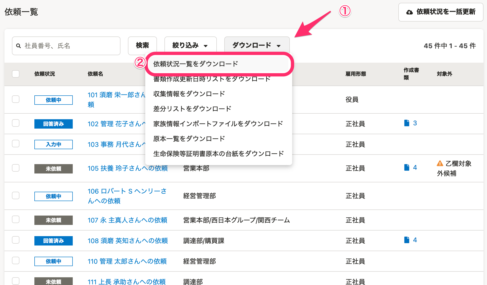
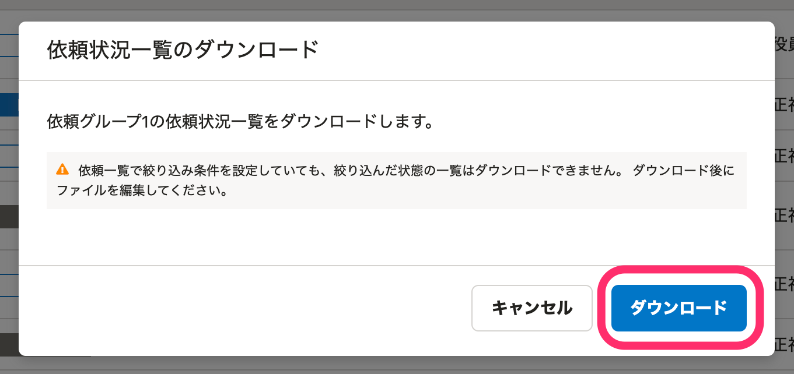
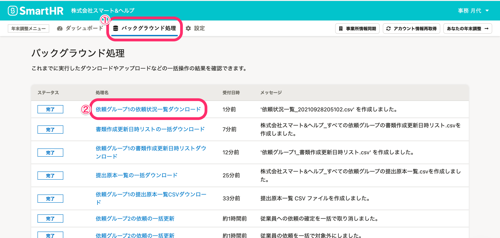
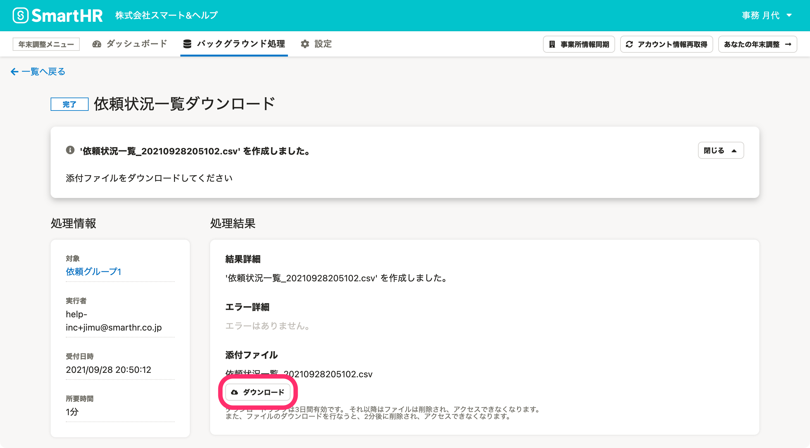
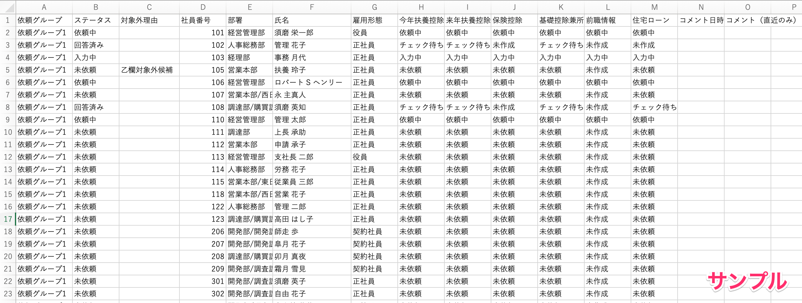

:::alert
当ページで案内しているSmartHRの年末調整機能の内容は、2021年（令和3年）版のものです。
2022年（令和4年）版の年末調整機能の公開時期は秋頃を予定しています。
なお、画面や文言、一部機能は変更になる可能性があります。
公開時期が決まり次第、[アップデート情報](https://smarthr.jp/update)でお知らせします。
:::

年末調整の依頼一覧画面に表示されるステータスや作成書類などの情報は、CSVファイルでダウンロードできます。

:::tips
依頼一覧画面の表示は、最大50名です。
従業員数が多い場合は、CSVファイルをダウンロードして確認することをおすすめします。
:::

# 1\. 依頼一覧画面で［ダウンロード▼］>［依頼状況一覧をダウンロード］をクリック

依頼一覧画面にある［**ダウンロード▼］>**［ **依頼状況一覧をダウンロード］** をクリックすると、 **［依頼状況一覧のダウンロード］** 画面が表示されます。

# 2\. ［ダウンロード］をクリック

 **［ダウンロード］** をクリックすると、バックグラウンド処理が始まります。

# 3\. 依頼状況一覧ファイルを確認する

年末調整メニューの **［バックグラウンド処理］** をクリックします。

ステータスが  **［完了］** に変わったら、 **［{依頼グループ名}の依頼状況一覧ダウンロード］** をクリックすると、処理結果画面に移ります。

 **［ダウンロード］** をクリックしてCSVファイルをダウンロードします。

CSVファイルを開き、内容を確認してください。

:::related
[すべての依頼グループの依頼状況一覧をダウンロードする](https://knowledge.smarthr.jp/hc/ja/articles/4405396080025)
:::
