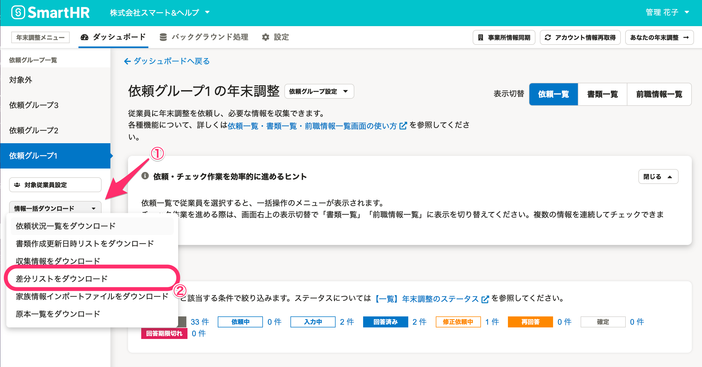

:::alert
当ページで案内しているSmartHRの年末調整機能の内容は、2021年（令和3年）版のものです。
2022年（令和4年）版の年末調整機能の公開時期は秋頃を予定しています。
なお、画面や文言、一部機能は変更になる可能性があります。
公開時期が決まり次第、[アップデート情報](https://smarthr.jp/update)でお知らせします。
:::

SmartHRの従業員情報に登録されている内容と、年末調整で入力された内容に変更（差分）があるかを確認できる「差分リスト」のダウンロード手順を説明します。

差分リストは、依頼グループ単位もしくは、すべての依頼グループ分をまとめてダウンロードできます。

:::alert
以下の差分リストは、依頼グループ単位ではダウンロードできません。
- 今年と来年の本人情報差分リスト
- 今年と来年の扶養親族情報差分リスト
ダウンロード手順は「[すべての依頼グループ分をまとめてダウンロードする](https://knowledge.smarthr.jp/hc/ja/articles/4405171704985#toc--6)」をご覧ください。
:::
:::related
[年末調整の差分リストとは？](https://knowledge.smarthr.jp/hc/ja/articles/360035370213)
:::

# 依頼グループ単位でダウンロードする

## 1\. 依頼一覧画面で［ダウンロード▼］>［差分リストをダウンロード］をクリック

依頼一覧画面の **［ダウンロード▼］** メニューにある **［差分リストをダウンロード］** をクリックすると、「差分リストのダウンロード」画面が表示されます。

## 2.［ダウンロード］をクリック

 **［ダウンロード］** をクリックすると、差分リストのダウンロードが始まります。

## 3\. バックグラウンド処理画面から差分リストをダウンロード

年末調整メニューの **［バックグラウンド処理］** をクリックします。

ステータスが **［完了］** になるまで待ち、 **［{依頼グループ名}の差分リストダウンロード］** をクリックすると、処理結果画面に移ります。

 **［ダウンロード］** をクリックして、zipファイルをダウンロードします。

### 差分リストの種類

zipファイルには、2つのCSVファイルが含まれています。

- 今年の本人情報差分リスト
- 今年の扶養親族差分リスト

:::related
[【一覧】今年の本人情報差分リストCSV凡例](https://knowledge.smarthr.jp/hc/ja/articles/4405362292121)
[【一覧】今年の扶養親族差分リストCSV凡例](https://knowledge.smarthr.jp/hc/ja/articles/4405362296089)
:::

# すべての依頼グループ分をまとめてダウンロードする

:::alert
以下の操作は、管理者権限アカウントに限ります。
:::

## 1.依頼グループ一覧の［情報一括ダウンロード▼］>［差分リストをダウンロード］をクリック

依頼グループ一覧にある **［情報一括ダウンロード▼**  **］** メニューから **［差分リストをダウンロード］** をクリックすると、「差分リストのダウンロード」画面が表示されます。

## 2.［ダウンロード］をクリック

 **［ダウンロード対象リスト］** でダウンロードしたい差分リストを選択し、 **［ダウンロード］** をクリックすると、差分リストのダウンロードが始まります。

## 3\. バックグラウンド処理画面から差分リストをダウンロード

年末調整メニューの **［バックグラウンド処理］** をクリックします。

ステータスが **［完了］** になるまで待ち、 **［今年の差分リストの一括ダウンロード］** または **［今年・来年の差分リストの一括ダウンロード］** をクリックすると、処理結果画面に移ります。

 **［ダウンロード］** をクリックしてzipファイルをダウンロードします。

### 差分リストの種類

それぞれのzipファイルには、2つのCSVファイルが含まれています。

#### 今年（2021年）の差分リスト

- すべての依頼グループの今年の扶養親族差分リスト
- すべての依頼グループの今年の本人情報差分リスト

CSVファイルの項目は、依頼グループ単位でダウンロードできるCSVファイルと同じです。

#### 今年（2021年）と来年（2022年）の差分リスト

- すべての依頼グループの今年と来年の扶養親族情報差分リスト
- すべての依頼グループの今年と来年の本人情報差分リスト

:::related
[【一覧】今年と来年の扶養親族情報差分リスト](https://knowledge.smarthr.jp/hc/ja/articles/4408021570841/)
[【一覧】今年と来年の本人情報差分リスト](https://knowledge.smarthr.jp/hc/ja/articles/4408029105817/)
:::
