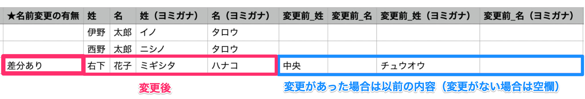
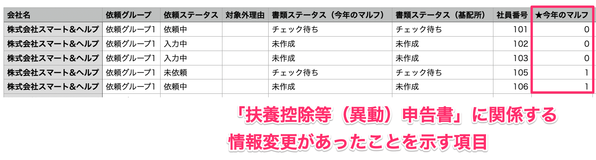

:::alert
当ページで案内しているSmartHRの年末調整機能の内容は、2021年（令和3年）版のものです。
2022年（令和4年）版の年末調整機能の公開時期は秋頃を予定しています。
なお、画面や文言、一部機能は変更になる可能性があります。
公開時期が決まり次第、[アップデート情報](https://smarthr.jp/update)でお知らせします。
:::

差分リストとは、年末調整をきっかけに生じた従業員情報・家族情報の変更（差分）を確認するためのCSVファイルです。

当ページでは差分リストの概要と、差分リストを使って「扶養控除等（異動）申告書」のチェックを効率化する方法を説明します。

:::tips
事前にSmartHRに登録している従業員情報を整備することで、差分リストを活用できます。
[差分リストを活用するための事前準備](https://knowledge.smarthr.jp/hc/ja/articles/4405706899353)
[Q. 差分リストを使って手続きの対象者を抽出できますか？](https://knowledge.smarthr.jp/hc/ja/articles/4405483960345)
:::

# 差分リストの概要

差分リストは、年末調整をきっかけに生じた従業員情報・家族情報の変更（差分）を確認するためのCSVファイルです。

情報に差分がある場合、変更前・変更後の情報は、どちらも差分リスト上で確認できます。

差分リストは「今年（2021年）の差分リスト」と「今年（2021年）と来年（2022年）の差分リスト」の2種類あり、それぞれに2つのCSVファイルが含まれています。

# 差分リストの種類

## 1\. 今年（2021年）の差分リスト

「今年（2021年）の差分リスト」は、**年末調整機能に従業員が追加された時点**と**差分リストをダウンロードした時点**の情報を比較して差分を抽出します。

「今年（2021年）の差分リスト」に含まれるCSVファイルは以下の2つです。

- 今年の本人情報差分リスト：本人情報の変更有無を確認できます
- 今年の扶養親族差分リスト：配偶者・扶養家族情報の変更有無を確認できます

「今年（2021年）の差分リスト」は、本来は情報の修正が必要ない「誤字・脱字による変更」や、「番地やマンション階数などの表記変更」なども判別可能です。

**例：名前に変更があった場合**

:::tips
情報に変更がない場合、「変更前\_xx」の項目は空欄です。
変更があった場合のみ、変更以前の内容を表示します。
:::

また、申告内容のチェックにおいて確認事項が多い「扶養控除等（異動）申告書」については、差分リストを使えば書類に関係する情報の変更有無を一目で判別できます。

**例：「扶養控除等（異動）申告書」に関係する情報変更の有無を確認できる項目**

書類に記載する本人情報・扶養家族情報に差分がある場合は「0」、差分がない場合は「1」を表示します。

### 今年の差分リストを使って「扶養控除等（異動）申告書」のチェックを効率化する

「扶養控除等（異動）申告書」のチェックにかかる時間を短縮するためのポイントは次の4つです。

1.  「本人情報・扶養家族情報に変更がない従業員」を抽出する
2.  「本人情報・扶養家族情報に変更はないが、所得要件のみ変更がある従業員」を抽出する
3.  「本人情報のみ変更がある従業員」を抽出する
4.  「扶養家族情報のみ変更がある従業員」を抽出する

詳しい確認の手順は下記のヘルプページをご覧ください。

[差分リストを使って「給与所得者の扶養控除等 （異動）申告書」の内容を確認する](https://knowledge.smarthr.jp/hc/ja/articles/4405540222873/)

CSVファイルの項目や出力条件について、詳しくは下記のヘルプページをご覧ください。

[【一覧】今年の本人情報差分リストCSV凡例](https://knowledge.smarthr.jp/hc/ja/articles/4405362292121)

[【一覧】今年の扶養親族差分リストCSV凡例](https://knowledge.smarthr.jp/hc/ja/articles/4405362296089)

## 2\. 今年（2021年）と来年（2022年）の差分リスト

「今年（2021年）と来年（2022年）の差分リスト」は、**今年の情報として入力された内容**と**来年の情報として入力された内容**を比較して差分を抽出します。

「今年（2021年）と来年（2022年）の差分リスト」に含まれるCSVファイルは以下の2つです。

- 今年と来年の本人情報差分リスト：今年の情報として入力された本人情報と、来年の情報として入力された本人情報の変更有無を確認できます
- 今年と来年の扶養親族情報差分リスト：今年の情報として入力された配偶者・扶養家族情報と来年の情報として入力された配偶者・扶養家族情報の変更有無を確認できます

:::tips
今年と来年の差分リストは、情報の変更があった項目のみを表示します。
情報に変更がない項目は空欄です。
:::

CSVファイルの項目や出力条件について、詳しくは下記のヘルプページをご覧ください。

[【一覧】今年と来年の本人情報差分リストCSV凡例](https://knowledge.smarthr.jp/hc/ja/articles/4408029105817/)

[【一覧】今年と来年の扶養親族情報差分リストCSV凡例](https://knowledge.smarthr.jp/hc/ja/articles/4408021570841/)

# 差分リストのダウンロード方法

差分リストは、依頼グループ単位もしくは、すべての依頼グループ分をまとめてダウンロードできます。

依頼グループ単位でダウンロードする場合は、依頼一覧にある **［ダウンロード▼］** から、すべての依頼グループ分をまとめてダウンロードする場合は、 **［情報一括ダウンロード］** から操作してください。

ダウンロード手順や、手続きの対象者を抽出する方法は下記ヘルプページをご覧ください。

[差分リストをダウンロードする](https://knowledge.smarthr.jp/hc/ja/articles/4405171704985/)

:::alert
以下の差分リストは、依頼グループ単位ではダウンロードできません。
- 今年と来年の本人情報差分リスト
- 今年と来年の扶養親族情報差分リスト
また、 **［情報一括ダウンロード］** の操作は、管理者権限アカウントに限ります。
:::
