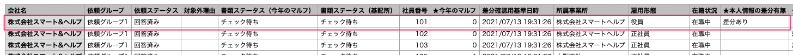
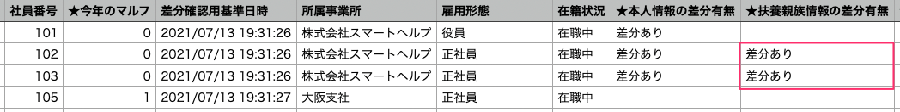

:::alert
当ページで案内しているSmartHRの年末調整機能の内容は、2021年（令和3年）版のものです。
2022年（令和4年）版の年末調整機能の公開時期は秋頃を予定しています。
なお、画面や文言、一部機能は変更になる可能性があります。
公開時期が決まり次第、[アップデート情報](https://smarthr.jp/update)でお知らせします。
:::

差分リストを使って「給与所得者の扶養控除等（異動）申告書」（マルフ）を効率よく確認する方法を説明します。

確認作業は「身上情報（SmartHRに登録している従業員情報）に変更がない従業員」と「身上情報に変更がある従業員」を振り分けることから始まります。

身上情報に変更があるかどうかは、項目名の頭に「★」がついた項目で確認できます。

差分リスト上で本人情報・扶養親族情報のどちらに変更があるのか、変更前後で情報がどう変わっているのかを一目で確認でき、便利です。ぜひお役立てください。

:::related
[差分リストをダウンロードする](https://knowledge.smarthr.jp/hc/ja/articles/4405171704985/)
:::

# 差分リスト利用時の前提

差分リストは、SmartHRの従業員情報に登録されている内容と、年末調整で入力された内容に変更（差分）があるかを確認するためのCSVファイルです。

差分を正しく抽出するには、前提として **年末調整機能に従業員情報を取り込む前にSmartHRに最新の従業員情報・家族情報が登録されている** 必要があります。

当ページで説明する内容は、必要な事前準備を終えていることを前提としています。

:::related
[差分リストを活用するための事前準備](https://knowledge.smarthr.jp/hc/ja/articles/4405706899353/)
:::

# 身上情報に変更がない従業員を確認する

## 情報の変更がない従業員を抽出する

「今年の本人情報差分リスト」を用意し、ファイルを開きます。

「★今年のマルフ」項目を確認し、「1」の表示がある場合は身上情報に変更がありません。

- 値の説明
    - 1：本人情報・扶養親族情報に変更なし
    - 0：本人情報・扶養親族情報の両方またはいずれかに変更あり

## 応用編：配偶者の控除区分だけが変わった従業員を抽出する

身上情報は変更がなく、本人または配偶者の所得変動により配偶者の「控除区分」だけに変更がある従業員を抽出します。

「今年の本人情報差分リスト」「今年の扶養親族差分リスト」を用意し、手順1から確認をはじめてください。

### 1.「今年の本人情報差分リスト」で扶養親族情報に変更がある従業員を確認する

「今年の本人情報差分リスト」で下記にすべて当てはまる従業員を確認してください。

- 「★今年のマルフ」項目が「0」になっている（＝扶養親族情報に変更がある）
- 「★本人情報の差分有無」項目が「空欄」になっている（＝本人情報に変更がない）
- 「★扶養親族情報の差分有無」項目が「差分あり」になっている（＝扶養親族情報に変更がある）

### 2.「今年の扶養親族情報差分リスト」で所得要件の変更を確認する

続いて、手順1で抽出した従業員について「今年の扶養親族情報差分リスト」を確認します。

まずは、計算式の列を追加し、配偶者情報だけに差分がある従業員を絞り込みます。

- 「社員番号」列の右に列を新しく追加します
- 追加した列に、計算式を入力します
    - 計算式：**\=COUNTIF(社員番号の列全体,社員番号の列の該当セル)**
- 追加した列に「1」が表示されている従業員を抽出します
    - 追加した列に「2」以上の数字が表示されている場合、配偶者以外の扶養家族情報にも差分があることを示しています

抽出した従業員について、下記にすべて当てはまるか確認してください。

- 「★差分種類」項目が「変更」になっている（＝扶養親族情報に変更がある）
- 「被扶養者 続柄」項目が「妻or夫」になっている（＝配偶者の情報に変更がある）
- 「変更前\_被扶養者 続柄」〜「変更前\_被扶養者 障害者区分」のすべての項目が「空欄」になっている（＝扶養親族の身上情報に変更がない）
- 「【参考】本人 合計所得見積額（所得金額調整控除後）」「【参考】被扶養者 税法上の年間所得見積額（単位：円）」の金額を確認し、源泉控除対象・配偶者控除・配偶者特別控除に変更があることを確認する

:::alert
年末調整における配偶者の区分は「配偶者控除」「配偶者特別控除」「同一生計配偶者」がありますが、SmartHRには「源泉控除対象」の情報しかありません。
そのため、年末調整で収集した結果に応じた区分が、参考値としてAH列「【参考】配偶者 配偶者控除対象」〜AJ列「【参考】配偶者 同一生計配偶者」に出力されます。
:::

源泉控除対象・配偶者控除・配偶者特別控除など各種控除の概要、所得要件は[年末調整の用語集](https://knowledge.smarthr.jp/hc/ja/articles/360052694653)をご覧ください。

:::tips
#### 身上情報に変更がない従業員の「扶養控除等（異動）申告書」をチェック済みにする
「確認状況の一括更新機能」からダウンロードできる「サンプルCSVファイル」と差分リストを組み合わせて使えば、対象の従業員に対して一括で書類をチェック済みにできます。

**1\. 差分リストから、身上情報に変更がない従業員の「社員番号」をコピーします。**
 **2\. サンプルCSVファイルの「社員番号」項目にコピーした内容を貼り付けます。（画像は貼り付け前）** 

**3\. 「今年のマルフ」項目に「1」を入力してCSVファイルを上書きして保存します。**

**4\. 確認状況の一括更新メニューでCSVファイルをアップロードすると、「今年のマルフ」の書類ステータスが「チェック待ち」から「チェック済み」に一括で更新されます。**
詳しくは[依頼状況と確認状況を一括で変更する](https://knowledge.smarthr.jp/hc/ja/articles/900006685963)をご覧ください。
:::

# 身上情報に変更がある従業員を確認する

## 本人情報の変更を確認する

「今年の本人情報差分リスト」を用意し、ファイルを開きます。

まずは「★本人情報の差分有無」項目が「差分あり」になっている従業員を確認します。

続いて、どの情報に変更があるのかを特定します。

### 基本情報（名前、生年月日、現住所、住民票住所）の変更を確認する

下記項目に「差分あり」の表示があるかどうかで確認できます。

- 「★名前変更の有無」
- 「★生年月日変更の有無」
- 「★現住所変更の有無」
- 「★住民票住所変更の有無」

「差分あり」の表示があった項目以降で、変更後の情報・変更前の情報を確認できます。

### 勤労学生、障害者控除、寡婦・ひとり親控除の変更を確認する

下記項目に「差分あり」の表示があるかどうかで確認できます。

- 「★勤労学生変更の有無」
- 「★障害者変更の有無」
- 「★寡婦・ひとり親変更の有無」

:::tips
SmartHRに以下いずれかの項目が登録されていると、年末調整機能に従業員情報を同期した際、従業員を勤労学生として判定します。
- 勤労学生：学校名
- 勤労学生：入学年月日
年末調整により「勤労学生の対象になった／対象から外れた」にもかかわらず、差分リストで確認できない場合には、同期時点の情報に上記いずれかの項目が含まれていない可能性があります。
:::

## 配偶者情報の変更を確認する

「今年の本人情報差分リスト」と「今年の扶養親族情報差分リスト」を用意し、ファイルを開きます。

### 「配偶者の有無」に変更があるかを確認する

**1\. 「今年の本人情報差分リスト」で、下記にすべて当てはまる従業員を確認してください。**

- 「★本人情報の差分有無」項目が「差分あり」になっている
- 「★配偶者の有無変更の有無」項目が「差分あり」になっている

**2\. 抽出した従業員の「配偶者の有無」項目を確認します。**

#### 

- 「有」の表示がある：配偶者情報が**追加**されています（配偶者の有無：無→有）
- 「無」の表示がある：配偶者情報が**削除**されています（配偶者の有無：有→無）

### 配偶者の追加・削除を確認する方法

配偶者の追加・削除があったかを確認する場合は、上記手順1〜2のあとに、追加で以下の確認が必要です。

 **「今年の扶養親族情報差分リスト」を確認し、下記にすべて当てはまるかを確認してください。** 

#### 追加を確認する場合

- 「対象扶養親族」項目が「配偶者」になっている
- 「★差分種類」項目が「追加」になっている

#### 削除を確認する場合

- 「対象扶養親族」項目が「-」になっている
- 「★差分種類」項目が「削除」になっている
- 「変更前\_被扶養者 続柄」が「妻」または「夫」

:::alert
#### 扶養しない配偶者を追加・削除した場合、「今年の扶養親族情報差分リスト」に差分として抽出されないパターンがあります
- 「SmartHRに扶養しない配偶者情報の登録がなく、年末調整で扶養対象外の配偶者情報が追加された」場合
- 「SmartHRに扶養しない配偶者情報の登録がなく、年末調整で配偶者がいないと登録された」場合
いずれも「今年の扶養親族情報差分リスト」に差分として抽出されません。
配偶者の追加・削除を確認するには、「今年の本人情報差分リスト」の「配偶者の有無」項目を確認してください。
:::

### 変更された配偶者情報を確認する

1\. 「今年の本人情報差分リスト」で、「★扶養親族情報の差分有無」項目が「差分あり」になっている従業員を確認してください。

2\. 「今年の扶養親族情報差分リスト」で、「対象扶養親族」項目が「配偶者」かつ、「★差分種類」項目が「変更」になっているかを確認してください。

## 扶養家族情報の変更を確認する

「今年の本人情報差分リスト」と「今年の扶養親族情報差分リスト」を用意し、ファイルを開きます。

まずは「今年の本人情報差分リスト」で、「★扶養親族情報の差分有無」項目が「差分あり」になっている従業員を確認してください。

### 追加された扶養家族情報を確認する

「今年の扶養親族情報差分リスト」の「★差分種類」項目が「追加」になっているかどうかで確認できます。

「追加」の表示があった項目以降で、追加された扶養家族情報を確認できます。

### 削除された扶養家族情報を確認する

「今年の扶養親族情報差分リスト」の「★差分種類」項目が「削除」になっているかどうかで確認できます。

削除された扶養家族情報は、項目名に「変更前\_」がついている項目で確認できます。

### 変更された扶養家族情報を確認する

「今年の扶養親族情報差分リスト」の「★差分種類」項目が「変更」になっているかどうかで確認できます。

「変更」の表示があった項目以降で、変更後と変更前の扶養親族情報を確認できます。

# 内容チェック後の流れ

## 情報を修正する

従業員に修正を依頼する方法は、差し戻しと修正依頼があります。

[提出された書類を従業員に差し戻す](https://knowledge.smarthr.jp/hc/ja/articles/360053238834)

[従業員に年末調整の修正依頼を出す](https://knowledge.smarthr.jp/hc/ja/articles/360057982273)

[Q. 年末調整の修正依頼と差し戻しの違いは？](https://knowledge.smarthr.jp/hc/ja/articles/4404343461785)

管理者が収集情報を編集して直接修正する方法もあります。

[収集情報を直接編集する](https://knowledge.smarthr.jp/hc/ja/articles/360035657114)

## 書類をチェック済みにする

確認した書類をチェック済みにする方法は、一括操作と個別操作があります。

[依頼状況と確認状況を一括で変更する](https://knowledge.smarthr.jp/hc/ja/articles/900006685963)

[従業員から提出された年末調整の書類をまとめて確認する](https://knowledge.smarthr.jp/hc/ja/articles/360055393313)
