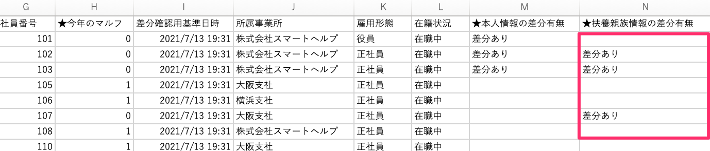
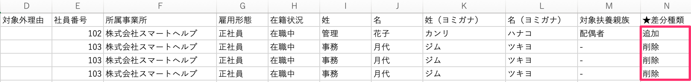

:::alert
当ページで案内しているSmartHRの年末調整機能の内容は、2021年（令和3年）版のものです。
2022年（令和4年）版の年末調整機能の公開時期は秋頃を予定しています。
なお、画面や文言、一部機能は変更になる可能性があります。
公開時期が決まり次第、[アップデート情報](https://smarthr.jp/update)でお知らせします。
:::
:::alert
協会けんぽの手続きのうち、SmartHRで対応可能な手続きのみを取り上げています。
:::
:::related
[差分リストをダウンロードする](https://knowledge.smarthr.jp/hc/ja/articles/4405171704985/)
[【一覧】今年の本人情報差分リストCSV凡例](https://knowledge.smarthr.jp/hc/ja/articles/4405362292121)
[【一覧】今年の扶養親族差分リストCSV凡例](https://knowledge.smarthr.jp/hc/ja/articles/4405362296089)
:::

# A. 手続きが必要になる可能性がある従業員を抽出できます。「今年の本人情報差分リスト」を確認してください。

確認方法は手続き別に説明します。

## 被扶養者（異動）届が必要な従業員を抽出する

「今年の本人情報差分リスト」と「今年の扶養親族差分リスト」を準備してください。

### 1\. 「今年の本人情報差分リスト」を確認する

「★扶養親族情報の差分有無」項目を確認してください。

「差分あり」が表示されている場合、従業員の扶養親族情報に追加・削除・変更があります。

### 2\. 「今年の扶養親族差分リスト」を確認する

手順1で扶養親族情報に追加・削除・変更があった従業員の「★差分種類」項目を確認します。

変更前後の内容はリストで確認できます。

- 「追加」が表示されている場合：追加された扶養親族情報があります。
- 「削除」が表示されている場合：削除された扶養親族情報があります。

:::tips
SmartHRで手続きの作成はできませんが、情報に変更があったケースも抽出できます。
「★差分種類」項目に「変更」が表示がされているか確認してください。
**手続きが必要になるケース**
- 「マイナンバーと基礎年金番号が紐付いていない配偶者」で住所変更があった
    
- 海外居住に変更になった
    
- 海外居住から国内居住に変更になった
    
:::

## 住所変更届が必要な従業員を抽出する

「今年の本人情報差分リスト」の以下項目に「差分あり」が表示されている場合、現住所または住民票住所に変更があります。

変更された内容をリストで確認してください。

- 「★現住所変更の有無」項目：現住所に変更があります。
- 「★住民票住所変更の有無」項目：住民票住所に変更があります。

:::tips
マイナンバーと基礎年金番号が結びついている被保険者は、原則、住所変更に関する届出は不要です。
詳しくは[年金に加入している方が引越したときの手続き｜日本年金機構](https://www.nenkin.go.jp/service/kokunen/kanyu/20120406.html)のページをご覧ください。
:::

## 氏名変更（訂正）届が必要な従業員を抽出する

「今年の本人情報差分リスト」の「★名前変更の有無 」項目に「差分あり」が表示されている場合、氏名に変更があります。

変更内容は「今年の本人情報差分リスト」の名前に関わる項目を比較・確認してください。

:::tips
マイナンバーと基礎年金番号が結びついている被保険者は、原則、氏名変更（訂正）に関する届出は不要です。
詳しくは[年金に加入している方が引越したときの手続き｜日本年金機構](https://www.nenkin.go.jp/service/kokunen/kanyu/20120406.html)のページをご覧ください。
:::
