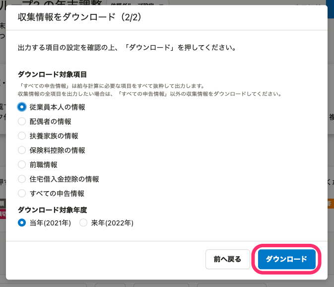
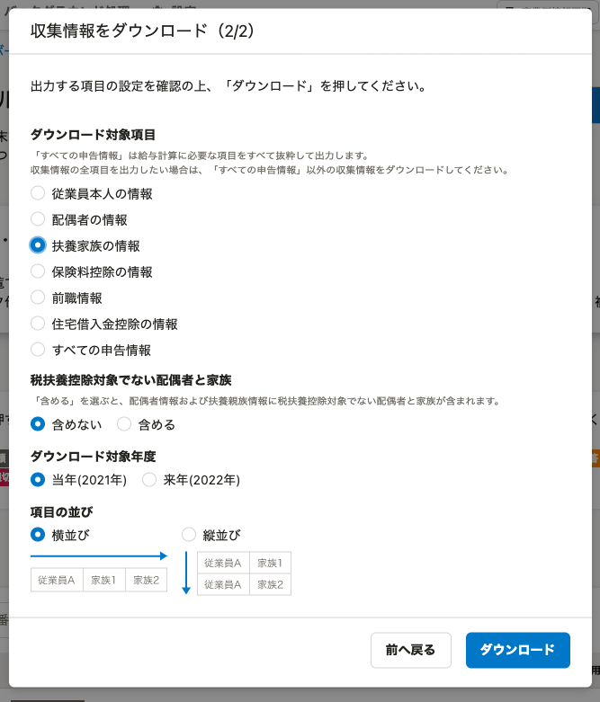

:::alert
当ページで案内しているSmartHRの年末調整機能の内容は、2021年（令和3年）版のものです。
2022年（令和4年）版の年末調整機能の公開時期は秋頃を予定しています。
なお、画面や文言、一部機能は変更になる可能性があります。
公開時期が決まり次第、[アップデート情報](https://smarthr.jp/update)でお知らせします。
:::

年末調整のアンケートで収集した情報は、すべての依頼グループを一括してダウンロードする方法と、依頼グループ単位でダウンロードする方法の2つがあります。

このページでは、依頼グループ単位で収集情報をダウンロードする方法を説明します。

すべての依頼グループを一括してダウンロードする方法は、下記のヘルプページをご確認ください。

:::related
[情報一括ダウンロードの使い方](https://knowledge.smarthr.jp/hc/ja/articles/4405396080025)
:::

# 1\. 依頼一覧画面の［ダウンロード▼］>［収集情報をダウンロード\] をクリック

依頼一覧画面の **［ダウンロード▼］メニュー**  にある **［収集情報をダウンロード］** をクリックすると、 **［収集情報をダウンロード（1/2）］** 画面が表示されます。

# 2\. ダウンロード形式を選択して［次へ］をクリック

ダウンロード形式に **［汎用データ形式］** と **［給与奉行形式］** のいずれかを選択して、 **［次へ］** をクリックします。

ダウンロード形式の違いは下記のとおりです。

- 汎用データ形式：さまざまなソフトに取込、加工しやすいよう、収集情報ごとにファイルを出力できます。
- 給与奉行形式：給与奉行iシリーズのデータ受入形式に基づいたファイルを出力できます。

Excelやスプレッドシートなどで収集情報のデータを編集する場合は「汎用データ形式」を、給与奉行iシリーズに情報を連携する場合は「給与奉行形式」をダウンロードしてください。

このページでは「汎用データ形式」のダウンロード方法を説明します。

「給与奉行形式」のダウンロード方法は下記のヘルプページをご覧ください。

:::related
[年末調整のデータを給与奉行形式でダウンロードする](https://knowledge.smarthr.jp/hc/ja/articles/360035370233)
:::

# 3.［ダウンロード対象項目］を選択して［ダウンロード］をクリック

汎用データ形式を選択すると、 **［収集情報をダウンロード（2/2）］** 画面が表示されます。

 **「ダウンロード対象項目」** から、ダウンロードしたい項目を選択します。

項目を選択すると、 **「ダウンロード対象項目」** 以降がそれぞれの項目に合わせた案内文に切り替わります。

## 従業員本人の情報

 **［従業員本人の情報］** は、年末調整のアンケートに入力された従業員本人にまつわる情報を一覧で確認できます。

 **［ダウンロード対象年度］** を選択して、 **［ダウンロード］** をクリックしてください。

:::related
[【一覧】従業員情報CSV凡例](https://knowledge.smarthr.jp/hc/ja/articles/360055845153)
:::

## 配偶者の情報

 **［配偶者の情報］** は、年末調整のアンケートに入力された配偶者にまつわる情報を一覧で確認できます。

確認画面の **［税扶養控除対象でない配偶者と家族］［ダウンロード対象年度］** を選択して、 **［ダウンロード］** をクリックしてください。

:::related
[【一覧】配偶者情報CSV凡例](https://knowledge.smarthr.jp/hc/ja/articles/360055932213)
:::

## 扶養家族の情報

 **［扶養家族の情報］** は、年末調整のアンケートに入力された扶養家族にまつわる情報を一覧で確認できます。

確認画面の **［税扶養控除対象でない配偶者と家族］［ダウンロード対象年度］［項目の並び］** を選択して、 **［ダウンロード］** をクリックしてください。

:::related
[【一覧】扶養家族情報CSV凡例](https://knowledge.smarthr.jp/hc/ja/articles/360054141614)
:::

## 保険料控除の情報

 **［保険料控除の情報］** は、年末調整のアンケートに入力された各種保険など、下記にまつわる情報を一覧で確認できます。

- 生命保険料（終身保険、入院保険、がん保険、所得補償保険、養老保険、学資保険など）
- 介護医療保険料
- 個人年金保険料
- 地震保険料
- 国民年金保険料（給与から控除されている厚生年金は該当しません）
- 国民健康保険料（給与から控除されている健康保険料は該当しません）
- 小規模企業共済掛金

確認画面の **［項目の並び］** を選択して、 **［ダウンロード］** をクリックしてください。

:::related
[【一覧】保険料控除情報CSV凡例](https://knowledge.smarthr.jp/hc/ja/articles/360054586574)
:::

## 前職情報

 **［前職情報］** は、年末調整のアンケートに入力された前職情報を一覧で確認できます。

 **［ダウンロード］** をクリックしてください。

:::related
[【一覧】前職情報CSV凡例](https://knowledge.smarthr.jp/hc/ja/articles/360035657454)
:::

## 住宅借入金控除の情報

 **［住宅借入金控除の情報］** は、年末調整のアンケートに入力された住宅借入金控除情報を一覧で確認できます。

 **［ダウンロード］** をクリックしてください。

:::related
[【一覧】住宅借入金控除情報CSV凡例](https://knowledge.smarthr.jp/hc/ja/articles/360056627593)
:::

## すべての申告情報

 **［すべての申告情報］** は、SmartHRの年末調整機能からダウンロードできるすべての収集情報から、給与計算にかかわる項目を抜粋したものを一覧で確認できます。

確認画面の **［税扶養控除対象でない配偶者と家族］［ダウンロード対象年度** ］を選択して、 **［ダウンロード］** をクリックしてください。

:::related
[【一覧】すべての申告情報CSV凡例](https://knowledge.smarthr.jp/hc/ja/articles/360056629453)
:::

# 4\. バックグラウンド処理画面からデータをダウンロードする

各確認画面の **［ダウンロード］** をクリックすると、バックグラウンド処理が始まります。

進捗は年末調整メニューの **［バックグラウンド処理］** で確認してください。

ステータスが **［完了］** に変わったら、 **［処理名］** をクリックします。

 **［処理結果］** 欄には、依頼グループの従業員のデータがまとめられたCSVファイルが作成されています。

 **［ダウンロード］** をクリックして内容を確認してください。

# CSVファイルの主な使用例

年末調整機能でダウンロードできるCSVファイルと使用例については、下記のヘルプページをご覧ください。

:::related
[【一覧】年末調整機能でダウンロードできるCSVファイルと使用例](https://knowledge.smarthr.jp/hc/ja/articles/4405369856281)
:::
