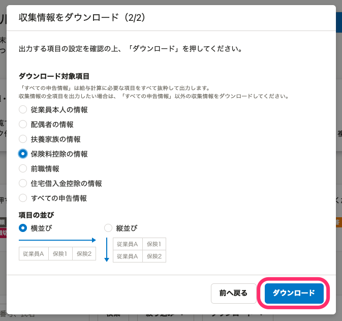
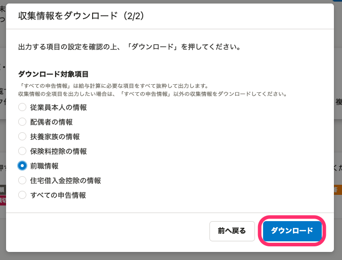
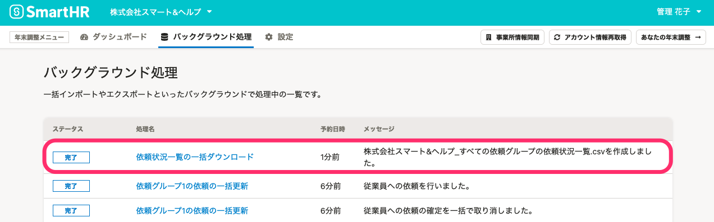

:::alert
当ページで案内しているSmartHRの年末調整機能の内容は、2021年（令和3年）版のものです。
2022年（令和4年）版の年末調整機能の公開時期は秋頃を予定しています。
なお、画面や文言、一部機能は変更になる可能性があります。
公開時期が決まり次第、[アップデート情報](https://smarthr.jp/update)でお知らせします。
:::

年末調整機能のすベての依頼グループを対象にした、データの一括ダウンロード方法を説明します。

ダウンロードできるCSVファイルの一覧と主な使用例は、下記をご覧ください。

:::related
[【一覧】年末調整機機能でダウンロードできるCSVファイルと使用例](https://knowledge.smarthr.jp/hc/ja/articles/4405369856281)
:::
:::tips
情報一括ダウンロード機能を使用する場合は、下記の点に注意してください。
- すべての依頼グループに対する操作権限を持つユーザー（管理者）しか使用できません。
- 従業員が所属していない依頼グループがある場合は、何も出力されません。
- 出力順は、依頼グループ作成時間の降順で表示されます。
- 依頼グループ内では、社員番号順で表示されます。
- CSVファイルで出力できない依頼グループがあった場合は、エラーファイルが出力されます。エラーファイルの内容を確認し、依頼グループを修正してください。
:::

# 1\. 依頼一覧画面の［情報一括ダウンロード▼］をクリック

依頼一覧画面の **［情報一括ダウンロード▼］** をクリックすると、すベての依頼グループを対象にしたデータの一括ダウンロードメニューが表示されます。

# 2\. 一括ダウンロードしたい項目を選択する

一括ダウンロードメニューから任意の項目をクリックすると、下記の確認画面が表示されます。

 **［ダウンロード］** をクリックすると、バックグラウンド処理が開始します。

## 依頼状況一覧をダウンロード

 **［依頼状況一覧をダウンロード］** をクリックすると、確認画面が表示されます。

 **［ダウンロード］** をクリックすると、すべての依頼グループの依頼状況一覧の一括ダウンロードを開始します。

:::related
[【一覧】依頼状況一覧CSV凡例](https://knowledge.smarthr.jp/hc/ja/articles/360036159274)
[特定の依頼グループの依頼状況一覧をダウンロードする](https://knowledge.smarthr.jp/hc/ja/articles/360034870814)
:::

## 書類作成更新日時リストのダウンロード

 **［書類作成更新日時リストのダウンロード］** をクリックすると、確認画面が表示されます。

 **［ダウンロード］** をクリックすると、すべての書類作成更新日時リストの一括ダウンロードを開始します。

:::related
[【一覧】書類作成更新日時リストCSV凡例](https://knowledge.smarthr.jp/hc/ja/articles/4405791434393)
[書類作成更新日時リストをダウンロードする](https://knowledge.smarthr.jp/hc/ja/articles/360054928774)
:::

## 収集情報をダウンロード

 **［収集情報をダウンロード］** をクリックすると、 **［収集情報をダウンロード（1/2）］** 画面が表示されます。

ダウンロード形式に **［汎用データ形式］** と **［給与奉行形式］** のいずれかを選択して、 **［次へ］** をクリックします。

### 汎用データ形式を選択した場合

汎用データ形式を選択すると、 **［収集情報をダウンロード（2/2）］** 画面が表示されます。

「ダウンロード対象項目」から、一括ダウンロードしたい項目を選択します。

項目を選択すると、それぞれの案内文に切り替わります。

#### 従業員本人の情報

 **［従業員本人の情報］** は、年末調整のアンケートに入力された従業員本人にまつわる情報を一覧で確認できます。

 **［ダウンロード対象年度］** を選択して、 **［ダウンロード］** をクリックしてください。

:::related
[【一覧】従業員情報CSV凡例](https://knowledge.smarthr.jp/hc/ja/articles/360055845153)
[収集情報をダウンロードする](https://knowledge.smarthr.jp/hc/ja/articles/360055844513)
:::

#### 配偶者の情報

 **［配偶者の情報］** は、年末調整のアンケートに入力された配偶者にまつわる情報を一覧で確認できます。

確認画面の **［税扶養控除対象でない配偶者と家族］［ダウンロード対象年度］** を選択して、 **［ダウンロード］** をクリックしてください。

:::related
[【一覧】配偶者情報CSV凡例](https://knowledge.smarthr.jp/hc/ja/articles/360055932213)
[収集情報をダウンロードする](https://knowledge.smarthr.jp/hc/ja/articles/360055844513)
:::

#### 扶養家族の情報

 **［扶養家族の情報］** は、年末調整のアンケートに入力された扶養家族にまつわる情報を一覧で確認できます。

確認画面の **［税扶養控除対象でない配偶者と家族］［ダウンロード対象年度］［項目の並び］** を選択して、 **［ダウンロード］** をクリックしてください。

:::related
[【一覧】扶養家族情報CSV凡例](https://knowledge.smarthr.jp/hc/ja/articles/360054141614)
[収集情報をダウンロードする](https://knowledge.smarthr.jp/hc/ja/articles/360055844513)
:::

#### 保険料控除の情報

 **［保険料控除の情報］** は、年末調整のアンケートに入力された各種保険など、下記にまつわる情報を一覧で確認できます。

- 生命保険料（終身保険、入院保険、がん保険、所得補償保険、養老保険、学資保険など）
- 介護医療保険料
- 個人年金保険料
- 地震保険料
- 国民年金保険料（給与から控除されている厚生年金は該当しません）
- 国民健康保険料（給与から控除されている健康保険料は該当しません）
- 小規模企業共済掛金

確認画面の **［項目の並び］** を選択して、 **［ダウンロード］** をクリックしてください。

:::related
[【一覧】保険料控除情報CSV凡例](https://knowledge.smarthr.jp/hc/ja/articles/360054586574)
[収集情報をダウンロードする](https://knowledge.smarthr.jp/hc/ja/articles/360055844513)
:::

#### 前職情報

 **［前職情報］** は、年末調整のアンケートに入力された前職情報を一覧で確認できます。

 **［ダウンロード］** をクリックしてください。

:::related
[【一覧】前職情報CSV凡例](https://knowledge.smarthr.jp/hc/ja/articles/360035657454)
[収集情報をダウンロードする](https://knowledge.smarthr.jp/hc/ja/articles/360055844513)
:::

#### 住宅借入金控除の情報

 **［住宅借入金控除の情報］** は、年末調整のアンケートに入力された住宅借入金控除情報を一覧で確認できます。

 **［ダウンロード］** をクリックしてください。

:::related
[【一覧】住宅借入金控除情報CSV凡例](https://knowledge.smarthr.jp/hc/ja/articles/360056627593)
[収集情報をダウンロードする](https://knowledge.smarthr.jp/hc/ja/articles/360055844513)
:::

#### すべての申告情報

 **［すべての申告情報］** は、SmartHRの年末調整機能からダウンロードできるすべての収集情報から、給与計算にかかわる項目を抜粋したものを一覧で確認できます。

確認画面の **［税扶養控除対象でない配偶者と家族］［ダウンロード対象年度** ］を選択して、 **［ダウンロード］** をクリックしてください。

:::related
[【一覧】すべての申告情報CSV凡例](https://knowledge.smarthr.jp/hc/ja/articles/360056629453)
[収集情報をダウンロードする](https://knowledge.smarthr.jp/hc/ja/articles/360055844513)
:::

### 給与奉行形式を選択した場合

 **［収集情報をダウンロード（1/2）］** 画面で、ダウンロードするファイルの形式に **［給与奉行形式］** を選択すると、下記の **［収集情報をダウンロード（2/2）］** 画面が表示されます。

注意事項を確認し、 **［ダウンロード］** をクリックしてください。

給与奉行形式のファイルは、収集情報の項目を、給与奉行iシリーズの汎用データ受入形式一覧表に基づいて整理したCSVファイルです。

:::related
[年末調整のデータを給与奉行形式でダウンロードする](https://knowledge.smarthr.jp/hc/ja/articles/360035370233)
[収集情報をダウンロードする](https://knowledge.smarthr.jp/hc/ja/articles/360055844513)
:::

## 差分リストのダウンロード

 **［差分リストのダウンロード］** をクリックすると確認画面が表示され、すべての依頼グループの差分リストを一括ダウンロードできます。

 **［ダウンロード対象リスト］** を選択して、 **［ダウンロード］** をクリックします。

:::related
[差分リストをダウンロードする](https://knowledge.smarthr.jp/hc/ja/articles/4405171704985)
[年末調整の差分リストとは？](https://knowledge.smarthr.jp/hc/ja/articles/360035370213)
[【一覧】今年の本人情報差分リストCSV凡例](https://knowledge.smarthr.jp/hc/ja/articles/4405362292121)
[【一覧】今年の扶養親族差分リストCSV凡例](https://knowledge.smarthr.jp/hc/ja/articles/4405362296089)
[【一覧】今年と来年の本人情報差分リストCSV凡例](https://knowledge.smarthr.jp/hc/ja/articles/4408029105817/)
[【一覧】今年と来年の扶養親族情報差分リストCSV凡例](https://knowledge.smarthr.jp/hc/ja/articles/4408021570841/)
:::

## 家族情報インポートファイルのダウンロード

 **［家族情報インポートファイルのダウンロード］** をクリックすると確認画面が表示され、すべての依頼グループの家族情報インポートファイルを一括ダウンロードできます。

:::related
[【一覧】年末調整の家族情報一括更新用CSV凡例](https://knowledge.smarthr.jp/hc/ja/articles/360056730693)
[年末調整で入力された家族情報をダウンロードする](https://knowledge.smarthr.jp/hc/ja/articles/360034870714)
:::

## 原本一覧のダウンロード

 **［原本一覧のダウンロード］** をクリックすると確認画面が表示され、すべての依頼グループの原本一覧を一括ダウンロードできます。

:::related
[【一覧】原本一覧CSV凡例](https://knowledge.smarthr.jp/hc/ja/articles/4405798339865)
[年末調整で入力された家族情報をダウンロードする](https://knowledge.smarthr.jp/hc/ja/articles/360034870714)
:::

# 3\. バックグラウンド処理画面からデータをダウンロードする

各確認画面の **［ダウンロード］** をクリックすると、バックグラウンド処理が始まります。

進捗は年末調整メニューの **［バックグラウンド処理］** で確認してください。

ステータスが **［完了］** に変わったら、 **［処理名］** をクリックします。

 **［処理結果］** 欄には、すべての依頼グループの従業員のデータが結合された状態のCSVファイルが作成されています。

 **［ダウンロード］** をクリックして内容を確認してください。

